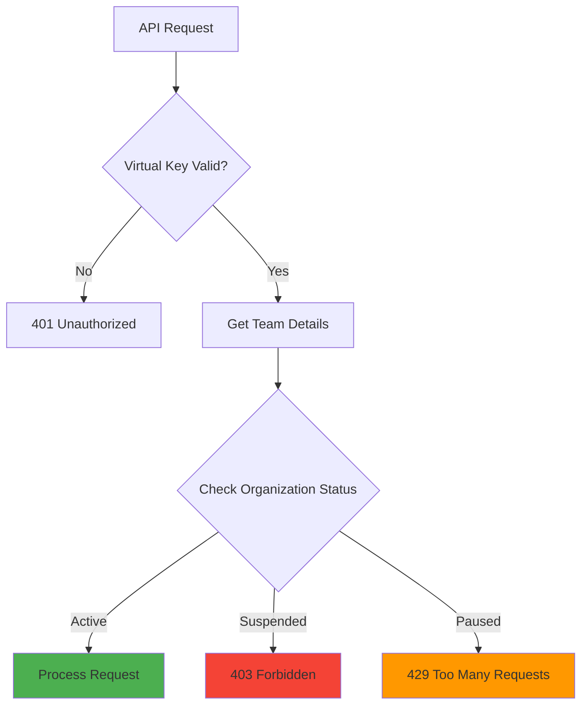

# Team Suspend & Pause Management

Learn how to suspend and pause teams to control access to your SaaS LiteLLM platform.

## Overview

Team status management allows you to temporarily or permanently restrict team access without deleting their data. This is useful for:

- Handling non-payment situations
- Enforcing terms of service violations
- Managing trial period expiration
- Performing maintenance on team resources
- Implementing temporary service holds

## Understanding Team Status

### Active Status

**Status:** `active`

Teams with active status have full access to:
- Make API calls using their virtual key
- Consume credits from their allocation
- Access all assigned model groups
- View usage statistics and job history

### Suspended Status

**Status:** `suspended`

Teams with suspended status are **blocked from all API access**:

- **API Calls:** Rejected with 403 Forbidden
- **Credit Usage:** No credits can be consumed
- **Data Access:** Historical data remains available
- **Virtual Keys:** Keys remain valid but non-functional
- **Billing:** Team can't incur new charges

**Use Cases:**
- Non-payment or overdue invoices
- Terms of service violations
- Security concerns or suspected abuse
- Account closure pending data retention
- Compliance or legal holds

### Paused Status

**Status:** `paused`

Teams with paused status have **temporary service interruption**:

- **API Calls:** Rejected with 429 Too Many Requests
- **Credit Usage:** No credits consumed during pause
- **Data Access:** Full access to historical data
- **Virtual Keys:** Keys remain valid but temporarily inactive
- **Billing:** Team won't incur charges while paused

**Use Cases:**
- Scheduled maintenance windows
- Customer-requested service pause
- Temporary budget holds
- Trial period between billing cycles
- Seasonal or periodic usage patterns

## Key Differences: Suspend vs Pause

| Feature | Active | Suspended | Paused |
|---------|--------|-----------|--------|
| API Access | ✅ Yes | ❌ No | ❌ No |
| HTTP Status | 200 | 403 Forbidden | 429 Too Many Requests |
| Credit Consumption | ✅ Yes | ❌ No | ❌ No |
| View History | ✅ Yes | ✅ Yes | ✅ Yes |
| Intent | Normal operation | Permanent/serious block | Temporary hold |
| Resumption | N/A | Admin action required | Can be automated |
| Error Message | N/A | "Team suspended" | "Team paused" |

## Implementation

### Database Schema

The team status is stored in the `organizations` table (which stores team metadata through organization relationships):

```sql
-- Organization status field (from organizations.py)
CREATE TABLE organizations (
    organization_id VARCHAR(255) PRIMARY KEY,
    name VARCHAR(500) NOT NULL,
    status VARCHAR(50) DEFAULT 'active',  -- 'active', 'suspended', 'paused'
    metadata JSON DEFAULT '{}',
    created_at TIMESTAMP NOT NULL DEFAULT NOW(),
    updated_at TIMESTAMP NOT NULL DEFAULT NOW()
);
```

The status field accepts:
- `'active'` - Full access (default)
- `'suspended'` - Blocked access
- `'paused'` - Temporary hold

### Status Checking Flow



## API Endpoints

### Check Team Status

```bash
GET /api/teams/{team_id}
Authorization: Bearer {virtual_key}
```

**Response:**

```json
{
  "team_id": "team_abc123",
  "organization_id": "org_xyz789",
  "credits": {
    "credits_allocated": 1000,
    "credits_used": 245,
    "credits_remaining": 755
  },
  "model_groups": ["gpt-models", "claude-models"]
}
```

### Check Organization Status

```bash
GET /api/organizations/{organization_id}
```

**Response:**

```json
{
  "organization_id": "org_xyz789",
  "name": "Acme Corporation",
  "status": "active",
  "metadata": {},
  "created_at": "2025-10-01T12:00:00Z",
  "updated_at": "2025-10-15T08:30:00Z"
}
```

### Update Organization Status (Admin Only)

**Endpoint:** Currently managed via direct database access. Future API:

```bash
PUT /api/organizations/{organization_id}/status
Content-Type: application/json
Authorization: Bearer {admin_key}

{
  "status": "suspended",
  "reason": "Payment overdue"
}
```

**Expected Response:**

```json
{
  "organization_id": "org_xyz789",
  "status": "suspended",
  "previous_status": "active",
  "updated_at": "2025-10-15T14:30:00Z",
  "reason": "Payment overdue"
}
```

## Usage Examples

### Example 1: Suspend Team for Non-Payment

**Scenario:** Customer hasn't paid their invoice for 30 days.

**Steps:**

1. **Check current status:**

```bash
curl -X GET http://localhost:8003/api/organizations/org_customer123
```

2. **Update via database** (until API endpoint exists):

```sql
UPDATE organizations
SET status = 'suspended',
    metadata = jsonb_set(
        metadata::jsonb,
        '{suspension_reason}',
        '"Payment overdue"'::jsonb
    ),
    updated_at = NOW()
WHERE organization_id = 'org_customer123';
```

3. **Verify team API calls fail:**

```bash
# Team attempts to create a job
curl -X POST http://localhost:8003/api/jobs/create \
  -H "Authorization: Bearer sk-team-key-abc123" \
  -H "Content-Type: application/json" \
  -d '{
    "team_id": "team_abc123",
    "job_type": "document_analysis"
  }'

# Expected response:
# HTTP 403 Forbidden
# {
#   "detail": "Team access suspended - contact support"
# }
```

4. **Resume when payment received:**

```sql
UPDATE organizations
SET status = 'active',
    metadata = jsonb_set(
        metadata::jsonb,
        '{suspension_reason}',
        'null'::jsonb
    ),
    updated_at = NOW()
WHERE organization_id = 'org_customer123';
```

### Example 2: Pause Team for Maintenance

**Scenario:** Performing model group reconfiguration for a customer.

**Steps:**

1. **Notify customer** about upcoming maintenance window

2. **Pause team access:**

```sql
UPDATE organizations
SET status = 'paused',
    metadata = jsonb_set(
        metadata::jsonb,
        '{pause_reason}',
        '"Scheduled maintenance"'::jsonb
    ),
    metadata = jsonb_set(
        metadata::jsonb,
        '{pause_until}',
        '"2025-10-16T10:00:00Z"'::jsonb
    ),
    updated_at = NOW()
WHERE organization_id = 'org_customer456';
```

3. **Perform maintenance:**

```bash
# Update team's model groups
curl -X PUT http://localhost:8003/api/teams/team_def456/model-groups \
  -H "Content-Type: application/json" \
  -d '{
    "model_groups": ["gpt-models", "claude-models", "new-model-group"]
  }'
```

4. **Resume team access:**

```sql
UPDATE organizations
SET status = 'active',
    metadata = metadata::jsonb - 'pause_reason' - 'pause_until',
    updated_at = NOW()
WHERE organization_id = 'org_customer456';
```

### Example 3: Automated Pause on Credit Exhaustion

**Scenario:** Automatically pause teams when credits run out (with grace period).

**Implementation:**

```python
# services/credit_monitor.py
from sqlalchemy.orm import Session
from models.credits import TeamCredits
from models.organizations import Organization

def check_and_pause_low_credit_teams(db: Session, threshold: int = 0):
    """
    Pause teams that have exhausted their credits
    """
    # Find teams with no credits remaining
    low_credit_teams = db.query(TeamCredits).filter(
        TeamCredits.credits_remaining <= threshold
    ).all()

    for team_credits in low_credit_teams:
        # Get the organization
        org = db.query(Organization).filter(
            Organization.organization_id == team_credits.organization_id
        ).first()

        if org and org.status == 'active':
            # Pause the organization
            org.status = 'paused'
            org.org_metadata['pause_reason'] = 'Credit exhausted'
            org.org_metadata['paused_at'] = datetime.utcnow().isoformat()

            db.commit()

            # Send notification
            send_notification(
                team_id=team_credits.team_id,
                message="Team paused - credits exhausted. Add credits to resume."
            )

# Schedule this to run periodically
# Example: Every 5 minutes via cron or scheduler
```

**Cron job:**

```bash
*/5 * * * * python /path/to/check_credits.py
```

### Example 4: Bulk Status Update

**Scenario:** Suspend multiple teams for a compliance audit.

```sql
-- Suspend all teams in a specific organization
UPDATE organizations
SET status = 'suspended',
    metadata = jsonb_set(
        metadata::jsonb,
        '{suspension_reason}',
        '"Compliance audit in progress"'::jsonb
    ),
    updated_at = NOW()
WHERE organization_id IN (
    'org_audit1',
    'org_audit2',
    'org_audit3'
);

-- Resume all suspended teams after audit
UPDATE organizations
SET status = 'active',
    metadata = metadata::jsonb - 'suspension_reason',
    updated_at = NOW()
WHERE status = 'suspended'
  AND metadata->>'suspension_reason' = 'Compliance audit in progress';
```

## Admin Dashboard Integration

### Dashboard UI Components

**Team Status Badge:**

```jsx
// components/TeamStatusBadge.jsx
export function TeamStatusBadge({ status }) {
  const statusConfig = {
    active: { color: 'green', text: 'Active', icon: '✓' },
    suspended: { color: 'red', text: 'Suspended', icon: '⊘' },
    paused: { color: 'orange', text: 'Paused', icon: '⏸' }
  };

  const config = statusConfig[status] || statusConfig.active;

  return (
    <span className={`badge badge-${config.color}`}>
      {config.icon} {config.text}
    </span>
  );
}
```

**Status Update Form:**

```jsx
// components/UpdateTeamStatus.jsx
export function UpdateTeamStatus({ organizationId, currentStatus }) {
  const [status, setStatus] = useState(currentStatus);
  const [reason, setReason] = useState('');

  const handleSubmit = async () => {
    await fetch(`/api/organizations/${organizationId}/status`, {
      method: 'PUT',
      headers: { 'Content-Type': 'application/json' },
      body: JSON.stringify({ status, reason })
    });

    // Refresh data
    window.location.reload();
  };

  return (
    <form onSubmit={handleSubmit}>
      <select value={status} onChange={e => setStatus(e.target.value)}>
        <option value="active">Active</option>
        <option value="paused">Paused</option>
        <option value="suspended">Suspended</option>
      </select>

      <input
        type="text"
        placeholder="Reason (optional)"
        value={reason}
        onChange={e => setReason(e.target.value)}
      />

      <button type="submit">Update Status</button>
    </form>
  );
}
```

## Best Practices

### 1. Always Document Status Changes

Store reason and timestamp in organization metadata:

```json
{
  "status_history": [
    {
      "status": "suspended",
      "reason": "Payment overdue",
      "changed_by": "admin@company.com",
      "changed_at": "2025-10-15T14:30:00Z"
    }
  ]
}
```

### 2. Notify Teams Before Status Changes

Send email/webhook notifications:

```python
def suspend_team_with_notification(org_id: str, reason: str):
    # Send warning email
    send_email(
        to=get_org_email(org_id),
        subject="Team Suspension Notice",
        body=f"Your team will be suspended. Reason: {reason}"
    )

    # Wait for 24 hours grace period
    schedule_task(
        task=apply_suspension,
        args=[org_id, reason],
        delay=86400  # 24 hours
    )
```

### 3. Implement Graduated Responses

```python
def handle_overdue_payment(days_overdue: int, org_id: str):
    if days_overdue >= 30:
        suspend_team(org_id, "Payment 30+ days overdue")
    elif days_overdue >= 14:
        pause_team(org_id, "Payment 14+ days overdue")
    elif days_overdue >= 7:
        send_warning(org_id, "Payment 7 days overdue")
```

### 4. Provide Self-Service Resume

Allow customers to resume paused teams:

```python
@app.post("/api/organizations/{org_id}/resume")
async def resume_team(org_id: str, payment_proof: str):
    # Verify payment
    if verify_payment(payment_proof):
        org = db.query(Organization).filter(
            Organization.organization_id == org_id
        ).first()

        if org.status == 'paused':
            org.status = 'active'
            db.commit()
            return {"status": "resumed"}

    raise HTTPException(400, "Cannot resume team")
```

### 5. Monitor Status Changes

Log all status changes for audit:

```python
def audit_log_status_change(
    org_id: str,
    old_status: str,
    new_status: str,
    reason: str,
    admin_id: str
):
    log_entry = {
        "timestamp": datetime.utcnow().isoformat(),
        "organization_id": org_id,
        "old_status": old_status,
        "new_status": new_status,
        "reason": reason,
        "changed_by": admin_id
    }

    # Store in audit log table
    db.add(AuditLog(**log_entry))
    db.commit()
```

## Troubleshooting

### Team Can't Resume After Payment

**Problem:** Updated organization status to 'active' but team still can't access API.

**Solutions:**

1. **Check team's organization mapping:**

```sql
SELECT tc.team_id, tc.organization_id, o.status
FROM team_credits tc
JOIN organizations o ON tc.organization_id = o.organization_id
WHERE tc.team_id = 'team_abc123';
```

2. **Verify virtual key is still valid:**

```bash
curl -X GET http://localhost:8002/key/info \
  -H "Authorization: Bearer {master_key}" \
  -d '{"keys": ["sk-team-key-abc123"]}'
```

3. **Check LiteLLM team budget:**

```bash
curl -X GET http://localhost:8002/team/info?team_id=team_abc123 \
  -H "Authorization: Bearer {master_key}"
```

### Status Changes Not Reflected in API

**Problem:** Database shows 'suspended' but API still allows requests.

**Cause:** Authentication middleware not checking organization status.

**Solution:** Implement status check in authentication:

```python
# auth/dependencies.py
async def verify_virtual_key(
    authorization: str = Header(None),
    db: Session = Depends(get_db)
):
    # ... existing key verification ...

    # Get team's organization
    team_credits = db.query(TeamCredits).filter(
        TeamCredits.virtual_key == virtual_key
    ).first()

    if team_credits:
        org = db.query(Organization).filter(
            Organization.organization_id == team_credits.organization_id
        ).first()

        if org.status == 'suspended':
            raise HTTPException(
                status_code=403,
                detail="Team access suspended - contact support"
            )
        elif org.status == 'paused':
            raise HTTPException(
                status_code=429,
                detail="Team access temporarily paused"
            )

    return team_credits.team_id
```

## Next Steps

Now that you understand team status management:

1. **[Monitor Teams](monitoring.md)** - Track team usage and health
2. **[Manage Credits](credits.md)** - Understand credit allocation
3. **[View Usage Analytics](monitoring.md#usage-analytics)** - Analyze consumption patterns

## Additional Resources

- **[Team Management Guide](teams.md)** - Full team administration
- **[Organization Management](organizations.md)** - Organization hierarchy
- **[API Reference](../api-reference/teams.md)** - Team API endpoints
