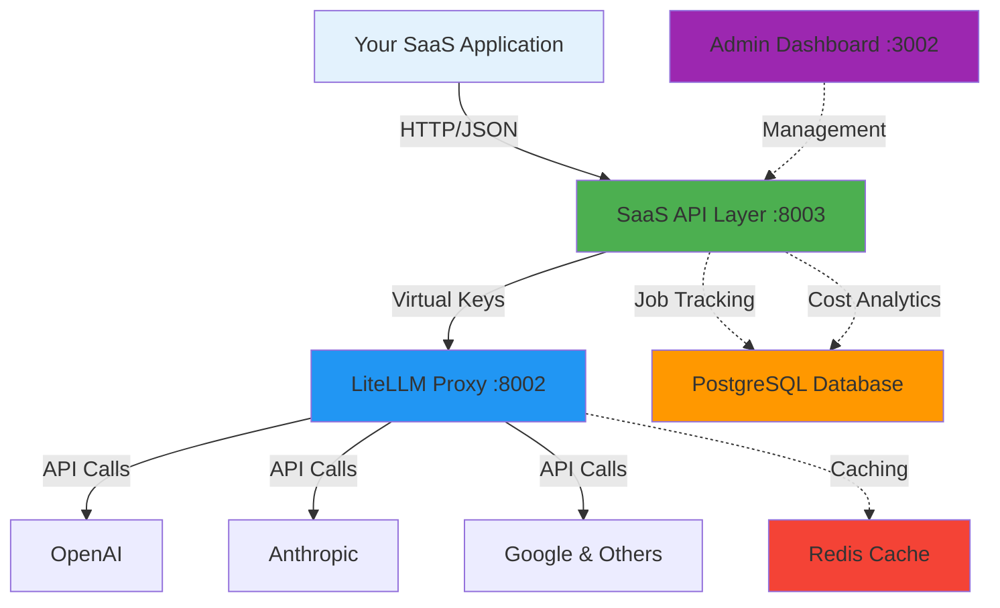
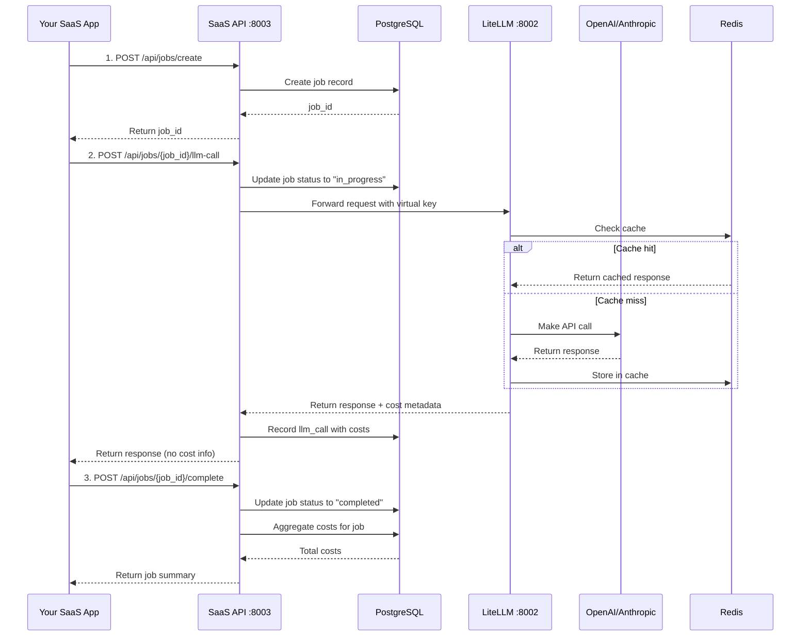

# Architecture

Understand the layered architecture of SaaS LiteLLM and how it's built on top of LiteLLM to provide a SaaS-ready API.

## Overview

SaaS LiteLLM is **built on top of [LiteLLM](https://docs.litellm.ai)** and uses a **layered architecture** that adds a SaaS wrapper around the LiteLLM proxy, enabling:

!!! info "Built on LiteLLM"
    SaaS LiteLLM leverages LiteLLM as its foundation for unified LLM API access to 100+ providers (OpenAI, Anthropic, Google, Azure, etc.). The SaaS layer adds job-based cost tracking, multi-tenancy, and business features on top of LiteLLM's core routing capabilities.

- **Job-based cost tracking** - Multiple LLM calls grouped into jobs
- **Team isolation** - Teams never directly access LiteLLM
- **Hidden complexity** - Model selection and pricing completely abstracted
- **Per-job cost aggregation** - Track costs per business operation
- **Flexible pricing** - Set your own markup and pricing strategy

## System Architecture



## Component Breakdown

### 1. Your SaaS Application

**What it is:**
- Your customer-facing application (web app, mobile app, API client)
- The application that your teams/customers use directly

**What it does:**
- Makes API calls to the SaaS API layer using virtual keys
- Implements your business logic and user interface
- Never interacts with LiteLLM directly

**Example:**
```python
# Your application code
response = requests.post(
    "https://your-saas-api.com/api/jobs/{job_id}/llm-call",
    headers={"Authorization": "Bearer sk-your-virtual-key"},
    json={"messages": [{"role": "user", "content": "Analyze..."}]}
)
```

### 2. SaaS API Layer (Port 8003)

**What it is:**
- FastAPI application that wraps LiteLLM
- The layer that provides job-based endpoints
- **This is what you expose to your teams**

**What it does:**
- Authenticates requests using virtual keys
- Creates and manages jobs for cost tracking
- Proxies LLM calls to LiteLLM with job context
- Aggregates costs per job in PostgreSQL
- Enforces team budgets and access controls
- Provides usage analytics

**Key Endpoints:**
- `POST /api/jobs/create` - Create a new job
- `POST /api/jobs/{job_id}/llm-call` - Make an LLM call
- `POST /api/jobs/{job_id}/llm-call-stream` - Streaming LLM call
- `POST /api/jobs/{job_id}/complete` - Complete a job
- `GET /api/teams/{team_id}/usage` - Get team usage stats

### 3. LiteLLM Proxy (Port 8002)

**What it is:**
- Standard [LiteLLM](https://docs.litellm.ai) proxy server (the foundation of SaaS LiteLLM)
- Handles actual LLM routing to 100+ providers
- **This is internal only - never exposed to teams**

**What it does:**
- Routes requests to appropriate LLM providers (OpenAI, Anthropic, Google, Azure, AWS Bedrock, etc.)
- Provides unified OpenAI-compatible API across all providers
- Manages rate limiting per team (TPM/RPM limits)
- Handles caching in Redis for cost savings
- Manages fallbacks and retries
- Tracks usage in LiteLLM's own database tables
- Load balances across multiple models/providers

**Why it's hidden:**
- Teams don't need to understand LiteLLM configuration
- Model selection is abstracted away
- Pricing is completely hidden
- You maintain full control over infrastructure
- Provider switching is transparent to teams

### 4. PostgreSQL Database

**What it stores:**

**Your SaaS Tables:**
- `jobs` - Job metadata and status
- `llm_calls` - Individual LLM calls per job
- `job_cost_summaries` - Aggregated costs per job
- `organizations` - Organization management
- `teams` - Team management with credit allocation
- `model_access_groups` - Control which teams access which models
- `model_aliases` - Model configuration and pricing
- `credit_transactions` - Credit history and transactions

**LiteLLM Tables** (auto-created by LiteLLM):
- `LiteLLM_VerificationToken` - Virtual keys
- `LiteLLM_UserTable` - LiteLLM users
- `LiteLLM_TeamTable` - LiteLLM teams
- `LiteLLM_SpendLogs` - Usage tracking

**Benefits:**
- Historical tracking of all jobs and calls
- Cost analytics per team, organization, or job type
- Credit transaction history
- Usage reporting and insights

### 5. Redis Cache

**What it does:**
- Caches LLM responses for identical requests
- Reduces costs by avoiding duplicate API calls
- Improves latency for repeated queries

**Configuration:**
- Configurable TTL per model
- Automatic cache key generation based on request
- Transparent to your application code

### 6. Admin Dashboard (Port 3002)

**What it is:**
- Next.js application for platform management
- Web UI for administrators

**What it does:**
- Create and manage organizations
- Create and manage teams
- Configure model access groups
- Allocate credits to teams
- Suspend/resume teams
- Monitor usage and costs
- View analytics and reports

**Who uses it:**
- Platform administrators
- Finance/billing teams
- Customer support

## Data Flow

Let's trace a typical request through the system:



### Step-by-Step Flow

1. **Create Job**
   - Your app creates a job for tracking
   - SaaS API stores job in PostgreSQL
   - Returns job_id to your app

2. **Make LLM Calls**
   - Your app makes one or more LLM calls using the job_id
   - SaaS API forwards to LiteLLM with virtual key
   - LiteLLM checks Redis cache first
   - If not cached, calls the provider (OpenAI, Anthropic, etc.)
   - Response returned to your app (without cost info)
   - Cost metadata stored in PostgreSQL

3. **Complete Job**
   - Your app marks the job as completed
   - SaaS API aggregates all costs for the job
   - Returns summary (for internal use only)

## Why This Architecture?

### 🎯 Complete Abstraction

**Problem:** Teams shouldn't need to understand LiteLLM, models, tokens, or pricing.

**Solution:** The SaaS API layer provides a simple, business-oriented interface. Teams only see jobs and calls, not models or costs.

### 💰 Job-Based Cost Tracking

**Problem:** A single business operation (like "analyze document") often requires multiple LLM calls. How do you track total cost?

**Solution:** Group related LLM calls into jobs. Track aggregate cost per job, not per API call.

**Example:**
```python
# One job = Multiple LLM calls = One aggregated cost
job_id = create_job("document_analysis")

extract_text(job_id)       # Call 1: $0.005
classify_content(job_id)   # Call 2: $0.008
generate_summary(job_id)   # Call 3: $0.010

complete_job(job_id)
# Total cost: $0.023
# You charge: $0.10 (flat rate)
# Your profit: $0.077
```

### 🔒 Team Isolation

**Problem:** How do you manage multiple teams with different budgets and access levels?

**Solution:** Organizations → Teams → Model Access Groups hierarchy with credit allocation and budget controls.

### 💵 Flexible Pricing

**Problem:** Your pricing strategy might not match actual LLM costs (e.g., you want flat-rate pricing).

**Solution:** Actual costs are tracked internally but never exposed. You set your own pricing strategy.

**Pricing Options:**
- **Flat rate per job** - "$0.10 per document analysis"
- **Tiered pricing** - "$0.05 for first 100 jobs, $0.03 after"
- **Markup pricing** - "Actual cost + 30% markup"
- **Subscription** - "Unlimited jobs for $99/month"

### 📊 Usage Analytics

**Problem:** You need to understand which workflows are expensive, which teams use the most, and where to optimize.

**Solution:** Detailed analytics per team, organization, job type, and time period.

### 🛡️ Budget Protection

**Problem:** Teams could accidentally run up huge costs.

**Solution:** Credit allocation with suspend/pause capabilities. Teams can't exceed their budget.

## Scalability Considerations

### Horizontal Scaling

**SaaS API Layer:**
- Stateless FastAPI application
- Can run multiple instances behind a load balancer
- Each instance connects to same PostgreSQL and Redis

**LiteLLM Proxy:**
- Also stateless
- Can run multiple instances for high availability
- Shares PostgreSQL and Redis for coordination

### Database Optimization

**PostgreSQL:**
- Index on `team_id`, `job_id`, `created_at` for fast queries
- Partitioning for large `llm_calls` table
- Read replicas for analytics queries

**Redis:**
- Separate cache instances for different regions
- Eviction policy: LRU (Least Recently Used)
- Monitoring for cache hit rates

### Cost Optimization

- **Redis caching** reduces duplicate API calls
- **Model fallbacks** use cheaper models when appropriate
- **Rate limiting** prevents runaway costs
- **Budget controls** enforce hard limits

## Security Model

### API Keys and Authentication

| Layer | Authentication | Purpose |
|-------|----------------|---------|
| **Your App → SaaS API** | Virtual keys (Bearer token) | Team authentication |
| **SaaS API → LiteLLM** | Virtual keys (internal) | Internal routing |
| **LiteLLM → Providers** | Provider API keys | Provider authentication |
| **Admin → Dashboard** | Your auth system | Admin access |

### Data Isolation

- All queries filtered by `team_id`
- Job IDs are UUIDs (non-guessable)
- LiteLLM master key never exposed to teams
- Model pricing completely abstracted
- Internal tables (costs, models) never exposed via API

### Access Controls

- **Model Access Groups** - Control which teams can use which models
- **Credit Limits** - Teams can't exceed allocated credits
- **Rate Limits** - TPM/RPM limits per team
- **Suspend/Pause** - Disable teams if needed

## Deployment Modes

### Local Development

- SaaS API on port 8003
- LiteLLM on port 8002
- PostgreSQL on port 5432
- Redis on port 6380
- Admin Dashboard on port 3002

[:octicons-arrow-right-24: See Installation Guide](installation.md)

### Production (Railway)

- SaaS API on Railway with custom domain
- LiteLLM as internal Railway service
- PostgreSQL as Railway addon
- Redis as Railway addon
- Admin Dashboard on Vercel or Railway

[:octicons-arrow-right-24: See Deployment Guide](../deployment/railway.md)

### Docker Compose

- All services in Docker containers
- Easy orchestration and scaling
- Volume mounts for persistence

[:octicons-arrow-right-24: See Docker Guide](../deployment/docker.md)

## Key Benefits

✅ **Teams never see LiteLLM** - Complete abstraction layer

✅ **Job-based cost tracking** - True cost per business operation

✅ **Model flexibility** - Change models without affecting clients

✅ **Pricing control** - Set your own markup and pricing strategy

✅ **Usage analytics** - Detailed insights per team and job type

✅ **Budget protection** - Prevent runaway costs with credit limits

✅ **Multi-call jobs** - Track related LLM calls as a single unit

✅ **Streaming support** - Server-Sent Events for real-time responses

✅ **Caching** - Automatic response caching for cost savings

✅ **Rate limiting** - Per-team TPM/RPM limits

## Next Steps

Now that you understand the architecture:

1. **[Complete the Installation](installation.md)** - Get all services running
2. **[Set Up Admin Dashboard](../admin-dashboard/overview.md)** - Create teams and organizations
3. **[Learn Integration Patterns](../integration/overview.md)** - Integrate into your app
4. **[Try Examples](../examples/basic-usage.md)** - Run working code

## Additional Resources

- **[Database Schema](../reference/database-schema.md)** - Detailed table schemas
- **[Credit System](../reference/credit-system.md)** - How credits work
- **[Model Resolution](../reference/model-resolution.md)** - How models are selected
- **[Streaming Architecture](../reference/streaming-architecture.md)** - SSE implementation details
