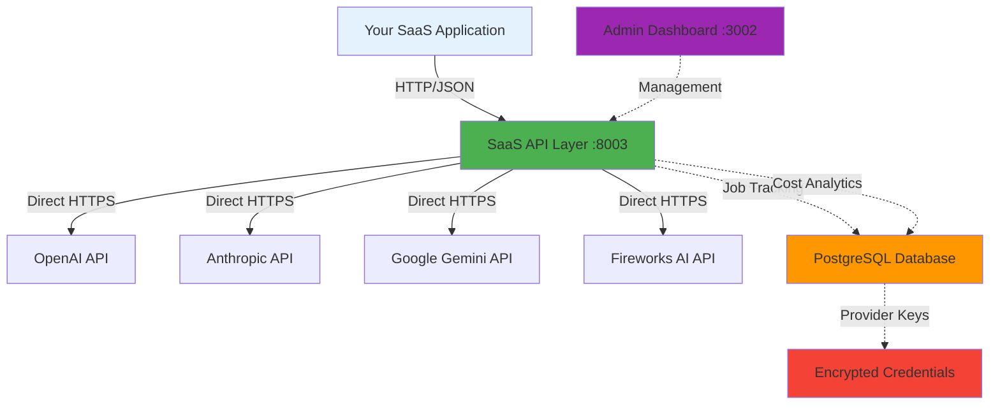
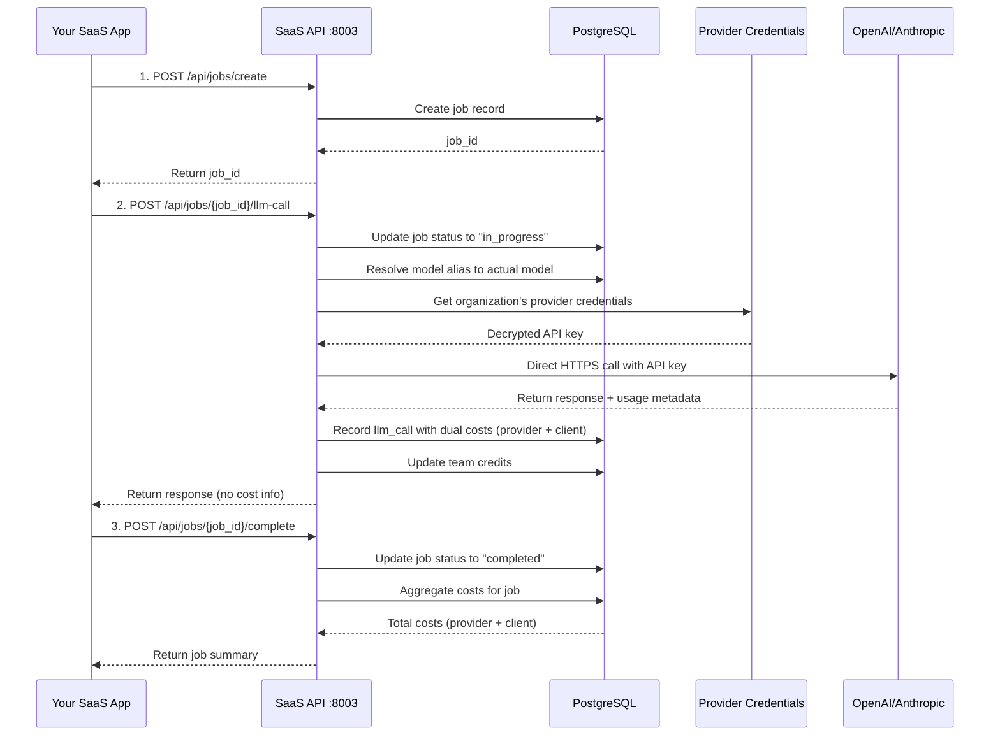

# Architecture

Understand the architecture of SaaS LiteLLM and how it provides job-based cost tracking for LLM API calls with direct provider integration.

## Overview

SaaS LiteLLM uses a **direct provider integration architecture** that enables:

!!! info "Direct Provider Integration"
    SaaS LiteLLM makes direct API calls to LLM providers (OpenAI, Anthropic, Google Gemini, Fireworks AI) without an intermediary proxy layer. This provides lower latency, full control, and simpler deployment while maintaining job-based cost tracking and multi-tenancy.

- **Job-based cost tracking** - Multiple LLM calls grouped into jobs
- **Team isolation** - Secure multi-tenancy with credit management
- **Direct provider calls** - No proxy layer for better performance
- **Provider credential management** - Encrypted API keys per organization
- **Per-job cost aggregation** - Track costs per business operation
- **Flexible pricing** - Set your own markup and pricing strategy

## System Architecture



## Why Direct Provider Integration?

### Evolution from Proxy Architecture

The system originally used LiteLLM as a proxy layer, but this architecture had limitations:

**Previous Challenges:**
- ❌ Added latency (extra network hop)
- ❌ Complex deployment (additional service on port 8002)
- ❌ Limited control over request/response handling
- ❌ Harder debugging through multiple layers
- ❌ Dependency on LiteLLM update cycle

**Current Benefits:**
- ✅ **Lower Latency** - Direct API calls save 100-200ms per request
- ✅ **Full Control** - Complete control over request formatting, retry logic, error handling
- ✅ **Simpler Deployment** - One less service to maintain
- ✅ **Easier Debugging** - Direct logs from provider responses
- ✅ **Faster Updates** - Add new providers/models without waiting for updates

## Component Breakdown

### 1. Your SaaS Application

**What it is:**
- Your customer-facing application (web app, mobile app, API client)
- The application that your teams/customers use directly

**What it does:**
- Makes API calls to the SaaS API layer using virtual keys
- Implements your business logic and user interface
- Never needs to know about model details or provider APIs

**Example:**
```python
# Your application code
response = requests.post(
    "https://your-saas-api.com/api/jobs/create-and-call",
    headers={"Authorization": "Bearer sk-your-virtual-key"},
    json={
        "team_id": "team-123",
        "job_type": "document_analysis",
        "model": "smart-analysis",  # Model alias, not actual provider model
        "messages": [{"role": "user", "content": "Analyze this document..."}]
    }
)
```

### 2. SaaS API Layer (Port 8003)

**What it is:**
- FastAPI application with direct provider integration
- The layer that provides job-based endpoints
- **This is what you expose to your teams**

**What it does:**
- Authenticates requests using virtual keys
- Creates and manages jobs for cost tracking
- Routes requests directly to LLM provider APIs
- Manages provider credentials (encrypted storage)
- Aggregates costs per job in PostgreSQL
- Enforces team budgets and access controls
- Provides usage analytics

**Key Endpoints:**
- `POST /api/jobs/create` - Create a new job
- `POST /api/jobs/{job_id}/llm-call` - Make an LLM call
- `POST /api/jobs/create-and-call` - Single-call convenience endpoint
- `POST /api/jobs/{job_id}/llm-call-stream` - Streaming LLM call
- `POST /api/jobs/create-and-call-stream` - Streaming single-call endpoint
- `POST /api/jobs/{job_id}/complete` - Complete a job
- `GET /api/teams/{team_id}/usage` - Get team usage stats

### 3. Provider Integration Layer

**What it is:**
- Direct integration service (`src/services/direct_provider_service.py`)
- Handles all provider-specific API communication
- **Internal component - not exposed to teams**

**Supported Providers:**
- **OpenAI** - GPT-5, GPT-4.1, GPT-4o, o3/o4-mini
- **Anthropic** - Claude Opus 4.1, Sonnet 4.5, Haiku 4.5
- **Google Gemini** - Gemini 2.5 Pro/Flash, Gemini 2.0 Pro/Flash
- **Fireworks AI** - Llama 3.3, DeepSeek R1, Qwen 2.5, Mixtral

**What it does:**
- Formats requests for each provider's API specification
- Makes direct HTTPS calls using `httpx`
- Parses and normalizes provider responses
- Calculates token usage and costs
- Handles streaming via Server-Sent Events (SSE)
- Implements retry logic and error handling
- Routes based on organization's provider credentials

### 4. Provider Credentials Management

**What it is:**
- Encrypted storage of provider API keys
- Organization-level credential management
- Database table: `provider_credentials`

**What it does:**
- Stores provider API keys encrypted at rest (Fernet encryption)
- Associates credentials with organizations
- Allows multiple credentials per provider per organization
- Supports activate/deactivate functionality
- Falls back to environment variables if no org credentials exist

**Security:**
- API keys encrypted before storage
- Decrypted only when making provider calls
- Never exposed via API responses
- Organization-level isolation

### 5. PostgreSQL Database

**What it stores:**

**Core SaaS Tables:**
- `jobs` - Job metadata and status
- `llm_calls` - Individual LLM calls with cost tracking
- `job_cost_summaries` - Aggregated costs per job
- `organizations` - Organization management
- `teams` - Team management with credit allocation
- `team_credits` - Virtual keys, credits, markup configuration
- `model_access_groups` - Control which teams access which models
- `model_aliases` - Model configuration with custom pricing
- `provider_credentials` - Encrypted provider API keys (NEW)
- `credit_transactions` - Credit history and transactions

**Cost Tracking Fields (in `llm_calls`):**
- `provider_cost_usd` - Actual cost charged by provider
- `client_cost_usd` - Cost charged to client (with markup)
- `model_pricing_input` - Input token price (per million)
- `model_pricing_output` - Output token price (per million)
- `cost_usd` - Legacy total cost field

**Benefits:**
- Historical tracking of all jobs and calls
- Dual cost tracking (provider cost vs client cost)
- Profit margin analysis
- Credit transaction history
- Usage reporting and insights

### 6. Admin Dashboard (Port 3002)

**What it is:**
- Next.js application for platform management
- Web UI for administrators

**What it does:**
- Create and manage organizations
- Create and manage teams
- Configure model access groups
- Manage provider credentials (NEW)
- View model pricing across providers (NEW)
- Allocate credits to teams
- Configure cost markup percentages
- Suspend/resume teams
- Monitor usage and costs
- View analytics and reports

**New Features (v1.0.0):**
- **Provider Credentials Page** - Add/edit/delete encrypted API keys
- **Model Pricing Page** - View pricing for 40+ models across 4 providers
- **Enhanced Model Creation** - Smart dropdowns, auto-pricing from catalog
- **Cost Transparency** - Provider costs vs client costs with profit margins

**Who uses it:**
- Platform administrators
- Finance/billing teams
- Customer support

## Data Flow

Let's trace a typical request through the system with direct provider integration:



### Step-by-Step Flow

1. **Create Job**
   - Your app creates a job for tracking
   - SaaS API stores job in PostgreSQL
   - Returns job_id to your app

2. **Make LLM Calls**
   - Your app makes one or more LLM calls using the job_id
   - SaaS API resolves model alias to actual provider model
   - Retrieves organization's encrypted provider credentials
   - Makes direct HTTPS call to provider API (OpenAI, Anthropic, etc.)
   - Calculates both provider cost and client cost (with markup)
   - Response returned to your app (without cost info)
   - Dual cost metadata stored in PostgreSQL

3. **Complete Job**
   - Your app marks the job as completed
   - SaaS API aggregates all costs for the job
   - Returns summary with total provider and client costs

## Why This Architecture?

### 🎯 Complete Abstraction

**Problem:** Teams shouldn't need to understand providers, models, tokens, or pricing.

**Solution:** The SaaS API layer provides a simple, business-oriented interface. Teams only see job-based endpoints with model aliases, not actual provider models.

### 💰 Job-Based Cost Tracking with Profit Margins

**Problem:** A single business operation often requires multiple LLM calls. How do you track total cost AND profit margin?

**Solution:** Group related LLM calls into jobs. Track both provider costs (what you pay) and client costs (what you charge) per job.

**Example:**
```python
# One job = Multiple LLM calls = Aggregated costs with profit
job_id = create_job("document_analysis")

extract_text(job_id)       # Provider: $0.005, Client: $0.007
classify_content(job_id)   # Provider: $0.008, Client: $0.010
generate_summary(job_id)   # Provider: $0.010, Client: $0.013

complete_job(job_id)
# Provider cost: $0.023
# Client cost: $0.030 (30% markup)
# Your profit: $0.007
```

### 🔐 Provider Credential Management

**Problem:** How do you manage API keys for multiple providers across multiple organizations?

**Solution:** Encrypted credential storage per organization with activate/deactivate controls.

**Features:**
- Organization-level credentials (teams inherit from org)
- Multiple credentials per provider (for rotation)
- Encrypted at rest using Fernet symmetric encryption
- Fallback to environment variables for backward compatibility
- Admin UI for credential management

### 🔒 Team Isolation

**Problem:** How do you manage multiple teams with different budgets and access levels?

**Solution:** Organizations → Teams → Model Access Groups hierarchy with credit allocation and budget controls.

### 💵 Flexible Pricing with Cost Transparency

**Problem:** Your pricing strategy might not match actual LLM costs. You need to track both what you pay and what you charge.

**Solution:** Dual cost tracking with configurable markup percentages. Profit margins visible in admin dashboard.

**Pricing Options:**
- **Flat rate per job** - "$0.10 per document analysis"
- **Tiered pricing** - "$0.05 for first 100 jobs, $0.03 after"
- **Markup pricing** - "Actual cost + 30% markup" (tracked automatically)
- **Subscription** - "Unlimited jobs for $99/month"

### 📊 Usage Analytics with Profit Tracking

**Problem:** You need to understand which workflows are profitable, which teams use the most, and where to optimize.

**Solution:** Detailed analytics with dual cost tracking (provider vs client) per team, organization, job type, and time period.

### 🛡️ Budget Protection

**Problem:** Teams could accidentally run up huge costs.

**Solution:** Credit allocation with suspend/pause capabilities. Teams can't exceed their budget. Real-time credit deduction after each call.

## Scalability Considerations

### Horizontal Scaling

**SaaS API Layer:**
- Stateless FastAPI application
- Can run multiple instances behind a load balancer
- Each instance connects to same PostgreSQL
- No shared state between instances

**Provider Calls:**
- Direct HTTPS calls (no intermediate proxy to scale)
- Built-in retry logic with exponential backoff
- Concurrent requests handled by async `httpx`

### Database Optimization

**PostgreSQL:**
- Index on `team_id`, `job_id`, `created_at` for fast queries
- Partitioning for large `llm_calls` table
- Read replicas for analytics queries
- Connection pooling via SQLAlchemy

### Cost Optimization

- **Credential management** allows per-org provider selection
- **Model aliases** enable model switching without client changes
- **Rate limiting** prevents runaway costs
- **Budget controls** enforce hard limits
- **Profit tracking** identifies unprofitable workflows

## Security Model

### API Keys and Authentication

| Layer | Authentication | Purpose |
|-------|----------------|---------|
| **Your App → SaaS API** | Virtual keys (Bearer token) | Team authentication |
| **SaaS API → Providers** | Provider API keys | Direct provider authentication |
| **Admin → Dashboard** | JWT authentication | Admin access |

### Provider Credential Security

- **Encryption at Rest** - Fernet symmetric encryption
- **Decryption Only When Needed** - Keys decrypted only for API calls
- **Never Exposed** - API keys never returned in API responses
- **Organization Isolation** - Each org's credentials are separate
- **Activate/Deactivate** - Disable credentials without deletion
- **Audit Trail** - Creation and update timestamps tracked

### Data Isolation

- All queries filtered by `team_id`
- Job IDs are UUIDs (non-guessable)
- Provider API keys encrypted in database
- Model pricing completely abstracted
- Internal tables (costs, models, credentials) never exposed via API

### Access Controls

- **Model Access Groups** - Control which teams can use which models
- **Credit Limits** - Teams can't exceed allocated credits
- **Rate Limits** - TPM/RPM limits per team
- **Suspend/Pause** - Disable teams if needed
- **Credential Management** - Only admins can view/edit provider keys

## Deployment Modes

### Local Development

- SaaS API on port 8003
- PostgreSQL on port 5432
- Admin Dashboard on port 3002
- No LiteLLM proxy needed

[:octicons-arrow-right-24: See Installation Guide](installation.md)

### Production (Railway)

- SaaS API on Railway with custom domain
- PostgreSQL as Railway addon
- Admin Dashboard on Vercel or Railway
- Provider API keys in environment or database
- No LiteLLM proxy needed

[:octicons-arrow-right-24: See Deployment Guide](../deployment/railway.md)

### Docker Compose

- All services in Docker containers
- Easy orchestration and scaling
- Volume mounts for persistence
- Environment variables for provider keys

[:octicons-arrow-right-24: See Docker Guide](../deployment/docker.md)

## Key Benefits

✅ **Direct provider integration** - Lower latency, simpler deployment

✅ **Job-based cost tracking** - True cost per business operation

✅ **Dual cost tracking** - Track what you pay vs what you charge

✅ **Provider credential management** - Encrypted, org-level API key storage

✅ **Model flexibility** - Change models without affecting clients

✅ **Pricing control** - Set your own markup and track profit margins

✅ **Usage analytics** - Detailed insights with profitability metrics

✅ **Budget protection** - Prevent runaway costs with credit limits

✅ **Multi-call jobs** - Track related LLM calls as a single unit

✅ **Streaming support** - Server-Sent Events for real-time responses

✅ **40+ Models** - Latest models from OpenAI, Anthropic, Gemini, Fireworks

## Migration from LiteLLM Proxy

!!! note "Architectural Change"
    Version 1.0.0 introduced direct provider integration, removing the LiteLLM proxy dependency. If you're upgrading from an earlier version, your existing virtual keys and team structure remain compatible.

**What Changed:**
- LiteLLM proxy service (port 8002) removed
- Direct provider API calls implemented
- Provider credentials management added
- LiteLLM database tables no longer used
- Simplified deployment (one less service)

**What Stayed the Same:**
- Job-based API endpoints unchanged
- Virtual key authentication unchanged
- Team credit system unchanged
- Admin dashboard structure (with new pages added)

**New Features in v1.0.0:**
- Provider credentials management UI
- Model pricing overview page
- Enhanced model alias creation
- Dual cost tracking (provider vs client)
- Auto-pricing from model catalog

## Next Steps

Now that you understand the architecture:

1. **[Complete the Installation](installation.md)** - Get all services running
2. **[Set Up Admin Dashboard](../admin-dashboard/overview.md)** - Create teams and organizations
3. **[Manage Provider Credentials](../admin-dashboard/provider-credentials.md)** - Add encrypted API keys
4. **[Learn Integration Patterns](../integration/overview.md)** - Integrate into your app
5. **[Try Examples](../examples/basic-usage.md)** - Run working code

## Additional Resources

- **[Database Schema](../reference/database-schema.md)** - Detailed table schemas
- **[Credit System](../reference/credit-system.md)** - How credits work
- **[Model Resolution](../reference/model-resolution.md)** - How models are selected
- **[Cost Transparency](../admin-dashboard/cost-transparency.md)** - Profit margin tracking
- **[Provider Credentials](../admin-dashboard/provider-credentials.md)** - API key management
