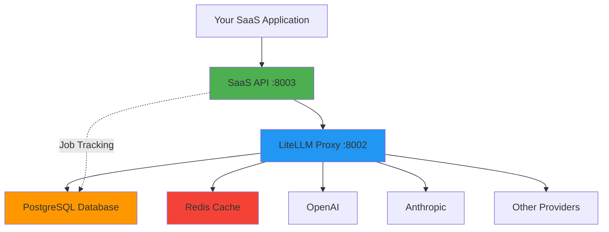

# Introduction to SaaS LiteLLM

## What is SaaS LiteLLM?

SaaS LiteLLM is a **production-ready platform built on top of [LiteLLM](https://docs.litellm.ai)** specifically designed for multi-tenant SaaS applications. It provides a complete abstraction layer over LiteLLM with **job-based cost tracking**, allowing you to build LLM-powered SaaS products without exposing infrastructure complexity to your customers.

!!! info "Built on LiteLLM"
    SaaS LiteLLM is built on top of [LiteLLM](https://docs.litellm.ai), which provides unified API access to 100+ LLM providers including OpenAI, Anthropic, Google, Azure, Cohere, and many more. LiteLLM handles the provider routing, while SaaS LiteLLM adds the SaaS-ready features on top.

SaaS LiteLLM wraps the LiteLLM proxy with a SaaS-oriented API layer that:

- Groups multiple LLM calls into **jobs** for better cost tracking
- Completely **hides models, pricing, and infrastructure** from your teams
- Provides **per-team isolation** with independent budgets and access controls
- Enables **flexible pricing** strategies while tracking actual provider costs
- Includes an **admin dashboard** for managing teams and model access

## Why Use SaaS LiteLLM?

### The Problem

If you're building a SaaS application that uses LLMs, you face several challenges:

1. **Cost Attribution** - How do you track costs per customer or per business operation when a single workflow makes multiple LLM calls?
2. **Pricing Strategy** - How do you charge customers without exposing your actual LLM costs?
3. **Multi-Tenancy** - How do you isolate teams with different budgets and access levels?
4. **Complexity** - Teams shouldn't need to understand models, tokens, or LiteLLM configuration

### The Solution

SaaS LiteLLM solves these problems by:

- **Job-Based Tracking** - Group related LLM calls into jobs (e.g., "document_analysis", "chat_session") and track aggregate costs
- **Cost Abstraction** - Teams never see actual costs or models - you can implement any pricing strategy
- **Built-in Multi-Tenancy** - Organizations, teams, model access groups, and credit allocation
- **Simple API** - Clean, business-oriented API instead of raw LLM endpoints

## Key Features

### 🎯 SaaS-Ready Architecture

- **Job-Based Workflow** - Create a job, make multiple LLM calls, complete the job, get aggregated costs
- **Hidden Complexity** - Teams interact with your SaaS API, never seeing LiteLLM, models, or pricing
- **Cost Aggregation** - Track true costs per business operation, not per API call
- **Usage Analytics** - Detailed insights per team, organization, and job type

### 💰 Business Features

- **Cost Transparency** - See actual LiteLLM costs vs. what you charge customers
- **Flexible Pricing** - Implement flat rate, tiered, markup-based, or custom pricing
- **Budget Controls** - Per-team credit allocation with suspend/pause capabilities
- **Profit Tracking** - Calculate margins per job, team, or organization

### 🔧 Technical Features

- **Multi-Tenant** - Organizations → Teams → Model Access Groups architecture
- **Model Access Control** - Control which teams can access which models via access groups
- **Virtual Keys** - Automatic virtual key generation (completely hidden from teams)
- **Multiple Providers** - Support for OpenAI, Anthropic, Google, and 100+ models via LiteLLM
- **Streaming Support** - Server-Sent Events (SSE) for real-time streaming responses
- **Redis Caching** - Automatic response caching for cost savings and performance
- **Rate Limiting** - Per-team TPM/RPM limits
- **Admin Dashboard** - Next.js dashboard for managing the platform
- **Type Safety** - Pydantic models throughout for request/response validation
- **Production Ready** - Deploy to Railway with Docker in minutes

## Architecture Overview

SaaS LiteLLM uses a layered architecture that abstracts LiteLLM behind your SaaS API:



### Component Breakdown

#### 1. Your SaaS Application
- Your customer-facing application (web app, mobile app, etc.)
- Makes API calls to the SaaS API layer
- Teams never see LiteLLM or models directly

#### 2. SaaS API Layer (Port 8003)
- **FastAPI** application that wraps LiteLLM
- Provides job-based endpoints: `/api/jobs/create`, `/api/jobs/{id}/llm-call`, etc.
- Handles authentication, team isolation, and cost tracking
- **This is what you expose to your teams**

#### 3. LiteLLM Proxy (Port 8002)
- Standard LiteLLM proxy server
- Handles actual LLM routing to providers (OpenAI, Anthropic, etc.)
- Manages virtual keys, rate limiting, and caching
- **This is internal only - never exposed to teams**

#### 4. PostgreSQL Database
- Stores jobs, LLM calls, teams, organizations, and usage data
- Provides cost aggregation and analytics
- Enables historical tracking and reporting

#### 5. Redis Cache
- Caches LLM responses for identical requests
- Reduces costs and improves latency
- Configurable TTL per model

#### 6. Admin Dashboard (Port 3002)
- **Next.js** application for platform management
- Create organizations, teams, model access groups
- Allocate credits, suspend/resume teams
- Monitor usage and costs

## Use Cases

SaaS LiteLLM is perfect for these scenarios:

### Document Processing SaaS
- **Job**: Document analysis workflow
- **LLM Calls**: Extract text → Summarize → Classify → Generate insights
- **Benefit**: Track total cost per document, not per API call

### Chat Application
- **Job**: Chat session (conversation with context)
- **LLM Calls**: Multiple messages in a conversation
- **Benefit**: Track cost per session, charge per conversation

### Data Extraction Platform
- **Job**: Extract structured data from unstructured text
- **LLM Calls**: Parse → Validate → Transform → Enrich
- **Benefit**: Flat-rate pricing regardless of text length

### AI Writing Assistant
- **Job**: Content generation task
- **LLM Calls**: Research → Outline → Write → Edit → Polish
- **Benefit**: Predictable pricing per content piece

### API Translation Service
- **Job**: Multi-language translation task
- **LLM Calls**: One call per language
- **Benefit**: Track cost per translation job

## How It Works

Here's a simple workflow:

```python
import requests

API = "http://localhost:8003/api"

# 1. Create job for tracking
job = requests.post(f"{API}/jobs/create", json={
    "team_id": "acme-corp",
    "job_type": "document_analysis",
    "metadata": {"document_id": "doc_123"}
}).json()

job_id = job["job_id"]

# 2. Make LLM calls within the job
response = requests.post(f"{API}/jobs/{job_id}/llm-call", json={
    "messages": [
        {"role": "user", "content": "Analyze this document..."}
    ]
}).json()

# 3. Complete job and get costs
result = requests.post(f"{API}/jobs/{job_id}/complete", json={
    "status": "completed"
}).json()

# Internal tracking shows:
# - actual_cost_usd: $0.0234
# - You can charge: $0.10 (flat rate)
# - Your profit: $0.0766
```

**Key Points:**
- Teams only see your SaaS API, never LiteLLM
- No model names, token counts, or costs exposed
- You control pricing strategy completely
- All costs tracked per job automatically

## What is LiteLLM?

[LiteLLM](https://docs.litellm.ai) is an open-source library that provides a unified interface to 100+ LLM providers. It standardizes the API across different providers so you can easily switch between:

- **OpenAI** (GPT-4, GPT-3.5-turbo, etc.)
- **Anthropic** (Claude 3 Opus, Sonnet, Haiku, etc.)
- **Google** (Gemini Pro, PaLM, etc.)
- **Azure OpenAI Service**
- **AWS Bedrock** (Claude, Llama, etc.)
- **Cohere**, **Replicate**, **Hugging Face**, **Together AI**
- And 95+ more providers

**What LiteLLM Provides:**

- ✅ Unified API format (OpenAI-compatible)
- ✅ Provider-specific authentication handling
- ✅ Rate limiting and automatic retries
- ✅ Fallback routing between models
- ✅ Cost tracking per API call
- ✅ Response caching
- ✅ Load balancing across providers

## What SaaS LiteLLM Adds on Top

SaaS LiteLLM takes LiteLLM's powerful routing capabilities and adds a complete SaaS-ready layer:

**✅ Job-Based Cost Tracking** - Group multiple LLM calls into business operations (e.g., "document_analysis"), not individual API calls

**✅ Multi-Tenant Architecture** - Full organization → teams → model access groups hierarchy with credit allocation

**✅ Simplified Billing** - Charge 1 credit per job instead of tracking tokens per call

**✅ Team Isolation** - Completely hide models, pricing, and infrastructure from your teams

**✅ Admin Dashboard** - Web UI for managing teams, credits, model access, and monitoring usage

**✅ SaaS API Layer** - Clean REST API designed for customer-facing applications

## Comparison with Standard LiteLLM

| Feature | Standard LiteLLM | SaaS LiteLLM (Built on LiteLLM) |
|---------|------------------|----------------------------------|
| **Foundation** | Core routing library | LiteLLM + SaaS wrapper |
| **API Style** | Raw LLM endpoints | Job-based workflow |
| **Cost Tracking** | Per API call | Per business operation (job) |
| **Team Visibility** | See models, costs | Hidden - abstracted away |
| **Pricing Model** | Pass-through | Flexible - set your own |
| **Multi-Tenancy** | Virtual keys only | Organizations + Teams + Access Groups |
| **Admin Interface** | Basic UI | Full dashboard with credit management |
| **Budget Controls** | Rate limits | Credits, suspend/pause, budget modes |
| **Billing** | Token-based | Credit-based (per job) |
| **Use Case** | Admin/internal use | Customer-facing SaaS |

## What Makes This "SaaS-Ready"?

1. **Complete Abstraction** - Teams never interact with LiteLLM directly
2. **Business-Oriented** - API designed around jobs/tasks, not models/tokens
3. **Cost Management** - Built-in credit system with allocation and tracking
4. **Multi-Tenant** - Full organization/team hierarchy with isolation
5. **Admin Tools** - Dashboard for managing teams and monitoring usage
6. **Flexible Pricing** - Decouple what you charge from what you pay
7. **Production Features** - Streaming, caching, rate limiting, error handling

## Next Steps

Ready to get started?

- **[Quickstart Guide](quickstart.md)** - Get up and running in 5 minutes
- **[Installation Guide](installation.md)** - Detailed setup instructions
- **[Architecture Deep Dive](architecture.md)** - Understand the full system design
- **[Integration Guide](../integration/overview.md)** - Integrate into your app

## Additional Resources

- **[Examples](../examples/basic-usage.md)** - Working code examples
- **[API Reference](../api-reference/overview.md)** - Complete API documentation
- **[Admin Dashboard Guide](../admin-dashboard/overview.md)** - Manage your platform
