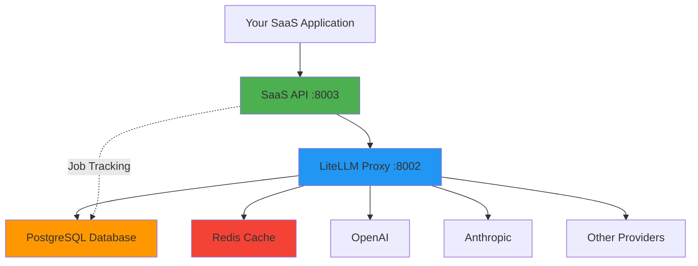

# Welcome to SaaS LiteLLM

A production-ready platform **built on top of [LiteLLM](https://docs.litellm.ai)** with **job-based cost tracking** for multi-tenant SaaS applications. Build your LLM-powered SaaS without exposing infrastructure complexity to your customers.

## What is SaaS LiteLLM?

SaaS LiteLLM is a complete SaaS wrapper built on top of LiteLLM that provides:

!!! info "Built on LiteLLM"
    SaaS LiteLLM leverages [LiteLLM](https://docs.litellm.ai) as its foundation for unified LLM API access. LiteLLM provides the core routing to 100+ LLM providers (OpenAI, Anthropic, Google, Azure, etc.), while SaaS LiteLLM adds the job-based cost tracking, multi-tenancy, and SaaS-ready features on top.

**Core Features:**

- **Job-Based Cost Tracking** - Group multiple LLM calls into business operations and track true costs
- **Multi-Tenant Architecture** - Isolated teams with independent budgets and access controls
- **Hidden Complexity** - Teams interact with a clean API, never seeing models, pricing, or infrastructure
- **Flexible Pricing** - Set your own pricing strategy while tracking actual provider costs
- **Production-Ready** - Deploy to Railway, includes PostgreSQL, Redis, rate limiting, and monitoring

## Key Features

### 🎯 SaaS-Ready Architecture
- **Job-Based Tracking** - Group multiple LLM calls into business operations
- **Hidden Complexity** - Teams never see models, pricing, or LiteLLM
- **Cost Aggregation** - Track true costs per job, not per API call
- **Usage Analytics** - Detailed insights per team and job type

### 💰 Business Features
- **Cost Transparency** - See actual LiteLLM costs vs. customer pricing
- **Flexible Pricing** - Flat rate, tiered, or markup-based pricing
- **Budget Controls** - Per-team credit allocation with suspend/pause capabilities
- **Profit Tracking** - Calculate margins per job/team

### 🔧 Technical Features
- 🚀 Deploy to Railway with Docker
- 🐘 PostgreSQL database with job tracking schema
- 👥 Team and organization management
- 🔑 Virtual API key generation (hidden from teams)
- 🔄 Multiple LLM providers (OpenAI, Anthropic, etc.)
- ⚡ Redis caching for performance and cost savings
- 📊 Rate limiting per team (TPM/RPM)
- 🎛️ Admin dashboard for team management
- 🌊 Server-Sent Events (SSE) streaming support

## Quick Links

<div class="grid cards" markdown>

-   :material-rocket-launch:{ .lg .middle } __Getting Started__

    ---

    New to SaaS LiteLLM? Start here for installation and setup.

    [:octicons-arrow-right-24: Quickstart Guide](getting-started/quickstart.md)

-   :material-view-dashboard:{ .lg .middle } __Admin Dashboard__

    ---

    Learn how to manage organizations, teams, and model access.

    [:octicons-arrow-right-24: Dashboard Guide](admin-dashboard/overview.md)

-   :material-code-braces:{ .lg .middle } __Integration Guide__

    ---

    Integrate the SaaS API into your application.

    [:octicons-arrow-right-24: Integration Docs](integration/overview.md)

-   :material-api:{ .lg .middle } __API Reference__

    ---

    Complete API documentation with interactive examples.

    [:octicons-arrow-right-24: API Docs](api-reference/overview.md) | [:octicons-arrow-right-24: ReDoc](http://localhost:8003/redoc)

</div>

## Quick Example

Here's a simple example of using the job-based API:

=== "Python"

    ```python
    import requests

    API = "http://localhost:8003/api"

    # 1. Create job for tracking
    job = requests.post(f"{API}/jobs/create", json={
        "team_id": "acme-corp",
        "job_type": "document_analysis",
        "metadata": {"document_id": "doc_123"}
    }).json()

    job_id = job["job_id"]

    # 2. Make LLM call
    response = requests.post(f"{API}/jobs/{job_id}/llm-call", json={
        "messages": [
            {"role": "user", "content": "Analyze this document..."}
        ]
    }).json()

    # 3. Complete job
    result = requests.post(f"{API}/jobs/{job_id}/complete", json={
        "status": "completed"
    }).json()

    print(f"Total cost: ${result['costs']['total_cost_usd']}")
    ```

=== "JavaScript"

    ```javascript
    const API = "http://localhost:8003/api";

    // 1. Create job for tracking
    const jobResponse = await fetch(`${API}/jobs/create`, {
      method: "POST",
      headers: { "Content-Type": "application/json" },
      body: JSON.stringify({
        team_id: "acme-corp",
        job_type: "document_analysis",
        metadata: { document_id: "doc_123" }
      })
    });
    const job = await jobResponse.json();
    const jobId = job.job_id;

    // 2. Make LLM call
    const llmResponse = await fetch(`${API}/jobs/${jobId}/llm-call`, {
      method: "POST",
      headers: { "Content-Type": "application/json" },
      body: JSON.stringify({
        messages: [
          { role: "user", content: "Analyze this document..." }
        ]
      })
    });

    // 3. Complete job
    const result = await fetch(`${API}/jobs/${jobId}/complete`, {
      method: "POST",
      headers: { "Content-Type": "application/json" },
      body: JSON.stringify({ status: "completed" })
    }).json();

    console.log(`Total cost: $${result.costs.total_cost_usd}`);
    ```

=== "cURL"

    ```bash
    # 1. Create job
    JOB_ID=$(curl -X POST http://localhost:8003/api/jobs/create \
      -H "Content-Type: application/json" \
      -d '{"team_id":"acme-corp","job_type":"document_analysis"}' \
      | jq -r '.job_id')

    # 2. Make LLM call
    curl -X POST http://localhost:8003/api/jobs/$JOB_ID/llm-call \
      -H "Content-Type: application/json" \
      -d '{"messages":[{"role":"user","content":"Analyze this document..."}]}'

    # 3. Complete job
    curl -X POST http://localhost:8003/api/jobs/$JOB_ID/complete \
      -H "Content-Type: application/json" \
      -d '{"status":"completed"}'
    ```

[:octicons-arrow-right-24: See more examples](examples/basic-usage.md)

## Architecture Overview



**Why This Architecture?**

1. **Hidden Complexity** - Teams interact with your SaaS API, not LiteLLM
2. **Job-Based Costs** - Track costs for business operations, not individual API calls
3. **Flexible Pricing** - Charge what you want, track actual costs internally
4. **Multi-Tenant** - Isolated teams with their own budgets and limits

[:octicons-arrow-right-24: Learn more about the architecture](getting-started/architecture.md)

## Documentation Sections

### For Admin Users
- [**Admin Dashboard Guide**](admin-dashboard/overview.md) - Manage organizations, teams, and model access
- [**Organizations**](admin-dashboard/organizations.md) - Create and manage organizations
- [**Teams**](admin-dashboard/teams.md) - Team management and virtual keys
- [**Model Access Groups**](admin-dashboard/model-access-groups.md) - Control model access
- [**Credits**](admin-dashboard/credits.md) - Allocate and monitor credits

### For Developers
- [**Integration Overview**](integration/overview.md) - How to integrate the API
- [**Job Workflow**](integration/job-workflow.md) - Understanding job-based tracking
- [**Streaming**](integration/streaming.md) - Server-Sent Events (SSE) streaming
- [**Typed Client**](integration/typed-client.md) - Type-safe Python client
- [**Error Handling**](integration/error-handling.md) - Handle errors gracefully

### For System Administrators
- [**Local Development**](deployment/local-development.md) - Docker Compose setup
- [**Railway Deployment**](deployment/railway.md) - Deploy to Railway
- [**Environment Variables**](deployment/environment-variables.md) - Configuration guide
- [**Testing**](testing/overview.md) - Run integration tests

## Resources

- **Interactive API Docs**: [ReDoc](http://localhost:8003/redoc) | [Swagger UI](http://localhost:8003/docs)
- **Admin Dashboard**: [http://localhost:3002](http://localhost:3002)
- **LiteLLM Documentation**: [docs.litellm.ai](https://docs.litellm.ai)

## Getting Help

!!! question "Need Help?"
    - Check the [Troubleshooting Guide](testing/troubleshooting.md)
    - Review [Common Errors](integration/error-handling.md)
    - See [Examples](examples/basic-usage.md) for working code

## Next Steps

Ready to get started?

1. [:octicons-arrow-right-24: Follow the Quickstart Guide](getting-started/quickstart.md)
2. [:octicons-arrow-right-24: Learn about the Architecture](getting-started/architecture.md)
3. [:octicons-arrow-right-24: Try the Examples](examples/basic-usage.md)
4. [:octicons-arrow-right-24: Integrate into Your App](integration/overview.md)
