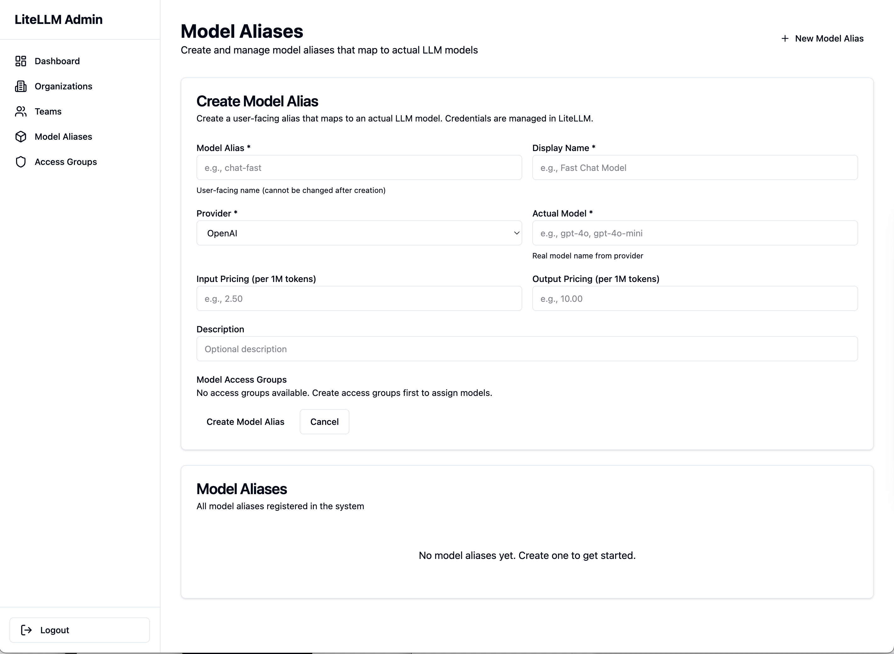

# Model Aliases

Configure simple, friendly names for the 100+ LLM models available through LiteLLM.

## What are Model Aliases?

**Model Aliases** are simple names that map to actual LLM provider models. They allow you to:

- ✅ Hide complex provider-specific model names from clients
- ✅ Create consistent naming across providers
- ✅ Switch providers without changing client code
- ✅ Offer tiered model options (fast, balanced, smart)
- ✅ Control pricing and access per model

!!! info "Built on LiteLLM"
    [LiteLLM](https://docs.litellm.ai) supports 100+ LLM providers. Model aliases let you expose these models with simple, friendly names instead of provider-specific formats like `openai/gpt-4` or `anthropic/claude-3-opus-20240229`.

## How Model Aliases Work

```
Client Code         Alias           LiteLLM Model                Provider
-----------         -----           -------------                --------
model: "gpt-4"  →   gpt-4      →   openai/gpt-4            →   OpenAI API
model: "claude"  →   claude     →   anthropic/claude-3-opus →   Anthropic API
model: "smart"   →   smart      →   openai/gpt-4            →   OpenAI API
```

**Example Client Code:**
```python
# Client just uses simple alias
response = await client.chat(
    job_id=job_id,
    model="gpt-4",  # Simple, clean
    messages=[...]
)
```

**What Actually Happens:**
1. Client sends `model: "gpt-4"`
2. SaaS API looks up alias: `gpt-4` → `openai/gpt-4`
3. LiteLLM routes to OpenAI with model `gpt-4`
4. Response flows back to client

## Creating Model Aliases


*Model Aliases interface - create user-facing model names with pricing*

### Via Admin Dashboard

1. **Navigate to Model Aliases**
   - Click "Model Management" → "Aliases"
   - Click "Create Alias"

2. **Fill in Details**
   - **Alias**: Simple name (e.g., `gpt-4`)
   - **LiteLLM Model**: Provider/model format (e.g., `openai/gpt-4`)
   - **Description**: What this model is for
   - **Active**: Enable/disable alias

3. **Save**
   - Click "Create"
   - Alias is ready to use

### Via API

```bash
curl -X POST http://localhost:8003/api/model-aliases/create \
  -H "Content-Type: application/json" \
  -d '{
    "alias": "gpt-4",
    "litellm_model": "openai/gpt-4",
    "description": "OpenAI GPT-4 - Most capable model",
    "active": true
  }'
```

**Response:**
```json
{
  "alias": "gpt-4",
  "litellm_model": "openai/gpt-4",
  "description": "OpenAI GPT-4 - Most capable model",
  "active": true,
  "created_at": "2024-10-14T12:00:00Z"
}
```

## LiteLLM Model Format

Model aliases must map to valid LiteLLM model names:

**Format:** `provider/model-name`

### Common Providers

**OpenAI:**
```
openai/gpt-4
openai/gpt-4-turbo
openai/gpt-3.5-turbo
openai/gpt-4-vision-preview
```

**Anthropic:**
```
anthropic/claude-3-opus-20240229
anthropic/claude-3-sonnet-20240229
anthropic/claude-3-haiku-20240307
anthropic/claude-3-5-sonnet-20240620
```

**Google:**
```
gemini/gemini-pro
gemini/gemini-1.5-pro
gemini/gemini-1.5-flash
```

**Azure OpenAI:**
```
azure/gpt-4-deployment-name
azure/gpt-35-turbo-deployment-name
```

**AWS Bedrock:**
```
bedrock/anthropic.claude-3-opus-20240229-v1:0
bedrock/anthropic.claude-3-sonnet-20240229-v1:0
bedrock/meta.llama3-70b-instruct-v1:0
```

[:octicons-arrow-right-24: See all supported providers in LiteLLM docs](https://docs.litellm.ai/docs/providers)

## Alias Naming Strategies

### Strategy 1: Provider-Based Naming

Keep provider in the alias name:

```json
[
  {"alias": "openai-gpt4", "litellm_model": "openai/gpt-4"},
  {"alias": "openai-gpt35", "litellm_model": "openai/gpt-3.5-turbo"},
  {"alias": "claude-opus", "litellm_model": "anthropic/claude-3-opus-20240229"},
  {"alias": "claude-sonnet", "litellm_model": "anthropic/claude-3-sonnet-20240229"},
  {"alias": "gemini-pro", "litellm_model": "gemini/gemini-pro"}
]
```

**Pros:**
- Clear which provider is being used
- Easy to understand
- Simple mapping

**Cons:**
- Harder to switch providers later
- Clients know provider details

### Strategy 2: Generic/Abstract Naming

Hide provider details with abstract names:

```json
[
  {"alias": "smart", "litellm_model": "openai/gpt-4"},
  {"alias": "balanced", "litellm_model": "openai/gpt-4-turbo"},
  {"alias": "fast", "litellm_model": "openai/gpt-3.5-turbo"},
  {"alias": "vision", "litellm_model": "openai/gpt-4-vision-preview"}
]
```

**Pros:**
- Can switch providers transparently
- Simple, memorable names
- Provider-agnostic

**Cons:**
- Less clear what model is actually used
- May need documentation

### Strategy 3: Tiered Naming

Name by capability/price tier:

```json
[
  {"alias": "basic", "litellm_model": "openai/gpt-3.5-turbo"},
  {"alias": "professional", "litellm_model": "openai/gpt-4-turbo"},
  {"alias": "enterprise", "litellm_model": "openai/gpt-4"},
  {"alias": "premium", "litellm_model": "anthropic/claude-3-opus-20240229"}
]
```

**Pros:**
- Maps to pricing plans
- Easy for clients to choose
- Clear value proposition

**Cons:**
- Clients don't know actual model
- May limit flexibility

### Strategy 4: Use Case Naming

Name by intended application:

```json
[
  {"alias": "chat", "litellm_model": "openai/gpt-3.5-turbo"},
  {"alias": "analysis", "litellm_model": "openai/gpt-4"},
  {"alias": "creative", "litellm_model": "anthropic/claude-3-opus-20240229"},
  {"alias": "code", "litellm_model": "openai/gpt-4"},
  {"alias": "vision", "litellm_model": "openai/gpt-4-vision-preview"}
]
```

**Pros:**
- Guides clients to right model
- Self-documenting
- Clear purpose

**Cons:**
- Same model may appear multiple times
- Can be confusing

### Recommended: Hybrid Approach

Combine strategies for clarity and flexibility:

```json
[
  // Standard names (most common)
  {"alias": "gpt-4", "litellm_model": "openai/gpt-4"},
  {"alias": "gpt-3.5-turbo", "litellm_model": "openai/gpt-3.5-turbo"},
  {"alias": "claude-3-opus", "litellm_model": "anthropic/claude-3-opus-20240229"},
  {"alias": "claude-3-sonnet", "litellm_model": "anthropic/claude-3-sonnet-20240229"},

  // Convenience aliases
  {"alias": "fast", "litellm_model": "openai/gpt-3.5-turbo"},
  {"alias": "smart", "litellm_model": "openai/gpt-4"},

  // Use case aliases
  {"alias": "vision", "litellm_model": "openai/gpt-4-vision-preview"}
]
```

## Common Model Alias Setups

### Setup 1: OpenAI Only

```bash
# GPT-4
curl -X POST http://localhost:8003/api/model-aliases/create \
  -d '{
    "alias": "gpt-4",
    "litellm_model": "openai/gpt-4",
    "description": "Most capable GPT-4 model"
  }'

# GPT-4 Turbo
curl -X POST http://localhost:8003/api/model-aliases/create \
  -d '{
    "alias": "gpt-4-turbo",
    "litellm_model": "openai/gpt-4-turbo",
    "description": "Faster and cheaper GPT-4"
  }'

# GPT-3.5 Turbo
curl -X POST http://localhost:8003/api/model-aliases/create \
  -d '{
    "alias": "gpt-3.5-turbo",
    "litellm_model": "openai/gpt-3.5-turbo",
    "description": "Fast and efficient for most tasks"
  }'
```

### Setup 2: Multi-Provider

```bash
# OpenAI GPT-4
curl -X POST http://localhost:8003/api/model-aliases/create \
  -d '{
    "alias": "gpt-4",
    "litellm_model": "openai/gpt-4",
    "description": "OpenAI GPT-4"
  }'

# Anthropic Claude 3 Opus
curl -X POST http://localhost:8003/api/model-aliases/create \
  -d '{
    "alias": "claude-3-opus",
    "litellm_model": "anthropic/claude-3-opus-20240229",
    "description": "Claude 3 Opus - Most capable Claude model"
  }'

# Google Gemini Pro
curl -X POST http://localhost:8003/api/model-aliases/create \
  -d '{
    "alias": "gemini-pro",
    "litellm_model": "gemini/gemini-pro",
    "description": "Google Gemini Pro"
  }'
```

### Setup 3: Tiered Models

```bash
# Basic Tier
curl -X POST http://localhost:8003/api/model-aliases/create \
  -d '{
    "alias": "basic",
    "litellm_model": "openai/gpt-3.5-turbo",
    "description": "Fast, cost-effective model"
  }'

# Professional Tier
curl -X POST http://localhost:8003/api/model-aliases/create \
  -d '{
    "alias": "pro",
    "litellm_model": "openai/gpt-4-turbo",
    "description": "Balanced performance and cost"
  }'

# Enterprise Tier
curl -X POST http://localhost:8003/api/model-aliases/create \
  -d '{
    "alias": "enterprise",
    "litellm_model": "openai/gpt-4",
    "description": "Most capable model"
  }'
```

## Managing Model Aliases

### List All Aliases

```bash
curl http://localhost:8003/api/model-aliases
```

**Response:**
```json
{
  "aliases": [
    {
      "alias": "gpt-4",
      "litellm_model": "openai/gpt-4",
      "description": "Most capable GPT-4 model",
      "active": true,
      "usage_count": 1543
    },
    {
      "alias": "claude-3-opus",
      "litellm_model": "anthropic/claude-3-opus-20240229",
      "description": "Claude 3 Opus",
      "active": true,
      "usage_count": 892
    }
  ]
}
```

### View Alias Details

```bash
curl http://localhost:8003/api/model-aliases/gpt-4
```

**Response:**
```json
{
  "alias": "gpt-4",
  "litellm_model": "openai/gpt-4",
  "description": "Most capable GPT-4 model",
  "active": true,
  "access_groups": ["gpt-models", "premium-models"],
  "teams_with_access": 15,
  "usage_stats": {
    "total_calls": 1543,
    "total_cost_usd": 234.56,
    "avg_tokens_per_call": 850
  }
}
```

### Update Alias

```bash
curl -X PUT http://localhost:8003/api/model-aliases/gpt-4 \
  -H "Content-Type: application/json" \
  -d '{
    "description": "OpenAI GPT-4 - Most capable model (updated)",
    "active": true
  }'
```

### Disable Alias

Temporarily disable without deleting:

```bash
curl -X PUT http://localhost:8003/api/model-aliases/old-model \
  -d '{
    "active": false
  }'
```

When disabled:
- Teams can't use this model
- API returns error if requested
- Alias stays in system for future re-enabling

### Delete Alias

!!! danger "Warning"
    Deleting an alias removes it from all access groups. Teams using this alias will lose access.

```bash
curl -X DELETE http://localhost:8003/api/model-aliases/deprecated-model
```

## Switching Providers

One powerful use of aliases: switch providers without changing client code.

### Example: Switch from OpenAI to Anthropic

**Initial Setup:**
```bash
curl -X POST http://localhost:8003/api/model-aliases/create \
  -d '{
    "alias": "smart",
    "litellm_model": "openai/gpt-4",
    "description": "Smart model for complex tasks"
  }'
```

**Clients use it:**
```python
response = await client.chat(
    job_id=job_id,
    model="smart",  # Points to GPT-4
    messages=[...]
)
```

**Later: Switch to Claude without client changes:**
```bash
curl -X PUT http://localhost:8003/api/model-aliases/smart \
  -d '{
    "litellm_model": "anthropic/claude-3-opus-20240229",
    "description": "Smart model for complex tasks (now using Claude)"
  }'
```

**Clients still use same code:**
```python
response = await client.chat(
    job_id=job_id,
    model="smart",  # Now points to Claude 3 Opus!
    messages=[...]
)
```

## Adding New Models

When a new model is released:

### 1. Check LiteLLM Support

Verify the model is supported:
- Check [LiteLLM providers documentation](https://docs.litellm.ai/docs/providers)
- Look for model format (e.g., `openai/gpt-4o`)

### 2. Add API Keys (if new provider)

If it's a new provider, add credentials to LiteLLM config:

```yaml
# litellm_config.yaml
model_list:
  - model_name: gpt-4o
    litellm_params:
      model: openai/gpt-4o
      api_key: os.environ/OPENAI_API_KEY
```

### 3. Create Model Alias

```bash
curl -X POST http://localhost:8003/api/model-aliases/create \
  -d '{
    "alias": "gpt-4o",
    "litellm_model": "openai/gpt-4o",
    "description": "GPT-4 Omni - Latest OpenAI model"
  }'
```

### 4. Add to Access Groups

```bash
curl -X POST http://localhost:8003/api/model-access-groups/gpt-models/add-models \
  -d '{
    "model_aliases": ["gpt-4o"]
  }'
```

### 5. Notify Teams

Inform clients about new model availability:
```
New Model Available: gpt-4o

We've added OpenAI's latest GPT-4 Omni model to your available models.

To use it, simply specify: model="gpt-4o" in your API calls.

Benefits:
- Faster response times
- Improved reasoning
- Better at complex tasks

Try it today!
```

## Complete Client Onboarding Example

```bash
# 1. Create model aliases
curl -X POST http://localhost:8003/api/model-aliases/create \
  -d '{
    "alias": "gpt-4",
    "litellm_model": "openai/gpt-4",
    "description": "GPT-4 for complex tasks"
  }'

curl -X POST http://localhost:8003/api/model-aliases/create \
  -d '{
    "alias": "gpt-3.5-turbo",
    "litellm_model": "openai/gpt-3.5-turbo",
    "description": "Fast model for simple tasks"
  }'

# 2. Create access group
curl -X POST http://localhost:8003/api/model-access-groups/create \
  -d '{
    "group_name": "starter-models",
    "description": "Models for starter plan",
    "model_aliases": ["gpt-3.5-turbo"]
  }'

# 3. Create organization
curl -X POST http://localhost:8003/api/organizations/create \
  -d '{
    "organization_id": "org_newclient",
    "name": "New Client Inc"
  }'

# 4. Create team
curl -X POST http://localhost:8003/api/teams/create \
  -d '{
    "organization_id": "org_newclient",
    "team_id": "newclient-prod",
    "team_alias": "Production",
    "access_groups": ["starter-models"],
    "credits_allocated": 1000
  }'

# 5. Client can now use model aliases
# In their code: model="gpt-3.5-turbo"
```

## Best Practices

### Naming

1. **Use Standard Names When Possible**
   - `gpt-4`, `claude-3-opus`, `gemini-pro`
   - Familiar to developers
   - Easy to remember

2. **Be Consistent**
   - If you use hyphens, use them everywhere
   - Stick to lowercase
   - Follow a naming pattern

3. **Avoid Version Numbers in Aliases**
   ```bash
   # ❌ Bad: Hard to maintain
   alias: "gpt-4-0613"

   # ✅ Good: Can update underlying model
   alias: "gpt-4"
   litellm_model: "openai/gpt-4-0613"
   ```

### Organization

1. **Group Related Models**
   - All OpenAI models together
   - All fast models together
   - All vision models together

2. **Use Descriptions**
   - Explain what the model is good for
   - Mention speed/cost trade-offs
   - Note any special capabilities

3. **Track Usage**
   - Monitor which models are popular
   - Identify underused models
   - Optimize based on actual usage

### Maintenance

1. **Regular Updates**
   - Update to newer model versions
   - Deprecate old models gradually
   - Test new models before rolling out

2. **Communicate Changes**
   - Notify teams before removing models
   - Provide migration guides
   - Offer grace periods

3. **Monitor Costs**
   - Track spend per model
   - Identify expensive models
   - Adjust pricing if needed

## Troubleshooting

### Invalid Model Error

**Problem:** "Model not found" or "Invalid model"

**Solutions:**
1. Verify alias exists:
   ```bash
   curl http://localhost:8003/api/model-aliases/gpt-4
   ```

2. Check alias is active:
   ```bash
   curl http://localhost:8003/api/model-aliases/gpt-4
   # Should show "active": true
   ```

3. Verify team has access:
   ```bash
   curl http://localhost:8003/api/teams/acme-prod
   # Check access_groups include group with this model
   ```

### LiteLLM Routing Error

**Problem:** "Provider authentication failed" or routing error

**Solutions:**
1. Check LiteLLM config has provider credentials
2. Verify litellm_model format is correct
3. Test model directly via LiteLLM:
   ```bash
   curl http://localhost:8002/chat/completions \
     -d '{"model": "openai/gpt-4", "messages": [...]}'
   ```

### Alias Already Exists

**Problem:** "Alias already exists"

**Solutions:**
1. Use different alias name
2. Update existing alias instead:
   ```bash
   curl -X PUT http://localhost:8003/api/model-aliases/gpt-4 \
     -d '{"litellm_model": "openai/gpt-4-turbo"}'
   ```

## Next Steps

Now that you understand model aliases:

1. **[Create Access Groups](model-access-groups.md)** - Group aliases for team access
2. **[Assign to Teams](teams.md)** - Give teams access to models
3. **[Monitor Usage](monitoring.md)** - Track which models are used
4. **[Review LiteLLM Docs](https://docs.litellm.ai/docs/providers)** - See all supported models

## Quick Reference

### Create Alias
```bash
POST /api/model-aliases/create
{
  "alias": "gpt-4",
  "litellm_model": "openai/gpt-4",
  "description": "GPT-4 model",
  "active": true
}
```

### List Aliases
```bash
GET /api/model-aliases
```

### Update Alias
```bash
PUT /api/model-aliases/{alias}
{
  "description": "Updated description",
  "litellm_model": "openai/gpt-4-turbo"
}
```

### Disable Alias
```bash
PUT /api/model-aliases/{alias}
{
  "active": false
}
```

### Delete Alias
```bash
DELETE /api/model-aliases/{alias}
```
