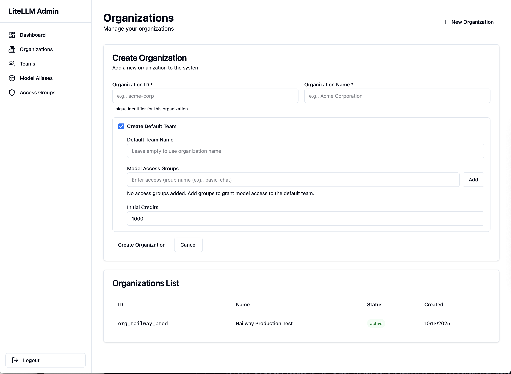

# Organizations

Learn how to create and manage organizations in the SaaS LiteLLM platform.

## What are Organizations?

**Organizations** are the top-level entity in the SaaS LiteLLM hierarchy. They represent your customers, clients, or business units.

**Hierarchy:**
```
Organization
  └── Teams
       └── Model Access Groups
            └── Model Aliases
```

**Key Concepts:**
- One organization can have multiple teams
- Organizations provide logical grouping
- Usage can be tracked per organization
- Billing is typically done at the organization level

## Organization Structure

### Organization Properties

| Property | Type | Description |
|----------|------|-------------|
| `organization_id` | string | Unique identifier (e.g., "org_acme") |
| `name` | string | Display name (e.g., "ACME Corporation") |
| `metadata` | object | Custom data (industry, tier, etc.) |
| `created_at` | timestamp | When organization was created |
| `status` | string | active, suspended |

### Example Organization

```json
{
  "organization_id": "org_acme",
  "name": "ACME Corporation",
  "metadata": {
    "industry": "Technology",
    "tier": "Enterprise",
    "account_manager": "jane@yourcompany.com",
    "billing_email": "billing@acme.com"
  },
  "created_at": "2024-10-14T12:00:00Z",
  "status": "active"
}
```

## Creating Organizations


*Organizations management interface - create and manage customer organizations*

### Via Admin Dashboard

1. **Navigate to Organizations**
   - Click "Organizations" in the sidebar
   - Click "Create Organization" button

2. **Fill in Details**
   - **Organization ID**: Unique identifier (lowercase, hyphens, e.g., "org-acme")
   - **Name**: Display name (e.g., "ACME Corporation")
   - **Metadata** (optional): Add custom fields

3. **Save**
   - Click "Create"
   - Organization is created immediately

### Via API

```bash
curl -X POST http://localhost:8003/api/organizations/create \
  -H "Content-Type: application/json" \
  -d '{
    "organization_id": "org_acme",
    "name": "ACME Corporation",
    "metadata": {
      "industry": "Technology",
      "tier": "Enterprise"
    }
  }'
```

**Response:**
```json
{
  "organization_id": "org_acme",
  "name": "ACME Corporation",
  "metadata": {
    "industry": "Technology",
    "tier": "Enterprise"
  },
  "created_at": "2024-10-14T12:00:00Z",
  "status": "active"
}
```

### Naming Conventions

**Organization ID Best Practices:**

✅ **Good:**
- `org_acme`
- `org-acme-corp`
- `acme_corporation`

❌ **Avoid:**
- `ACME Corp` (spaces)
- `org/acme` (special characters)
- `123acme` (starting with numbers)

**Recommendations:**
- Use prefix like `org_` for clarity
- Use lowercase
- Use hyphens or underscores for spaces
- Keep it short but descriptive
- Make it URL-safe

## Viewing Organizations

### List All Organizations

**Via Dashboard:**
- Navigate to Organizations
- See table with all organizations
- Search by name or ID
- Filter by status

**Via API:**
```bash
curl http://localhost:8003/api/organizations
```

**Response:**
```json
{
  "organizations": [
    {
      "organization_id": "org_acme",
      "name": "ACME Corporation",
      "team_count": 5,
      "total_credits_allocated": 10000,
      "status": "active"
    },
    {
      "organization_id": "org_techco",
      "name": "TechCo Inc",
      "team_count": 2,
      "total_credits_allocated": 5000,
      "status": "active"
    }
  ]
}
```

### View Organization Details

**Via Dashboard:**
- Click on organization name
- See full details including:
  - All teams in organization
  - Total credits allocated
  - Usage statistics
  - Recent activity

**Via API:**
```bash
curl http://localhost:8003/api/organizations/org_acme
```

**Response:**
```json
{
  "organization_id": "org_acme",
  "name": "ACME Corporation",
  "metadata": {
    "industry": "Technology",
    "tier": "Enterprise"
  },
  "teams": [
    {
      "team_id": "acme-dev",
      "team_alias": "ACME Dev Team",
      "credits_remaining": 850,
      "status": "active"
    },
    {
      "team_id": "acme-prod",
      "team_alias": "ACME Production",
      "credits_remaining": 1200,
      "status": "active"
    }
  ],
  "usage_summary": {
    "total_jobs": 1543,
    "total_cost_usd": 234.56,
    "credits_used": 1543
  }
}
```

## Managing Organizations

### Update Organization

**Via Dashboard:**
- Click organization name
- Click "Edit"
- Update name or metadata
- Click "Save"

**Via API:**
```bash
curl -X PUT http://localhost:8003/api/organizations/org_acme \
  -H "Content-Type: application/json" \
  -d '{
    "name": "ACME Corporation (Updated)",
    "metadata": {
      "industry": "Technology",
      "tier": "Enterprise Plus",
      "renewal_date": "2025-01-01"
    }
  }'
```

### Organization Metadata

Use metadata to store custom information:

```json
{
  "metadata": {
    // Billing
    "tier": "Enterprise",
    "billing_email": "billing@acme.com",
    "payment_method": "invoice",
    "renewal_date": "2025-01-01",

    // Account Management
    "account_manager": "jane@yourcompany.com",
    "sales_rep": "john@yourcompany.com",
    "support_tier": "premium",

    // Business Info
    "industry": "Technology",
    "company_size": "500-1000",
    "country": "United States",

    // Custom Fields
    "contract_id": "CONTRACT-2024-123",
    "notes": "High-value customer, priority support"
  }
}
```

## Organization Teams

### View Teams in Organization

**Via Dashboard:**
- Navigate to organization details
- See "Teams" section
- Click "View All Teams" for filtered team list

**Via API:**
```bash
curl http://localhost:8003/api/organizations/org_acme/teams
```

### Create Team in Organization

When creating a team, specify the organization_id:

```bash
curl -X POST http://localhost:8003/api/teams/create \
  -H "Content-Type: application/json" \
  -d '{
    "organization_id": "org_acme",
    "team_id": "acme-analytics",
    "team_alias": "ACME Analytics Team",
    "access_groups": ["gpt-models"],
    "credits_allocated": 1000
  }'
```

[:octicons-arrow-right-24: Learn more about creating teams](teams.md)

## Organization Usage & Analytics

### Usage Statistics

Track usage across all teams in an organization:

**Metrics Available:**
- Total jobs completed
- Total API calls made
- Total tokens consumed
- Total cost in USD
- Credits used
- Average cost per job
- Usage by job type
- Usage by team

**Via API:**
```bash
curl "http://localhost:8003/api/organizations/org_acme/usage?period=2024-10"
```

**Response:**
```json
{
  "organization_id": "org_acme",
  "period": "2024-10",
  "summary": {
    "total_jobs": 1543,
    "successful_jobs": 1501,
    "failed_jobs": 42,
    "total_cost_usd": 234.56,
    "total_tokens": 2500000,
    "credits_used": 1543
  },
  "by_team": {
    "acme-dev": {
      "jobs": 843,
      "cost_usd": 120.34
    },
    "acme-prod": {
      "jobs": 700,
      "cost_usd": 114.22
    }
  },
  "by_job_type": {
    "document_analysis": {
      "count": 500,
      "cost_usd": 89.50
    },
    "chat_session": {
      "count": 1043,
      "cost_usd": 145.06
    }
  }
}
```

### Cost Tracking

Monitor costs at the organization level:

```bash
curl "http://localhost:8003/api/organizations/org_acme/costs?start_date=2024-10-01&end_date=2024-10-31"
```

**Track:**
- Actual costs (what you pay LiteLLM providers)
- Credits charged (what you charge the organization)
- Profit margins
- Cost trends over time

## Deleting Organizations

!!! danger "Permanent Action"
    Deleting an organization will also delete all teams and associated data. This action cannot be undone!

### Prerequisites

Before deleting an organization:

1. **Export data** if needed
2. **Notify teams** that access will be revoked
3. **Complete billing** if applicable
4. **Ensure no active jobs**

### Via Dashboard

1. Navigate to organization details
2. Scroll to bottom
3. Click "Delete Organization"
4. Type organization ID to confirm
5. Click "Confirm Delete"

### Via API

```bash
curl -X DELETE http://localhost:8003/api/organizations/org_acme \
  -H "Content-Type: application/json"
```

**What Gets Deleted:**
- Organization record
- All teams in the organization
- All virtual keys
- Job history (optional - can be archived)
- Usage statistics (optional - can be archived)

## Common Workflows

### Workflow 1: Onboard New Customer

```bash
# 1. Create organization
curl -X POST http://localhost:8003/api/organizations/create \
  -H "Content-Type: application/json" \
  -d '{
    "organization_id": "org_newcustomer",
    "name": "New Customer Inc",
    "metadata": {
      "tier": "Standard",
      "billing_email": "billing@newcustomer.com"
    }
  }'

# 2. Create initial team
curl -X POST http://localhost:8003/api/teams/create \
  -H "Content-Type: application/json" \
  -d '{
    "organization_id": "org_newcustomer",
    "team_id": "newcustomer-prod",
    "team_alias": "Production Team",
    "access_groups": ["gpt-models"],
    "credits_allocated": 1000
  }'

# 3. Share virtual key with customer
# (Retrieved from team creation response)
```

### Workflow 2: Upgrade Organization Tier

```bash
# Update organization metadata
curl -X PUT http://localhost:8003/api/organizations/org_acme \
  -H "Content-Type: application/json" \
  -d '{
    "name": "ACME Corporation",
    "metadata": {
      "tier": "Enterprise Plus",
      "upgraded_at": "2024-10-14"
    }
  }'

# Add credits to all teams
# (Done individually per team or via bulk operation)
```

### Workflow 3: Offboard Customer

```bash
# 1. Suspend all teams
curl -X POST http://localhost:8003/api/teams/acme-dev/suspend
curl -X POST http://localhost:8003/api/teams/acme-prod/suspend

# 2. Export usage data for final billing
curl "http://localhost:8003/api/organizations/org_acme/usage?period=all" > acme_usage.json

# 3. Delete organization (after grace period)
curl -X DELETE http://localhost:8003/api/organizations/org_acme
```

## Best Practices

### Naming

1. **Use consistent prefixes**: `org_` for all organizations
2. **Keep it short**: Easier to reference in logs and code
3. **Use descriptive names**: Helps identify customer quickly
4. **Avoid PII**: Don't use customer email or personal data

### Metadata

1. **Store billing info**: Contact, payment method, renewal dates
2. **Track account management**: Who manages this account internally
3. **Business classification**: Industry, size, tier
4. **Custom fields**: Contract IDs, notes, tags

### Organization Management

1. **Review usage monthly**: Check which organizations are heavy users
2. **Monitor growth**: Track team count over time
3. **Identify opportunities**: Upgrade candidates, upsell potential
4. **Clean up**: Archive or delete inactive organizations

## Troubleshooting

### Can't Create Organization

**Problem:** "Organization ID already exists"

**Solution:** Choose a different organization_id. Each must be unique.

### Can't Delete Organization

**Problem:** "Organization has active teams"

**Solution:** Delete or suspend all teams first, then delete organization.

### Missing Usage Data

**Problem:** Organization shows no usage statistics

**Solution:**
1. Check that teams have completed jobs
2. Verify database connection
3. Check date range filters
4. Ensure jobs completed (not just created)

## Next Steps

Now that you understand organizations:

1. **[Create Teams](teams.md)** - Add teams to your organization
2. **[Set Up Model Access](model-access-groups.md)** - Control which models teams can use
3. **[Allocate Credits](credits.md)** - Give teams credits to make API calls
4. **[Monitor Usage](monitoring.md)** - Track organization usage and costs
