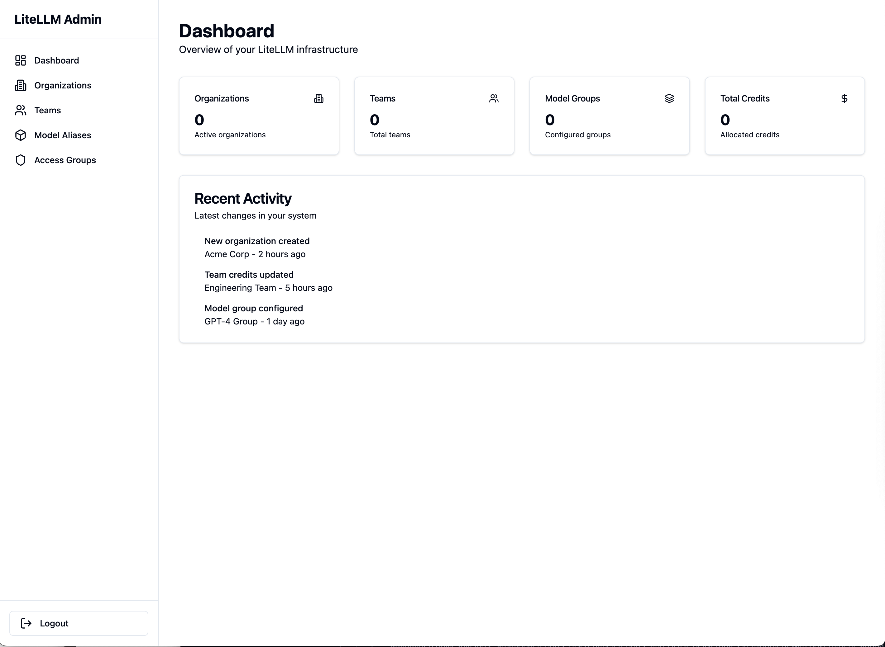
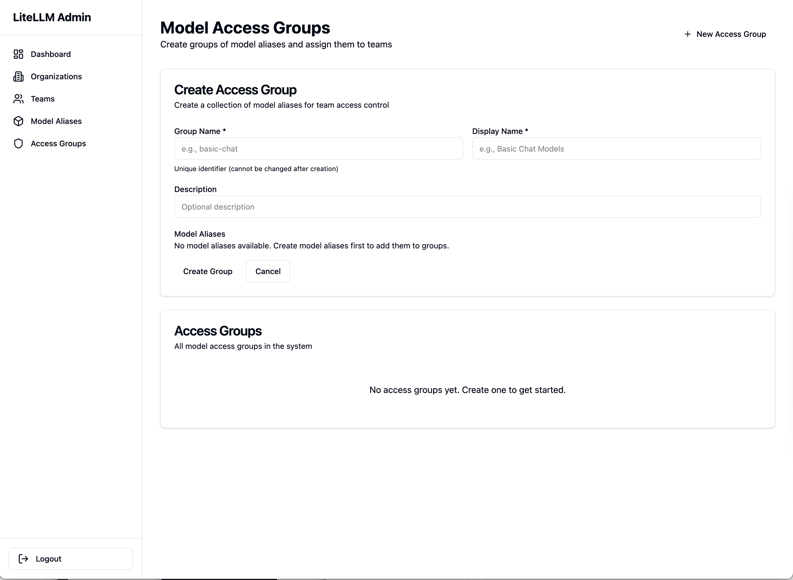
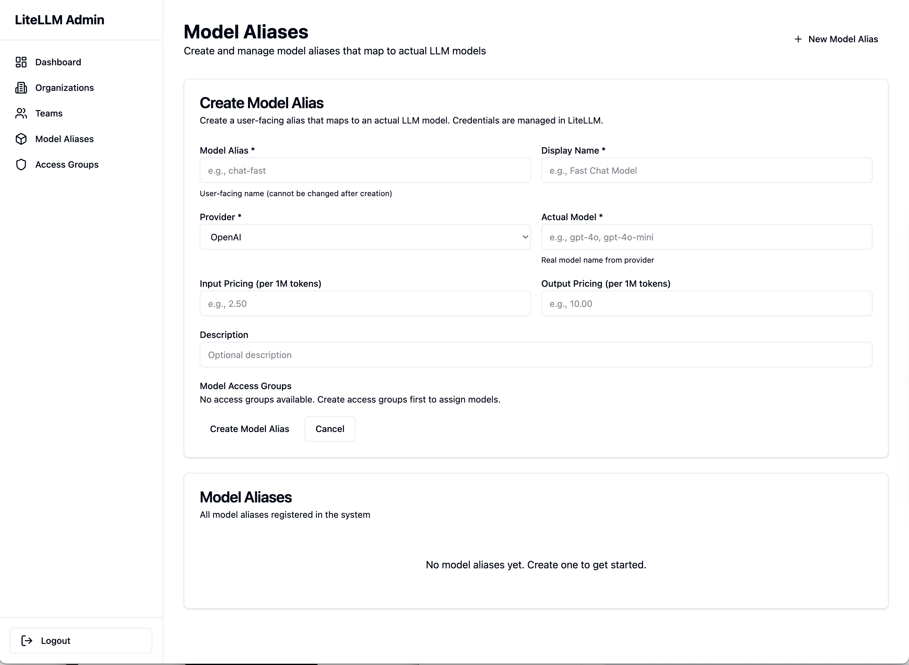

# Admin Dashboard Overview

The SaaS LiteLLM Admin Dashboard is a Next.js web application for managing your platform, organizations, teams, and model access.

## What is the Admin Dashboard?

The Admin Dashboard provides a user-friendly interface for platform administrators to:

- ✅ Create and manage organizations
- ✅ Create and manage teams with virtual keys
- ✅ Configure model access groups
- ✅ Define model aliases with pricing
- ✅ Allocate and monitor credits
- ✅ Suspend and resume teams
- ✅ Monitor usage and costs

**Access URL (Local):** http://localhost:3002

**Access URL (Production):** https://your-admin-dashboard.com

## Screenshots

### First-Time Setup

*Create your first admin account with the owner role*

### Dashboard Overview

*Monitor your LiteLLM infrastructure at a glance*

### Organizations Management

*Create and manage customer organizations*

### Teams Management

*Manage teams, credits, and virtual API keys*

### Model Access Groups

*Control which models teams can access*

### Model Aliases

*Create semantic model names with pricing configuration*

!!! info "Built on LiteLLM"
    The Admin Dashboard manages the SaaS layer built on top of [LiteLLM](https://docs.litellm.ai). It provides a UI for features like job-based cost tracking and multi-tenant architecture that SaaS LiteLLM adds to the core LiteLLM routing capabilities.

## Key Features

### 🏢 Organization Management
- Create top-level organizations
- Manage organization metadata
- View all teams in an organization
- Track organization-level usage

[:octicons-arrow-right-24: Learn more about organizations](organizations.md)

### 👥 Team Management
- Create teams within organizations
- Generate virtual API keys automatically
- Assign model access groups to teams
- Set credit allocations
- Suspend/resume teams
- View team statistics

[:octicons-arrow-right-24: Learn more about teams](teams.md)

### 🔐 Model Access Control
- Define model access groups (e.g., "gpt-models", "claude-models")
- Assign model aliases to access groups
- Control which teams can access which models
- Flexible permission system

[:octicons-arrow-right-24: Learn more about model access groups](model-access-groups.md)

### 🎯 Model Aliases
- Create semantic model names (e.g., "ChatAgent" → "gpt-4")
- Configure pricing per model (input/output tokens)
- Provider configuration
- Fallback routing

[:octicons-arrow-right-24: Learn more about model aliases](model-aliases.md)

### 💳 Credit Management
- Allocate credits to teams
- Monitor credit usage
- Track credit transactions
- Set budget modes (job-based, consumption-based)
- Low credit alerts

[:octicons-arrow-right-24: Learn more about credits](credits.md)

### 📊 Monitoring & Analytics
- Real-time usage statistics
- Cost tracking per team
- Job monitoring
- Team activity logs
- Usage trends

[:octicons-arrow-right-24: Learn more about monitoring](monitoring.md)

## Starting the Dashboard

### Local Development

```bash
cd admin-dashboard

# Install dependencies (first time only)
npm install

# Start development server
npm run dev
```

The dashboard will be available at: http://localhost:3002

### Production Deployment

Deploy to Vercel, Netlify, or any Node.js hosting:

```bash
# Build for production
npm run build

# Start production server
npm start
```

## Dashboard Architecture


**Components:**
- **Admin Dashboard (Next.js)** - Web UI on port 3002
- **SaaS API** - Backend REST API on port 8003
- **PostgreSQL** - Data storage

## Common Workflows

### Workflow 1: Onboard a New Customer

1. **Create Organization**
   - Navigate to Organizations → Create
   - Enter organization name and metadata
   - Save organization

2. **Create Model Access Group** (if needed)
   - Navigate to Model Access → Create Group
   - Define which models this customer can access
   - Assign model aliases

3. **Create Team**
   - Navigate to Teams → Create
   - Select the organization
   - Assign access groups
   - Allocate initial credits
   - Save and copy the virtual key

4. **Share Virtual Key**
   - Provide virtual key to customer securely
   - Customer can now make API calls

### Workflow 2: Monitor Team Usage

1. **View Team List**
   - Navigate to Teams
   - See all teams with current status

2. **Check Team Details**
   - Click on a team
   - View credits remaining
   - See recent jobs
   - Check usage statistics

3. **Add Credits** (if needed)
   - Click "Add Credits"
   - Enter amount
   - Confirm transaction

### Workflow 3: Suspend a Team

1. **Navigate to Team**
   - Find the team in Teams list
   - Click team name

2. **Suspend Team**
   - Click "Suspend" button
   - Confirm suspension
   - Team can no longer make API calls

3. **Resume Team** (when ready)
   - Click "Resume" button
   - Team access restored

[:octicons-arrow-right-24: Learn more about suspend/resume](suspend-pause.md)

## Dashboard Sections

### Organizations Section

**Path:** `/organizations`

- List all organizations
- Create new organizations
- View organization details
- List teams in organization
- Organization usage statistics

### Teams Section

**Path:** `/teams`

- List all teams
- Create new teams
- View team details
- Manage virtual keys
- Add/remove credits
- Suspend/resume teams
- View team usage

### Model Access Section

**Path:** `/model-access`

- List access groups
- Create access groups
- Assign model aliases
- Manage permissions

### Model Aliases Section

**Path:** `/model-aliases`

- List all model aliases
- Create new aliases
- Configure pricing
- Provider settings

### Monitoring Section

**Path:** `/monitoring`

- Dashboard overview
- Usage statistics
- Cost tracking
- Job monitoring
- Team activity

## Configuration

### Environment Variables

Create `.env.local` in the `admin-panel/` directory:

```bash
# SaaS API URL (required)
NEXT_PUBLIC_API_URL=http://localhost:8003

# Note: MASTER_KEY is entered by users at login,
# not stored in this file
```

### API Connection

The dashboard connects to the SaaS API to:
- Fetch data (organizations, teams, etc.)
- Create/update/delete resources
- Monitor usage and costs

All API calls are authenticated (implementation depends on your auth strategy).

## Security Considerations

### Authentication

The Admin Dashboard uses **MASTER_KEY authentication** to protect administrative endpoints.

**How it works:**
1. Users enter their MASTER_KEY on the login page
2. Dashboard validates key by making test request to `/api/model-groups`
3. Valid key is stored in localStorage
4. All API requests include `X-Admin-Key` header with the key

**Setting up:**

Local Development:
```bash
# .env
MASTER_KEY=sk-admin-local-dev-change-in-production
```

Production (Railway):
```bash
# Railway Variables
MASTER_KEY=sk-admin-GENERATE-SECURE-KEY-HERE
```

**Generate secure keys:**
```bash
openssl rand -hex 32
# Format: sk-admin-<generated-hex>
```

[:octicons-arrow-right-24: Full Authentication Guide](authentication.md)

### Network Security

**Production Best Practices:**

1. **HTTPS Only** - Always use HTTPS in production
2. **VPN Access** - Restrict dashboard to VPN network
3. **IP Whitelist** - Limit access to specific IPs
4. **Rate Limiting** - Prevent brute force attacks
5. **Audit Logging** - Log all admin actions
6. **CORS Configuration** - Add production admin panel URL to CORS

!!! tip "CORS Configuration Required"
    The admin panel is browser-based, so it requires CORS configuration in the SaaS API.

    You must add your production admin panel URL to the `allow_origins` list in `src/saas_api.py`.

    [:octicons-arrow-right-24: Learn how to configure CORS](../deployment/cors-and-authentication.md)

### Data Protection

- Don't expose virtual keys in logs
- Mask sensitive data in UI
- Implement RBAC if multiple admins
- Regular security audits

## Troubleshooting

### Dashboard Won't Start

**Problem:** `npm run dev` fails

**Solutions:**
```bash
# Clear node_modules and reinstall
rm -rf node_modules package-lock.json
npm install

# Check Node.js version (should be 16+)
node --version

# Try with clean cache
npm cache clean --force
npm install
```

### Can't Connect to API

**Problem:** Dashboard shows "API connection failed"

**Solutions:**
1. Verify SaaS API is running: `curl http://localhost:8003/health`
2. Check `NEXT_PUBLIC_API_URL` in `.env.local`
3. Check browser console for CORS errors
4. Verify firewall isn't blocking port 8003

### Data Not Loading

**Problem:** Lists show empty or "Loading..."

**Solutions:**
1. Check browser network tab for API errors
2. Verify database has data
3. Check SaaS API logs for errors
4. Ensure PostgreSQL is running

## Keyboard Shortcuts

| Shortcut | Action |
|----------|--------|
| `Ctrl/Cmd + K` | Search |
| `G + O` | Go to Organizations |
| `G + T` | Go to Teams |
| `G + M` | Go to Monitoring |
| `N` | Create New (on list pages) |
| `?` | Show help |

## Next Steps

Now that you understand the dashboard overview:

1. **[Set Up Organizations](organizations.md)** - Create your first organization
2. **[Create Teams](teams.md)** - Set up teams with virtual keys
3. **[Configure Model Access](model-access-groups.md)** - Control model access
4. **[Manage Credits](credits.md)** - Allocate credits to teams
5. **[Monitor Usage](monitoring.md)** - Track usage and costs

## Additional Resources

- **[API Reference](../api-reference/overview.md)** - Backend API documentation
- **[Integration Guide](../integration/overview.md)** - How teams integrate
- **[Troubleshooting](../testing/troubleshooting.md)** - Common issues
