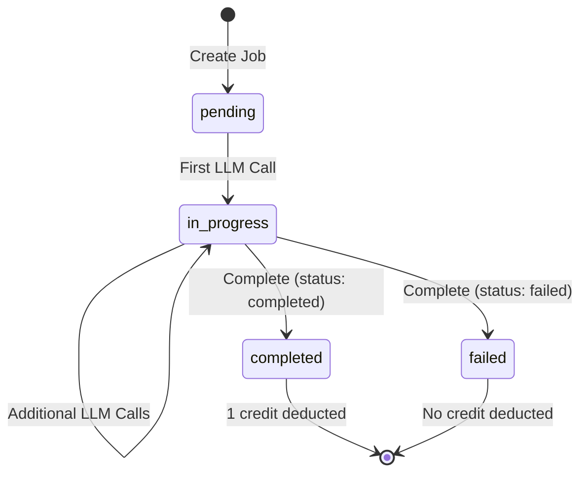

# Jobs API

The Jobs API provides endpoints for managing job lifecycle in the SaaS LiteLLM platform. Jobs are logical groupings of related LLM calls that represent a single business operation or workflow.

## Overview

Jobs enable simplified billing where 1 job = 1 credit, regardless of how many LLM calls are made within that job. This provides a business-centric approach to cost management.

**Base URL:** `/api/jobs`

**Authentication:** All endpoints require a Bearer token (virtual API key) in the `Authorization` header.

## Endpoints

### Create Job

Create a new job for tracking multiple LLM calls.

**Endpoint:** `POST /api/jobs/create`

**Authentication:** Required (virtual key)

**Request Body:**

```json
{
  "team_id": "string",
  "user_id": "string (optional)",
  "job_type": "string",
  "metadata": {
    "key": "value"
  }
}
```

**Request Fields:**

| Field | Type | Required | Description |
|-------|------|----------|-------------|
| `team_id` | string | Yes | Team identifier (must match authenticated team) |
| `user_id` | string | No | Optional user identifier for tracking |
| `job_type` | string | Yes | Type of job (e.g., "document_analysis", "chat_session") |
| `metadata` | object | No | Custom metadata for the job |

**Response (200 OK):**

```json
{
  "job_id": "550e8400-e29b-41d4-a716-446655440000",
  "status": "pending",
  "created_at": "2025-10-14T12:00:00.000Z"
}
```

**Response Fields:**

| Field | Type | Description |
|-------|------|-------------|
| `job_id` | string (UUID) | Unique identifier for the job |
| `status` | string | Initial status (always "pending") |
| `created_at` | string (ISO 8601) | Job creation timestamp |

**Example Request:**

=== "cURL"

    ```bash
    curl -X POST http://localhost:8003/api/jobs/create \
      -H "Authorization: Bearer sk-your-virtual-key" \
      -H "Content-Type: application/json" \
      -d '{
        "team_id": "acme-corp",
        "user_id": "john@acme.com",
        "job_type": "resume_analysis",
        "metadata": {
          "document_id": "doc_123",
          "document_name": "resume.pdf"
        }
      }'
    ```

=== "Python"

    ```python
    import requests

    API_URL = "http://localhost:8003/api"
    VIRTUAL_KEY = "sk-your-virtual-key"

    headers = {
        "Authorization": f"Bearer {VIRTUAL_KEY}",
        "Content-Type": "application/json"
    }

    response = requests.post(
        f"{API_URL}/jobs/create",
        headers=headers,
        json={
            "team_id": "acme-corp",
            "user_id": "john@acme.com",
            "job_type": "resume_analysis",
            "metadata": {
                "document_id": "doc_123",
                "document_name": "resume.pdf"
            }
        }
    )

    job = response.json()
    print(f"Created job: {job['job_id']}")
    ```

=== "JavaScript"

    ```javascript
    const API_URL = "http://localhost:8003/api";
    const VIRTUAL_KEY = "sk-your-virtual-key";

    const response = await fetch(`${API_URL}/jobs/create`, {
      method: 'POST',
      headers: {
        'Authorization': `Bearer ${VIRTUAL_KEY}`,
        'Content-Type': 'application/json'
      },
      body: JSON.stringify({
        team_id: 'acme-corp',
        user_id: 'john@acme.com',
        job_type: 'resume_analysis',
        metadata: {
          document_id: 'doc_123',
          document_name: 'resume.pdf'
        }
      })
    });

    const job = await response.json();
    console.log(`Created job: ${job.job_id}`);
    ```

**Error Responses:**

| Status Code | Error | Description |
|-------------|-------|-------------|
| 401 | Unauthorized | Invalid or missing virtual key |
| 403 | Forbidden | Virtual key does not belong to the specified team |
| 422 | Validation Error | Invalid request data |
| 500 | Internal Server Error | Server error |

**Example Error Response:**

```json
{
  "detail": "API key does not belong to team 'acme-corp'"
}
```

---

### Get Job

Retrieve details about a specific job.

**Endpoint:** `GET /api/jobs/{job_id}`

**Authentication:** Required (virtual key)

**Path Parameters:**

| Parameter | Type | Description |
|-----------|------|-------------|
| `job_id` | string (UUID) | The job identifier |

**Response (200 OK):**

```json
{
  "job_id": "550e8400-e29b-41d4-a716-446655440000",
  "team_id": "acme-corp",
  "user_id": "john@acme.com",
  "job_type": "resume_analysis",
  "status": "in_progress",
  "created_at": "2025-10-14T12:00:00.000Z",
  "started_at": "2025-10-14T12:00:05.000Z",
  "completed_at": null,
  "model_groups_used": ["ResumeAgent"],
  "credit_applied": false,
  "metadata": {
    "document_id": "doc_123",
    "document_name": "resume.pdf"
  }
}
```

**Response Fields:**

| Field | Type | Description |
|-------|------|-------------|
| `job_id` | string (UUID) | Unique job identifier |
| `team_id` | string | Team that owns this job |
| `user_id` | string | User who created the job (optional) |
| `job_type` | string | Type of job |
| `status` | string | Current status (pending, in_progress, completed, failed) |
| `created_at` | string (ISO 8601) | Job creation timestamp |
| `started_at` | string (ISO 8601) | When first LLM call was made (null if pending) |
| `completed_at` | string (ISO 8601) | When job was completed (null if not completed) |
| `model_groups_used` | array | List of model groups used in this job |
| `credit_applied` | boolean | Whether a credit was deducted for this job |
| `metadata` | object | Custom metadata |

**Example Request:**

=== "cURL"

    ```bash
    curl -X GET http://localhost:8003/api/jobs/550e8400-e29b-41d4-a716-446655440000 \
      -H "Authorization: Bearer sk-your-virtual-key"
    ```

=== "Python"

    ```python
    response = requests.get(
        f"{API_URL}/jobs/{job_id}",
        headers=headers
    )

    job = response.json()
    print(f"Job status: {job['status']}")
    ```

=== "JavaScript"

    ```javascript
    const response = await fetch(`${API_URL}/jobs/${jobId}`, {
      headers: {
        'Authorization': `Bearer ${VIRTUAL_KEY}`
      }
    });

    const job = await response.json();
    console.log(`Job status: ${job.status}`);
    ```

**Error Responses:**

| Status Code | Error | Description |
|-------------|-------|-------------|
| 401 | Unauthorized | Invalid or missing virtual key |
| 403 | Forbidden | Job does not belong to your team |
| 404 | Not Found | Job not found |

---

### Complete Job

Mark a job as complete and trigger credit deduction (if applicable).

**Endpoint:** `POST /api/jobs/{job_id}/complete`

**Authentication:** Required (virtual key)

**Path Parameters:**

| Parameter | Type | Description |
|-----------|------|-------------|
| `job_id` | string (UUID) | The job identifier |

**Request Body:**

```json
{
  "status": "completed",
  "metadata": {
    "result": "success",
    "output_file": "analysis_123.json"
  },
  "error_message": "Optional error message if status is 'failed'"
}
```

**Request Fields:**

| Field | Type | Required | Description |
|-------|------|----------|-------------|
| `status` | string | Yes | Job final status: "completed" or "failed" |
| `metadata` | object | No | Additional metadata to merge with existing metadata |
| `error_message` | string | No | Error message (only if status is "failed") |

**Response (200 OK):**

```json
{
  "job_id": "550e8400-e29b-41d4-a716-446655440000",
  "status": "completed",
  "completed_at": "2025-10-14T12:05:23.000Z",
  "costs": {
    "total_calls": 3,
    "successful_calls": 3,
    "failed_calls": 0,
    "total_tokens": 1350,
    "total_cost_usd": 0.0045,
    "avg_latency_ms": 1200,
    "credit_applied": true,
    "credits_remaining": 999
  },
  "calls": [
    {
      "call_id": "call-uuid-1",
      "purpose": "parse",
      "model_group": "ResumeAgent",
      "tokens": 450,
      "latency_ms": 1250,
      "error": null
    },
    {
      "call_id": "call-uuid-2",
      "purpose": "analyze",
      "model_group": "ResumeAgent",
      "tokens": 480,
      "latency_ms": 1180,
      "error": null
    },
    {
      "call_id": "call-uuid-3",
      "purpose": "summarize",
      "model_group": "ResumeAgent",
      "tokens": 420,
      "latency_ms": 1170,
      "error": null
    }
  ]
}
```

**Response Fields:**

| Field | Type | Description |
|-------|------|-------------|
| `job_id` | string (UUID) | Job identifier |
| `status` | string | Final job status |
| `completed_at` | string (ISO 8601) | Completion timestamp |
| `costs` | object | Aggregated cost information |
| `costs.total_calls` | integer | Total number of LLM calls |
| `costs.successful_calls` | integer | Number of successful calls |
| `costs.failed_calls` | integer | Number of failed calls |
| `costs.total_tokens` | integer | Total tokens used across all calls |
| `costs.total_cost_usd` | number | Total cost in USD (for internal tracking) |
| `costs.avg_latency_ms` | integer | Average latency in milliseconds |
| `costs.credit_applied` | boolean | Whether a credit was deducted |
| `costs.credits_remaining` | integer | Credits remaining for the team |
| `calls` | array | List of all LLM calls made in this job |

**Example Request:**

=== "cURL"

    ```bash
    curl -X POST http://localhost:8003/api/jobs/550e8400-e29b-41d4-a716-446655440000/complete \
      -H "Authorization: Bearer sk-your-virtual-key" \
      -H "Content-Type: application/json" \
      -d '{
        "status": "completed",
        "metadata": {
          "result": "success",
          "output_file": "analysis_123.json"
        }
      }'
    ```

=== "Python"

    ```python
    response = requests.post(
        f"{API_URL}/jobs/{job_id}/complete",
        headers=headers,
        json={
            "status": "completed",
            "metadata": {
                "result": "success",
                "output_file": "analysis_123.json"
            }
        }
    )

    result = response.json()
    print(f"Total calls: {result['costs']['total_calls']}")
    print(f"Total cost: ${result['costs']['total_cost_usd']:.4f}")
    print(f"Credit deducted: {result['costs']['credit_applied']}")
    print(f"Credits remaining: {result['costs']['credits_remaining']}")
    ```

=== "JavaScript"

    ```javascript
    const response = await fetch(`${API_URL}/jobs/${jobId}/complete`, {
      method: 'POST',
      headers: {
        'Authorization': `Bearer ${VIRTUAL_KEY}`,
        'Content-Type': 'application/json'
      },
      body: JSON.stringify({
        status: 'completed',
        metadata: {
          result: 'success',
          output_file: 'analysis_123.json'
        }
      })
    });

    const result = await response.json();
    console.log(`Total calls: ${result.costs.total_calls}`);
    console.log(`Credit deducted: ${result.costs.credit_applied}`);
    console.log(`Credits remaining: ${result.costs.credits_remaining}`);
    ```

**Credit Deduction Rules:**

Credits are ONLY deducted when ALL of these conditions are met:

1. Job status is "completed" (not "failed")
2. All LLM calls succeeded (no failed calls)
3. Credit hasn't already been applied

**Example: Completing Failed Job (No Credit Deduction):**

```bash
curl -X POST http://localhost:8003/api/jobs/{job_id}/complete \
  -H "Authorization: Bearer sk-your-virtual-key" \
  -H "Content-Type: application/json" \
  -d '{
    "status": "failed",
    "error_message": "Document parsing failed",
    "metadata": {
      "error_type": "ParsingError"
    }
  }'
```

**Error Responses:**

| Status Code | Error | Description |
|-------------|-------|-------------|
| 401 | Unauthorized | Invalid or missing virtual key |
| 403 | Forbidden | Job does not belong to your team |
| 404 | Not Found | Job not found |
| 422 | Validation Error | Invalid status value |

---

### Single-Call Job (Create, Call, and Complete)

Create a job, make a single LLM call, and complete the job in one request. This is a convenience endpoint for simple workflows that only need one LLM call.

**Endpoint:** `POST /api/jobs/create-and-call`

**Authentication:** Required (virtual key)

**Performance Benefits:**
- ~66% latency reduction (1 API call vs 3)
- Single network round-trip
- Automatic job lifecycle management

**Request Body:**

```json
{
  "team_id": "acme-corp",
  "job_type": "chat_response",
  "model": "gpt-4",
  "messages": [
    {
      "role": "user",
      "content": "What is Python?"
    }
  ],
  "user_id": "optional-user-id",
  "job_metadata": {
    "session_id": "sess_123"
  },
  "purpose": "chat",
  "temperature": 0.7,
  "max_tokens": 500
}
```

**Request Fields:**

| Field | Type | Required | Description |
|-------|------|----------|-------------|
| `team_id` | string | Yes | Team identifier (must match authenticated team) |
| `job_type` | string | Yes | Type of job (e.g., "chat_response", "text_generation") |
| `model` | string | Yes | Model alias or model group name |
| `messages` | array | Yes | OpenAI-compatible messages array |
| `user_id` | string | No | Optional user identifier for tracking |
| `job_metadata` | object | No | Custom metadata for the job |
| `purpose` | string | No | Optional label for the LLM call (e.g., "chat", "generation") |
| `temperature` | number | No | Sampling temperature (0.0-2.0, default: 0.7) |
| `max_tokens` | integer | No | Maximum tokens to generate |
| `response_format` | object | No | Structured output format (e.g., {"type": "json_object"}) |
| `tools` | array | No | Function calling tools |
| `tool_choice` | any | No | Tool choice strategy ("auto", "none", or specific tool) |
| `top_p` | number | No | Nucleus sampling parameter |
| `frequency_penalty` | number | No | Frequency penalty (-2.0 to 2.0) |
| `presence_penalty` | number | No | Presence penalty (-2.0 to 2.0) |
| `stop` | array | No | Stop sequences |

**Response (200 OK):**

```json
{
  "job_id": "550e8400-e29b-41d4-a716-446655440000",
  "status": "completed",
  "response": {
    "content": "Python is a high-level programming language...",
    "finish_reason": "stop"
  },
  "metadata": {
    "tokens_used": 256,
    "latency_ms": 1340,
    "model": "gpt-4"
  },
  "costs": {
    "total_calls": 1,
    "successful_calls": 1,
    "failed_calls": 0,
    "total_tokens": 256,
    "total_cost_usd": 0.0128,
    "avg_latency_ms": 1340,
    "credit_applied": true,
    "credits_remaining": 999
  },
  "completed_at": "2025-10-14T12:00:05.340Z"
}
```

**Response Fields:**

| Field | Type | Description |
|-------|------|-------------|
| `job_id` | string (UUID) | Unique job identifier |
| `status` | string | Always "completed" for successful calls |
| `response.content` | string | The generated response content |
| `response.finish_reason` | string | Why generation stopped: "stop", "length", or "content_filter" |
| `metadata.tokens_used` | integer | Total tokens used (prompt + completion) |
| `metadata.latency_ms` | integer | Call latency in milliseconds |
| `metadata.model` | string | Model alias or group that was requested |
| `costs` | object | Aggregated cost information |
| `costs.credit_applied` | boolean | Whether a credit was deducted (always true for successful calls) |
| `costs.credits_remaining` | integer | Credits remaining for the team |
| `completed_at` | string (ISO 8601) | Job completion timestamp |

**Example Request:**

=== "cURL"

    ```bash
    curl -X POST http://localhost:8003/api/jobs/create-and-call \
      -H "Authorization: Bearer sk-your-virtual-key" \
      -H "Content-Type: application/json" \
      -d '{
        "team_id": "acme-corp",
        "job_type": "chat_response",
        "model": "gpt-4",
        "messages": [
          {"role": "user", "content": "What is Python?"}
        ],
        "temperature": 0.7,
        "max_tokens": 500
      }'
    ```

=== "Python"

    ```python
    import requests

    API_URL = "http://localhost:8003/api"
    VIRTUAL_KEY = "sk-your-virtual-key"

    headers = {
        "Authorization": f"Bearer {VIRTUAL_KEY}",
        "Content-Type": "application/json"
    }

    response = requests.post(
        f"{API_URL}/jobs/create-and-call",
        headers=headers,
        json={
            "team_id": "acme-corp",
            "job_type": "chat_response",
            "model": "gpt-4",
            "messages": [
                {"role": "user", "content": "What is Python?"}
            ],
            "temperature": 0.7,
            "max_tokens": 500
        }
    )

    result = response.json()
    print(f"Response: {result['response']['content']}")
    print(f"Tokens used: {result['metadata']['tokens_used']}")
    print(f"Credits remaining: {result['costs']['credits_remaining']}")
    ```

=== "JavaScript"

    ```javascript
    const API_URL = "http://localhost:8003/api";
    const VIRTUAL_KEY = "sk-your-virtual-key";

    const response = await fetch(`${API_URL}/jobs/create-and-call`, {
      method: 'POST',
      headers: {
        'Authorization': `Bearer ${VIRTUAL_KEY}`,
        'Content-Type': 'application/json'
      },
      body: JSON.stringify({
        team_id: 'acme-corp',
        job_type: 'chat_response',
        model: 'gpt-4',
        messages: [
          {role: 'user', content: 'What is Python?'}
        ],
        temperature: 0.7,
        max_tokens: 500
      })
    });

    const result = await response.json();
    console.log(`Response: ${result.response.content}`);
    console.log(`Tokens used: ${result.metadata.tokens_used}`);
    console.log(`Credits remaining: ${result.costs.credits_remaining}`);
    ```

**When to Use This Endpoint:**

✅ **Best for:**
- Chat applications with single-turn responses
- Simple text generation tasks
- Quick question/answer scenarios
- Any workflow with exactly one LLM call

❌ **Not ideal for:**
- Complex workflows requiring multiple LLM calls
- Agentic workflows with branching logic
- Batch processing multiple documents
- Scenarios where you need to inspect intermediate results

**Performance Comparison:**

| Workflow Type | API Calls | Latency | Use Case |
|--------------|-----------|---------|----------|
| **Single-Call** | 1 | ~1.5s | Chat apps, simple tasks |
| **Multi-Step** | 3+ | ~4.5s+ | Complex workflows |

**Error Handling:**

If the LLM call fails, the job is automatically marked as failed (no credit deducted):

```python
try:
    response = requests.post(
        f"{API_URL}/jobs/create-and-call",
        headers=headers,
        json={
            "team_id": "acme-corp",
            "job_type": "chat",
            "model": "gpt-4",
            "messages": messages
        },
        timeout=30
    )
    response.raise_for_status()
    result = response.json()

except requests.exceptions.HTTPError as e:
    if e.response.status_code == 403:
        print(f"Access error: {e.response.json()['detail']}")
    elif e.response.status_code == 500:
        print(f"LLM call failed: {e.response.json()['detail']}")
except requests.exceptions.Timeout:
    print("Request timed out")
```

**Error Responses:**

| Status Code | Error | Description |
|-------------|-------|-------------|
| 401 | Unauthorized | Invalid or missing virtual key |
| 403 | Forbidden | Virtual key does not belong to team, or model access denied |
| 422 | Validation Error | Invalid request data |
| 500 | Internal Server Error | LLM call failed (job marked as failed, no credit charged) |

---

### Get Job Costs

Get detailed cost breakdown for a job (internal analytics).

**Endpoint:** `GET /api/jobs/{job_id}/costs`

**Authentication:** Required (virtual key)

**Path Parameters:**

| Parameter | Type | Description |
|-----------|------|-------------|
| `job_id` | string (UUID) | The job identifier |

**Response (200 OK):**

```json
{
  "job_id": "550e8400-e29b-41d4-a716-446655440000",
  "team_id": "acme-corp",
  "job_type": "resume_analysis",
  "status": "completed",
  "costs": {
    "total_cost_usd": 0.0045,
    "breakdown": [
      {
        "call_id": "call-uuid-1",
        "model": "gpt-4-turbo",
        "purpose": "parse",
        "prompt_tokens": 200,
        "completion_tokens": 250,
        "cost_usd": 0.0015,
        "created_at": "2025-10-14T12:00:10.000Z"
      },
      {
        "call_id": "call-uuid-2",
        "model": "gpt-4-turbo",
        "purpose": "analyze",
        "prompt_tokens": 220,
        "completion_tokens": 260,
        "cost_usd": 0.0016,
        "created_at": "2025-10-14T12:00:15.000Z"
      },
      {
        "call_id": "call-uuid-3",
        "model": "gpt-4-turbo",
        "purpose": "summarize",
        "prompt_tokens": 180,
        "completion_tokens": 240,
        "cost_usd": 0.0014,
        "created_at": "2025-10-14T12:00:20.000Z"
      }
    ]
  }
}
```

**Example Request:**

=== "cURL"

    ```bash
    curl -X GET http://localhost:8003/api/jobs/{job_id}/costs \
      -H "Authorization: Bearer sk-your-virtual-key"
    ```

=== "Python"

    ```python
    response = requests.get(
        f"{API_URL}/jobs/{job_id}/costs",
        headers=headers
    )

    costs = response.json()
    print(f"Total cost: ${costs['costs']['total_cost_usd']:.4f}")
    for call in costs['costs']['breakdown']:
        print(f"  {call['purpose']}: ${call['cost_usd']:.4f}")
    ```

**Error Responses:**

| Status Code | Error | Description |
|-------------|-------|-------------|
| 401 | Unauthorized | Invalid or missing virtual key |
| 403 | Forbidden | Job does not belong to your team |
| 404 | Not Found | Job not found |

---

## Job Lifecycle

Jobs progress through the following states:



### Job States

| State | Description | Credit Impact |
|-------|-------------|---------------|
| `pending` | Job created, no LLM calls yet | None |
| `in_progress` | At least one LLM call made | None (until completion) |
| `completed` | Job successfully completed | 1 credit deducted |
| `failed` | Job failed or cancelled | No credit deducted |

## Complete Workflow Example

Here's a complete example showing the full job workflow:

```python
import requests

API_URL = "http://localhost:8003/api"
VIRTUAL_KEY = "sk-your-virtual-key"

headers = {
    "Authorization": f"Bearer {VIRTUAL_KEY}",
    "Content-Type": "application/json"
}

# 1. Create job
job_response = requests.post(
    f"{API_URL}/jobs/create",
    headers=headers,
    json={
        "team_id": "acme-corp",
        "user_id": "john@acme.com",
        "job_type": "document_analysis",
        "metadata": {
            "document_id": "doc_123",
            "document_name": "report.pdf"
        }
    }
)
job = job_response.json()
job_id = job["job_id"]
print(f"Created job: {job_id}")

# 2. Make LLM calls (see LLM Calls API documentation)
# ...

# 3. Complete job
complete_response = requests.post(
    f"{API_URL}/jobs/{job_id}/complete",
    headers=headers,
    json={
        "status": "completed",
        "metadata": {
            "result": "success"
        }
    }
)

result = complete_response.json()
print(f"Job completed!")
print(f"Total calls: {result['costs']['total_calls']}")
print(f"Total cost: ${result['costs']['total_cost_usd']:.4f}")
print(f"Credit deducted: {result['costs']['credit_applied']}")
print(f"Credits remaining: {result['costs']['credits_remaining']}")
```

## Rate Limiting

Jobs API endpoints are subject to rate limiting per team:

- **Requests per minute (RPM):** Configurable per team
- **Default:** 100 RPM

When rate limited, you'll receive a `429 Too Many Requests` response. Implement exponential backoff for retries.

## Best Practices

1. **Always complete jobs** - Even if failed, complete the job to prevent "zombie jobs"
2. **Use meaningful job types** - Use descriptive types like "resume_parsing" not "job1"
3. **Add contextual metadata** - Include relevant context for analytics and debugging
4. **Handle errors gracefully** - Complete failed jobs with status "failed"
5. **Monitor credit balance** - Check credits before creating jobs

## See Also

- [LLM Calls API](llm-calls.md) - Make LLM calls within jobs
- [Job Workflow Guide](../integration/job-workflow.md) - Detailed workflow documentation
- [Teams API](teams.md) - Manage teams and credits
- [Authentication Guide](../integration/authentication.md) - API authentication details
