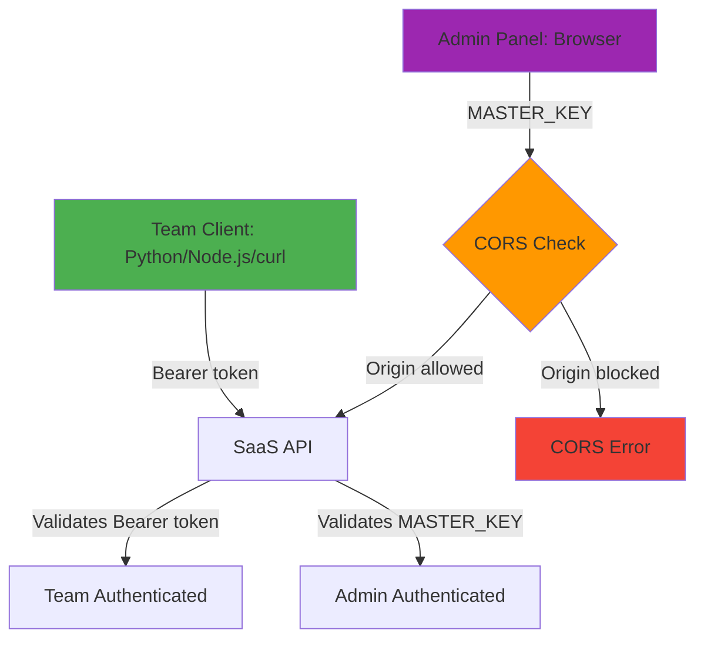

# CORS and Authentication

Understanding the critical difference between CORS and authentication in SaaS LiteLLM.

!!! tip "Deploying on Railway?"
    For Railway-specific CORS setup using dynamic service references (no hardcoded URLs), see the **[Railway CORS Setup Guide](railway-cors-setup.md)**.

    This guide covers the general concepts. The Railway guide shows you how to use `${{service.RAILWAY_PUBLIC_DOMAIN}}` for automatic configuration.

## TL;DR - The Key Insight

**CORS is a browser-only security feature. Server-side API clients completely ignore CORS.**

- ✅ **Team API clients (Python, Node.js, curl, Go)** - NOT affected by CORS
- ⚠️ **Browser-based admin panel (Next.js)** - Subject to CORS restrictions

**Authentication (Bearer tokens) secures the API regardless of CORS.**

## What is CORS?

CORS (Cross-Origin Resource Sharing) is a **browser security mechanism** that restricts which domains can make requests from JavaScript running in a web browser.

### CORS Only Affects Browsers

When JavaScript in a web browser tries to make a request to a different domain, the browser enforces CORS:

```javascript
// This code running in a browser at https://example.com
// trying to call https://api.yourcompany.com

fetch('https://api.yourcompany.com/api/jobs/create', {
  method: 'POST',
  headers: {
    'Authorization': 'Bearer sk-...',
    'Content-Type': 'application/json'
  },
  body: JSON.stringify({...})
})
// ⚠️ Browser checks CORS before sending this request
```

**The browser will:**
1. Send a "preflight" OPTIONS request to check if the domain is allowed
2. Block the request if the server doesn't allow the origin
3. Only send the actual request if CORS headers permit it

### CORS Does NOT Affect Server-Side Clients

Server-side HTTP clients **completely ignore CORS**:

```python
# Python requests - CORS does NOT apply
import requests

response = requests.post(
    'https://api.yourcompany.com/api/jobs/create',
    headers={'Authorization': 'Bearer sk-...'},
    json={...}
)
# ✅ This works regardless of CORS configuration
```

```bash
# curl - CORS does NOT apply
curl -X POST https://api.yourcompany.com/api/jobs/create \
  -H "Authorization: Bearer sk-..." \
  -d '{...}'
# ✅ This works regardless of CORS configuration
```

```javascript
// Node.js (server-side) - CORS does NOT apply
const axios = require('axios');

const response = await axios.post(
  'https://api.yourcompany.com/api/jobs/create',
  {...},
  {headers: {Authorization: 'Bearer sk-...'}}
);
// ✅ This works regardless of CORS configuration
```

## SaaS LiteLLM Architecture

### Two Types of Clients

| Client Type | Uses CORS? | Authentication | Example |
|-------------|-----------|----------------|---------|
| **Team API Clients** | ❌ No (server-side) | Bearer token (virtual key) | Python app, Node.js service, cron job |
| **Admin Panel** | ✅ Yes (browser-based) | MASTER_KEY (X-Admin-Key header) | Next.js admin dashboard |

### Authentication Flow



## Current CORS Configuration

### In `src/saas_api.py`

```python
app.add_middleware(
    CORSMiddleware,
    allow_origins=[
        # Local development
        "http://localhost:3000",  # Admin panel dev
        "http://localhost:3002",  # Admin panel alternate
        "http://localhost:3001",
        # Production - Add your admin panel URL
        # "https://admin-panel-production.up.railway.app",
    ],
    allow_credentials=True,
    allow_methods=["*"],
    allow_headers=["*"],
)
```

### What This Means

**Browser-based admin panel:**
- ✅ Can make requests from localhost:3000, 3001, 3002
- ❌ Blocked from other origins (until you add them)
- Must add production admin panel URL for production

**Server-side team clients:**
- ✅ Work from ANY location
- ✅ Completely ignore CORS configuration
- ✅ Only need valid Bearer token (virtual key)

## Common Scenarios

### Scenario 1: Team Client (Python)

```python
# Team's Python application making API calls

import requests

API_URL = "https://saas-api-production.up.railway.app"
VIRTUAL_KEY = "sk-team-virtual-key-here"

headers = {
    "Authorization": f"Bearer {VIRTUAL_KEY}",
    "Content-Type": "application/json"
}

# Create job
response = requests.post(
    f"{API_URL}/api/jobs/create",
    headers=headers,
    json={"team_id": "acme-corp", "job_type": "analysis"}
)

# ✅ Works perfectly - CORS doesn't apply to server-side Python
# ✅ Only requires valid virtual key
# ✅ Can be called from anywhere (AWS, Google Cloud, on-premise, etc.)
```

**Result:** ✅ Works - CORS is ignored by Python `requests`

### Scenario 2: Admin Panel (Browser)

```javascript
// Admin panel (Next.js) running at https://admin.yourcompany.com
// Making request to https://api.yourcompany.com

const response = await fetch('https://api.yourcompany.com/api/model-groups', {
  headers: {
    'X-Admin-Key': masterKey
  }
})

// ⚠️ Browser checks CORS before sending this request
```

**If CORS allows `https://admin.yourcompany.com`:**
- ✅ Request succeeds

**If CORS doesn't allow `https://admin.yourcompany.com`:**
- ❌ Browser blocks request with CORS error
- ❌ See error in browser console: "CORS policy: No 'Access-Control-Allow-Origin' header"

### Scenario 3: Browser-Based Team Client (Not Recommended)

```html
<!-- Team trying to call API directly from browser JavaScript -->
<script>
  fetch('https://api.yourcompany.com/api/jobs/create', {
    method: 'POST',
    headers: {
      'Authorization': 'Bearer sk-team-key',
      'Content-Type': 'application/json'
    },
    body: JSON.stringify({...})
  })
  // ❌ CORS error - API doesn't allow this origin
  // ⚠️ SECURITY RISK - Virtual key exposed in browser
</script>
```

**Result:** ❌ Blocked by CORS (and insecure anyway)

**Solution:** Use a backend API to proxy the requests:

```
Browser → Your Backend API → SaaS LiteLLM API
        (No CORS issue)    (Server-side, CORS ignored)
```

## Setting Up Production CORS

### Step 1: Deploy Admin Panel

Deploy your admin panel to production (Railway, Vercel, etc.) and note the URL:

```
https://admin-panel-production-abc123.up.railway.app
```

### Step 2: Update CORS Configuration

Edit `src/saas_api.py`:

```python
app.add_middleware(
    CORSMiddleware,
    allow_origins=[
        # Local development
        "http://localhost:3000",
        "http://localhost:3002",
        "http://localhost:3001",
        # Production
        "https://admin-panel-production-abc123.up.railway.app",
        # Or with custom domain
        # "https://admin.yourcompany.com",
    ],
    allow_credentials=True,
    allow_methods=["*"],
    allow_headers=["*"],
)
```

### Step 3: Redeploy SaaS API

```bash
# Commit and push changes
git add src/saas_api.py
git commit -m "Add production admin panel to CORS"
git push

# Railway will auto-deploy
```

### Step 4: Verify

Open your production admin panel and test:
- Login should work
- API requests should succeed
- No CORS errors in browser console

## Using Environment Variables for CORS

For more flexible configuration, use environment variables:

### 1. Update `src/config/settings.py`

```python
class Settings(BaseSettings):
    # ... existing settings ...

    # Admin panel URL for CORS
    admin_panel_url: str = "http://localhost:3002"

    # Additional CORS origins (comma-separated)
    additional_cors_origins: str = ""
```

### 2. Update `src/saas_api.py`

```python
# Build CORS origins from settings
cors_origins = [
    "http://localhost:3000",
    "http://localhost:3001",
    "http://localhost:3002",
    settings.admin_panel_url,
]

# Add additional origins if configured
if settings.additional_cors_origins:
    additional = [
        origin.strip()
        for origin in settings.additional_cors_origins.split(',')
        if origin.strip()
    ]
    cors_origins.extend(additional)

app.add_middleware(
    CORSMiddleware,
    allow_origins=cors_origins,
    allow_credentials=True,
    allow_methods=["*"],
    allow_headers=["*"],
)
```

### 3. Configure in Railway

Add environment variable:

```bash
# Railway Variables
ADMIN_PANEL_URL=https://admin-panel-production.up.railway.app

# Or multiple origins
ADDITIONAL_CORS_ORIGINS=https://admin.yourcompany.com,https://admin-staging.yourcompany.com
```

## Troubleshooting CORS

### Error: "CORS policy: No 'Access-Control-Allow-Origin' header"

**Problem:** Browser is blocking the request because the origin is not allowed.

**Check:**
1. Are you making the request from a **browser**?
   - Yes → CORS applies, add origin to `allow_origins`
   - No (Python/Node.js/curl) → CORS doesn't apply, this is a different error

2. Is the origin in the `allow_origins` list?
   ```python
   # Check current CORS config in src/saas_api.py
   allow_origins=[...]
   ```

3. Did you redeploy after updating CORS?
   - Changes to `src/saas_api.py` require redeployment

**Solution:**
```python
# Add your origin to allow_origins
allow_origins=[
    "http://localhost:3000",
    "https://your-admin-panel-url.com",  # ← Add this
]
```

### Error: "Team API client getting 401 Unauthorized"

**Problem:** This is NOT a CORS issue (server-side clients ignore CORS).

**Check:**
1. Is the virtual key correct?
2. Is the `Authorization` header formatted correctly?
   ```
   Authorization: Bearer sk-your-virtual-key
   ```
3. Is the team active and not suspended?

**This is an authentication issue, not CORS.**

### Error: "Preflight request doesn't pass access control check"

**Problem:** Browser preflight (OPTIONS) request is being blocked.

**Check:**
1. Is `allow_methods=["*"]` set?
2. Is `allow_headers=["*"]` set?
3. Is the origin in `allow_origins`?

**Solution:**
```python
app.add_middleware(
    CORSMiddleware,
    allow_origins=["https://your-origin.com"],
    allow_credentials=True,
    allow_methods=["*"],  # ← Must allow all methods
    allow_headers=["*"],  # ← Must allow all headers
)
```

## Security Considerations

### CORS is NOT Authentication

**CORS does NOT secure your API.** It only controls which browser-based clients can access it.

- ❌ CORS does NOT validate API keys
- ❌ CORS does NOT prevent malicious server-side clients
- ❌ CORS does NOT encrypt data

**Authentication (Bearer tokens) secures your API:**

- ✅ Bearer tokens validate team identity
- ✅ MASTER_KEY validates admin identity
- ✅ Works for all clients (browser and server-side)

### CORS + Authentication Together

```
Layer 1: CORS (Browser-only)
  ↓ Checks if origin is allowed
  ↓ (Server-side clients skip this layer)

Layer 2: Authentication (All clients)
  ↓ Validates Bearer token or MASTER_KEY
  ↓ Verifies team/admin identity
  ↓ Checks team status (active/suspended)

Layer 3: Authorization
  ↓ Verifies team has access to requested model
  ↓ Checks credit balance
  ↓ Validates rate limits
```

### Don't Use Wildcard CORS

**Avoid this in production:**
```python
# ❌ Don't do this
allow_origins=["*"]
```

**Why:**
- Allows any browser-based client to call your API
- Exposes admin endpoints to malicious websites
- Increases attack surface

**Instead:**
```python
# ✅ Explicitly list allowed origins
allow_origins=[
    "https://admin.yourcompany.com",
    "https://admin-staging.yourcompany.com",
]
```

## Summary

| Aspect | CORS | Authentication |
|--------|------|----------------|
| **Applies to** | Browser-based clients only | All clients |
| **Purpose** | Control which domains can make browser requests | Verify client identity |
| **Layer** | Browser security | API security |
| **Team clients** | Not affected | Required (Bearer token) |
| **Admin panel** | Required | Required (MASTER_KEY) |
| **Configuration** | `allow_origins` in CORS middleware | Virtual keys, MASTER_KEY |

## Next Steps

- **[Railway Deployment](railway.md)** - Deploy with proper CORS
- **[Environment Variables](environment-variables.md)** - Configure CORS via env vars
- **[Admin Authentication](../admin-dashboard/authentication.md)** - Set up MASTER_KEY
- **[Team Authentication](../integration/authentication.md)** - Use virtual keys

## Additional Resources

- **[MDN CORS Guide](https://developer.mozilla.org/en-US/docs/Web/HTTP/CORS)** - Official CORS documentation
- **[FastAPI CORS](https://fastapi.tiangolo.com/tutorial/cors/)** - FastAPI CORS middleware docs
