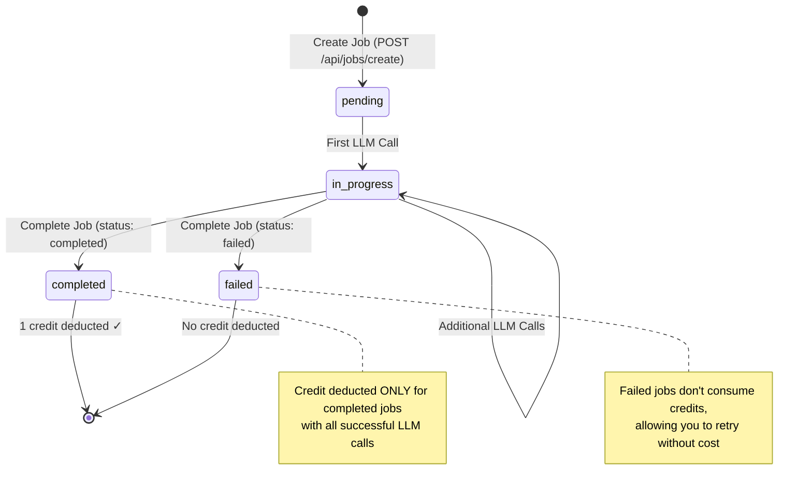

# Job Workflow

Learn about the job-based workflow that powers SaaS LiteLLM's cost tracking and billing system.

## What is a Job?

A **Job** is a logical grouping of related LLM calls that represent a single business operation or workflow. Instead of tracking and billing individual LLM calls, the platform groups them into jobs for simplified cost management.

### Why Jobs?

Traditional LLM APIs charge per API call. This creates complexity when a single workflow makes multiple calls:

| Traditional Approach | Job-Based Approach |
|---------------------|-------------------|
| ❌ Charge per API call | ✅ Charge per completed job |
| ❌ Hard to track workflow costs | ✅ Aggregate costs per workflow |
| ❌ Complex billing | ✅ Simple billing (1 credit = 1 job) |
| ❌ API-centric | ✅ Business-centric |

### Real-World Example: Resume Analysis

Your resume analysis tool performs multiple LLM operations:

```
Job: "resume_analysis"
├── LLM Call 1: Parse resume text
├── LLM Call 2: Compare requirements with candidate qualifications
└── LLM Call 3: Generate executive summary

Result: 1 Job = 1 Credit charged (not 3 credits!)
```

**Key Benefits:**
- **Simplified Billing** - Pay per job completion, not per LLM call
- **Cost Aggregation** - Track total cost across multiple calls
- **Usage Analytics** - Understand which workflows are expensive
- **Failure Handling** - Failed jobs don't consume credits

## Job Lifecycle

A job goes through several states during its lifetime:



### Job States

| State | Description | Credit Impact |
|-------|-------------|---------------|
| `pending` | Job created, no LLM calls yet | None |
| `in_progress` | At least one LLM call made | None (until completion) |
| `completed` | Job successfully completed | **1 credit deducted** |
| `failed` | Job failed or cancelled | **No credit deducted** |

## Workflow Options

SaaS LiteLLM supports two workflow patterns:

### 1. **Single-Call Workflow** (Recommended for Simple Use Cases)

Best for chat applications, single-turn responses, and simple tasks requiring only one LLM call.

**Advantages:**
- ~66% latency reduction (1 API call vs 3)
- Simpler code
- Automatic error handling
- Built-in credit deduction

**When to use:**
- Chat applications
- Single-turn text generation
- Simple classification tasks
- Any workflow with just one LLM call

**Jump to:** [Single-Call Workflow →](#single-call-workflow)

### 2. **Multi-Step Workflow** (For Complex Operations)

Best for complex workflows requiring multiple LLM calls, agentic workflows, or batch processing.

**Advantages:**
- Granular control over each step
- Support for multiple LLM calls per job
- Retry individual calls without starting over
- Track intermediate results

**When to use:**
- Multi-step document analysis
- Agentic workflows
- Batch processing
- Complex chains requiring multiple calls

**Jump to:** [Multi-Step Workflow →](#multi-step-workflow)

---

## Single-Call Workflow

For simple workflows that only need a single LLM call, use the combined create-and-call endpoint:

### Endpoint

```
POST /api/jobs/create-and-call
```

### Example: Chat Response

=== "Python"

    ```python
    import requests

    API = "http://localhost:8003/api"
    headers = {
        "Authorization": "Bearer sk-your-virtual-key",
        "Content-Type": "application/json"
    }

    # Single API call - creates job, calls LLM, and completes job
    response = requests.post(
        f"{API}/jobs/create-and-call",
        headers=headers,
        json={
            "team_id": "acme-corp",
            "job_type": "chat_response",
            "model": "gpt-4",  # Model alias or group
            "messages": [
                {"role": "user", "content": "What is Python?"}
            ],
            "temperature": 0.7,
            "max_tokens": 500
        }
    )

    result = response.json()
    print(f"Response: {result['response']['content']}")
    print(f"Tokens used: {result['metadata']['tokens_used']}")
    print(f"Credits remaining: {result['costs']['credits_remaining']}")
    ```

=== "JavaScript"

    ```javascript
    const API = "http://localhost:8003/api";
    const headers = {
      'Authorization': 'Bearer sk-your-virtual-key',
      'Content-Type': 'application/json'
    };

    // Single API call - creates job, calls LLM, and completes job
    const response = await fetch(`${API}/jobs/create-and-call`, {
      method: 'POST',
      headers: headers,
      body: JSON.stringify({
        team_id: 'acme-corp',
        job_type: 'chat_response',
        model: 'gpt-4',
        messages: [
          {role: 'user', content: 'What is Python?'}
        ],
        temperature: 0.7,
        max_tokens: 500
      })
    });

    const result = await response.json();
    console.log(`Response: ${result.response.content}`);
    console.log(`Tokens used: ${result.metadata.tokens_used}`);
    console.log(`Credits remaining: ${result.costs.credits_remaining}`);
    ```

=== "cURL"

    ```bash
    curl -X POST http://localhost:8003/api/jobs/create-and-call \
      -H "Authorization: Bearer sk-your-virtual-key" \
      -H "Content-Type: application/json" \
      -d '{
        "team_id": "acme-corp",
        "job_type": "chat_response",
        "model": "gpt-4",
        "messages": [
          {"role": "user", "content": "What is Python?"}
        ],
        "temperature": 0.7,
        "max_tokens": 500
      }'
    ```

**Response:**
```json
{
  "job_id": "550e8400-e29b-41d4-a716-446655440000",
  "status": "completed",
  "response": {
    "content": "Python is a high-level programming language...",
    "finish_reason": "stop"
  },
  "metadata": {
    "tokens_used": 256,
    "latency_ms": 1340,
    "model": "gpt-4"
  },
  "costs": {
    "total_calls": 1,
    "successful_calls": 1,
    "failed_calls": 0,
    "total_tokens": 256,
    "total_cost_usd": 0.0128,
    "avg_latency_ms": 1340,
    "credit_applied": true,
    "credits_remaining": 999
  },
  "completed_at": "2024-10-14T12:00:05.340Z"
}
```

### Error Handling

The single-call endpoint automatically handles errors:

```python
try:
    response = requests.post(
        f"{API}/jobs/create-and-call",
        headers=headers,
        json={
            "team_id": "acme-corp",
            "job_type": "chat",
            "model": "gpt-4",
            "messages": messages
        },
        timeout=30
    )
    response.raise_for_status()
    result = response.json()

except requests.exceptions.HTTPError as e:
    if e.response.status_code == 403:
        print(f"Access error: {e.response.json()['detail']}")
    elif e.response.status_code == 500:
        print(f"LLM call failed: {e.response.json()['detail']}")
    else:
        print(f"Request failed: {e}")
except requests.exceptions.Timeout:
    print("Request timed out")
```

### Performance Comparison

| Workflow Type | API Calls | Latency | Best For |
|--------------|-----------|---------|----------|
| **Single-Call** | 1 | ~1.5s | Chat apps, simple tasks |
| **Multi-Step** | 3+ | ~4.5s+ | Complex workflows, multiple calls |

**Latency breakdown:**
```
Single-Call:     [Create+Call+Complete] = ~1.5s
                           ↓
Multi-Step:      [Create] → [Call] → [Complete] = ~4.5s
                   ~0.1s     ~1.4s      ~0.1s
```

---

## Multi-Step Workflow

For complex workflows requiring multiple LLM calls, use the full job lifecycle:

### 1. Create Job

Create a job to start tracking LLM calls:

=== "Python"

    ```python
    import requests

    API = "http://localhost:8003/api"
    headers = {
        "Authorization": "Bearer sk-your-virtual-key",
        "Content-Type": "application/json"
    }

    # Create job
    response = requests.post(
        f"{API}/jobs/create",
        headers=headers,
        json={
            "team_id": "acme-corp",
            "user_id": "john@acme.com",
            "job_type": "document_analysis",
            "metadata": {
                "document_id": "doc_123",
                "document_name": "report.pdf",
                "pages": 5
            }
        }
    )

    job = response.json()
    job_id = job["job_id"]
    print(f"Created job: {job_id}")
    ```

=== "JavaScript"

    ```javascript
    const API = "http://localhost:8003/api";
    const headers = {
      'Authorization': 'Bearer sk-your-virtual-key',
      'Content-Type': 'application/json'
    };

    // Create job
    const response = await fetch(`${API}/jobs/create`, {
      method: 'POST',
      headers: headers,
      body: JSON.stringify({
        team_id: 'acme-corp',
        user_id: 'john@acme.com',
        job_type: 'document_analysis',
        metadata: {
          document_id: 'doc_123',
          document_name: 'report.pdf',
          pages: 5
        }
      })
    });

    const job = await response.json();
    const jobId = job.job_id;
    console.log(`Created job: ${jobId}`);
    ```

=== "cURL"

    ```bash
    curl -X POST http://localhost:8003/api/jobs/create \
      -H "Authorization: Bearer sk-your-virtual-key" \
      -H "Content-Type: application/json" \
      -d '{
        "team_id": "acme-corp",
        "user_id": "john@acme.com",
        "job_type": "document_analysis",
        "metadata": {
          "document_id": "doc_123",
          "document_name": "report.pdf",
          "pages": 5
        }
      }'
    ```

**Response:**
```json
{
  "job_id": "550e8400-e29b-41d4-a716-446655440000",
  "status": "pending",
  "created_at": "2024-10-14T12:00:00.000Z"
}
```

### 2. Make LLM Calls

Make one or more LLM calls associated with the job:

```python
# Make multiple LLM calls for the same job
for step in ["parse", "analyze", "summarize"]:
    response = requests.post(
        f"{API}/jobs/{job_id}/llm-call",
        headers=headers,
        json={
            "messages": [
                {"role": "user", "content": f"{step} this document..."}
            ],
            "purpose": step  # Optional: for tracking
        }
    )

    result = response.json()
    print(f"{step}: {result['response']['content'][:50]}...")
```

**Response:**
```json
{
  "call_id": "call-uuid-1",
  "response": {
    "content": "Here is the analysis...",
    "finish_reason": "stop"
  },
  "metadata": {
    "tokens_used": 450,
    "latency_ms": 1250
  }
}
```

!!! info "Job Status Changes"
    After the first LLM call, the job status automatically changes from `pending` to `in_progress`.

### 3. Complete Job

Complete the job to trigger credit deduction and get cost summary:

```python
# Complete job successfully
response = requests.post(
    f"{API}/jobs/{job_id}/complete",
    headers=headers,
    json={
        "status": "completed",
        "metadata": {
            "result": "success",
            "output_file": "analysis_123.json"
        }
    }
)

result = response.json()

print(f"Job completed!")
print(f"Total calls: {result['costs']['total_calls']}")
print(f"Total cost: ${result['costs']['total_cost_usd']:.4f}")
print(f"Credit deducted: {result['costs']['credit_applied']}")
print(f"Credits remaining: {result['costs']['credits_remaining']}")
```

**Response:**
```json
{
  "job_id": "550e8400-e29b-41d4-a716-446655440000",
  "status": "completed",
  "completed_at": "2024-10-14T12:05:23.000Z",
  "costs": {
    "total_calls": 3,
    "successful_calls": 3,
    "failed_calls": 0,
    "total_tokens": 1350,
    "total_cost_usd": 0.0045,
    "avg_latency_ms": 1200,
    "credit_applied": true,
    "credits_remaining": 999
  },
  "calls": [
    {
      "call_id": "call-uuid-1",
      "purpose": "parse",
      "tokens": 450,
      "latency_ms": 1250,
      "error": null
    },
    {
      "call_id": "call-uuid-2",
      "purpose": "analyze",
      "tokens": 480,
      "latency_ms": 1180,
      "error": null
    },
    {
      "call_id": "call-uuid-3",
      "purpose": "summarize",
      "tokens": 420,
      "latency_ms": 1170,
      "error": null
    }
  ]
}
```

## Credit Deduction Rules

Credits are **ONLY** deducted when ALL of these conditions are met:

1. ✅ Job status is `"completed"` (not `"failed"`)
2. ✅ All LLM calls succeeded (no failed calls)
3. ✅ Credit hasn't already been applied

**Key Points:**
- **1 Job = 1 Credit** regardless of:
  - Number of LLM calls (could be 1 or 100)
  - Actual USD cost (tracked separately for analytics)
  - Models used (different models in same job)
  - Time duration (seconds or hours)

## Handling Failures

If something goes wrong, complete the job as `failed` to avoid credit deduction:

```python
try:
    # Make LLM calls
    for step in workflow_steps:
        make_llm_call(job_id, step)

    # Complete successfully
    complete_job(job_id, "completed")

except Exception as e:
    # Complete as failed (no credit deducted)
    requests.post(
        f"{API}/jobs/{job_id}/complete",
        headers=headers,
        json={
            "status": "failed",
            "error_message": str(e),
            "metadata": {"error_type": type(e).__name__}
        }
    )
    print(f"Job failed: {e} (no credit charged)")
```

!!! tip "Always Complete Jobs"
    Always complete jobs (even as failed) to prevent "zombie jobs" that stay in `in_progress` state forever. This keeps your analytics clean.

## Job Metadata

Use metadata to store custom information about your jobs:

### Job Creation Metadata

```python
job = requests.post(f"{API}/jobs/create", headers=headers, json={
    "team_id": "acme-corp",
    "user_id": "john@acme.com",
    "job_type": "document_analysis",
    "metadata": {
        # Your app's context
        "task_id": "task_123",
        "user_email": "john@acme.com",
        "document_name": "report.pdf",
        "document_size_mb": 2.5,
        "priority": "high",
        "source": "upload",
        "workflow_version": "v2.1"
    }
}).json()
```

### Completion Metadata

```python
result = requests.post(
    f"{API}/jobs/{job_id}/complete",
    headers=headers,
    json={
        "status": "completed",
        "metadata": {
            # Your app's results
            "output_file": "analysis_123.json",
            "confidence_score": 0.95,
            "warnings": ["Low quality image on page 3"],
            "processing_time_seconds": 12.5,
            "pages_processed": 5
        }
    }
).json()
```

## Complete Example: Multi-Step Workflow

Here's a complete example showing a multi-step document analysis workflow:

```python
import requests
from typing import List, Dict

class DocumentAnalyzer:
    def __init__(self, base_url: str, virtual_key: str):
        self.base_url = base_url
        self.headers = {
            "Authorization": f"Bearer {virtual_key}",
            "Content-Type": "application/json"
        }

    def analyze_document(
        self,
        team_id: str,
        document_text: str,
        document_name: str
    ) -> Dict:
        """
        Complete document analysis workflow:
        1. Extract key information
        2. Classify document type
        3. Generate summary

        3 LLM calls = 1 Job = 1 Credit
        """
        # Step 1: Create job
        job = requests.post(
            f"{self.base_url}/api/jobs/create",
            headers=self.headers,
            json={
                "team_id": team_id,
                "job_type": "document_analysis",
                "metadata": {
                    "document_name": document_name,
                    "document_length": len(document_text)
                }
            }
        ).json()

        job_id = job["job_id"]
        print(f"✓ Created job: {job_id}")

        try:
            # Step 2: Extract key information
            extraction = requests.post(
                f"{self.base_url}/api/jobs/{job_id}/llm-call",
                headers=self.headers,
                json={
                    "messages": [
                        {
                            "role": "system",
                            "content": "Extract key information from documents."
                        },
                        {
                            "role": "user",
                            "content": f"Extract key info from:\n\n{document_text}"
                        }
                    ],
                    "purpose": "extraction"
                }
            ).json()

            extracted_info = extraction["response"]["content"]
            print(f"✓ Extracted information")

            # Step 3: Classify document type
            classification = requests.post(
                f"{self.base_url}/api/jobs/{job_id}/llm-call",
                headers=self.headers,
                json={
                    "messages": [
                        {
                            "role": "system",
                            "content": "Classify document types."
                        },
                        {
                            "role": "user",
                            "content": f"Classify: {extracted_info}"
                        }
                    ],
                    "purpose": "classification"
                }
            ).json()

            doc_type = classification["response"]["content"]
            print(f"✓ Classified as: {doc_type}")

            # Step 4: Generate summary
            summary = requests.post(
                f"{self.base_url}/api/jobs/{job_id}/llm-call",
                headers=self.headers,
                json={
                    "messages": [
                        {
                            "role": "system",
                            "content": "Generate concise summaries."
                        },
                        {
                            "role": "user",
                            "content": f"Summarize: {extracted_info}"
                        }
                    ],
                    "purpose": "summarization"
                }
            ).json()

            doc_summary = summary["response"]["content"]
            print(f"✓ Generated summary")

            # Step 5: Complete job successfully
            completion = requests.post(
                f"{self.base_url}/api/jobs/{job_id}/complete",
                headers=self.headers,
                json={
                    "status": "completed",
                    "metadata": {
                        "result": "success",
                        "document_type": doc_type,
                        "summary_length": len(doc_summary)
                    }
                }
            ).json()

            print(f"\n✅ Job completed!")
            print(f"   Total calls: {completion['costs']['total_calls']}")
            print(f"   Total cost: ${completion['costs']['total_cost_usd']:.4f}")
            print(f"   Credits remaining: {completion['costs']['credits_remaining']}")

            return {
                "extracted_info": extracted_info,
                "document_type": doc_type,
                "summary": doc_summary,
                "costs": completion["costs"]
            }

        except Exception as e:
            # Complete as failed (no credit charge)
            requests.post(
                f"{self.base_url}/api/jobs/{job_id}/complete",
                headers=self.headers,
                json={
                    "status": "failed",
                    "error_message": str(e)
                }
            )
            print(f"❌ Job failed: {e} (no credit charged)")
            raise

# Usage
analyzer = DocumentAnalyzer(
    base_url="http://localhost:8003",
    virtual_key="sk-your-virtual-key"
)

result = analyzer.analyze_document(
    team_id="acme-corp",
    document_text="Your document text here...",
    document_name="report.pdf"
)

print("\n" + "="*50)
print("ANALYSIS RESULTS")
print("="*50)
print(f"Type: {result['document_type']}")
print(f"Summary: {result['summary']}")
```

**Output:**
```
✓ Created job: 7f3d9a8b-4c21-4e89-b5d3-2a1c8f6e9b0d
✓ Extracted information
✓ Classified as: Financial Report
✓ Generated summary

✅ Job completed!
   Total calls: 3
   Total cost: $0.0045
   Credits remaining: 999

==================================================
ANALYSIS RESULTS
==================================================
Type: Financial Report
Summary: This quarterly financial report shows...
```

## Best Practices

### 1. Always Complete Jobs

```python
# ✅ GOOD: Always complete jobs
try:
    make_llm_calls(job_id)
    complete_job(job_id, "completed")
except Exception as e:
    complete_job(job_id, "failed", error_message=str(e))

# ❌ BAD: Leaving jobs incomplete
try:
    make_llm_calls(job_id)
    complete_job(job_id, "completed")
except Exception as e:
    pass  # Job stays in in_progress forever!
```

### 2. Use Meaningful Job Types

```python
# ✅ GOOD: Descriptive job types
job_types = [
    "document_analysis",
    "resume_parsing",
    "chat_session",
    "data_extraction",
    "content_generation"
]

# ❌ BAD: Generic job types
job_types = ["job1", "job2", "task", "process"]
```

### 3. Add Contextual Metadata

```python
# ✅ GOOD: Rich metadata
metadata = {
    "task_id": "task_123",
    "user_email": "john@acme.com",
    "document_name": "report.pdf",
    "priority": "high",
    "workflow_version": "v2.1"
}

# ❌ BAD: Empty or minimal metadata
metadata = {}
```

### 4. Use Purpose for Call Tracking

```python
# ✅ GOOD: Label each LLM call
purposes = ["parsing", "classification", "summarization"]

# ❌ BAD: No purpose tracking
purpose = None
```

## Viewing Job Details

You can retrieve job details at any time:

```bash
curl http://localhost:8003/api/jobs/{job_id} \
  -H "Authorization: Bearer sk-your-virtual-key"
```

**Response:**
```json
{
  "job_id": "550e8400-e29b-41d4-a716-446655440000",
  "team_id": "acme-corp",
  "user_id": "john@acme.com",
  "job_type": "document_analysis",
  "status": "completed",
  "created_at": "2024-10-14T12:00:00.000Z",
  "completed_at": "2024-10-14T12:05:23.000Z",
  "metadata": {
    "document_id": "doc_123",
    "result": "success"
  },
  "costs": {
    "total_calls": 3,
    "total_cost_usd": 0.0045,
    "credit_applied": true
  },
  "calls": [...]
}
```

## Next Steps

- **[Non-Streaming Calls](non-streaming.md)** - Learn about standard LLM calls
- **[Streaming Calls](streaming.md)** - Implement real-time streaming
- **[Error Handling](error-handling.md)** - Handle errors gracefully
- **[Examples](../examples/basic-usage.md)** - See working code examples
