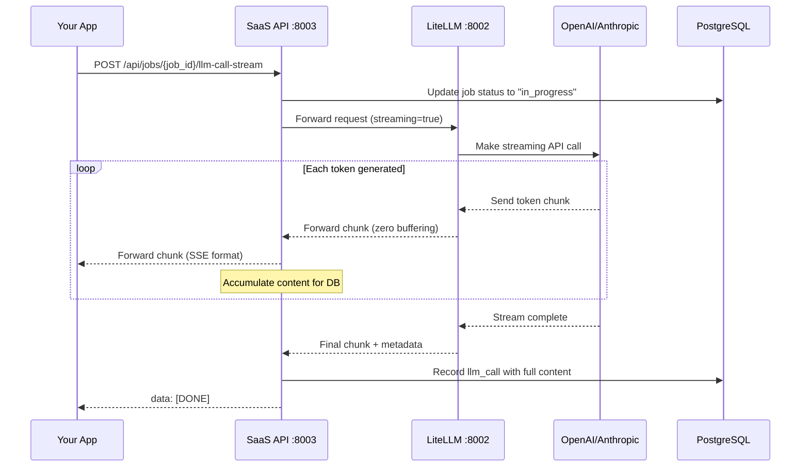

# Streaming LLM Calls

Learn how to use Server-Sent Events (SSE) for real-time streaming responses from LLMs.

## Overview

Streaming allows you to receive LLM responses progressively as they're generated, rather than waiting for the complete response. This creates a better user experience with lower perceived latency.

**Best for:**
- Chat applications and conversational interfaces
- Real-time content generation
- Long-form responses (articles, code, etc.)
- Interactive user experiences
- Progressive display requirements

**Characteristics:**
- ✅ Lower perceived latency (TTFT ~300-500ms vs ~2000ms)
- ✅ Progressive display of responses
- ✅ Better user experience
- ✅ Same credit model as non-streaming
- ✅ Same job-based tracking
- ⚠️ More complex implementation
- ⚠️ Requires SSE handling

## How Streaming Works

### Server-Sent Events (SSE)

Streaming uses the **Server-Sent Events (SSE)** protocol, a standard for server-to-client streaming over HTTP:

```
HTTP/1.1 200 OK
Content-Type: text/event-stream
Cache-Control: no-cache
X-Accel-Buffering: no

data: {"choices":[{"delta":{"content":"Hello"}}]}

data: {"choices":[{"delta":{"content":" world"}}]}

data: {"choices":[{"delta":{"content":"!"}}]}

data: [DONE]
```

**Key Points:**
- Each chunk is prefixed with `data: `
- Chunks arrive as they're generated
- Stream ends with `data: [DONE]`
- Zero buffering - minimal latency

### Streaming Architecture



**Performance:**
- **Time to First Token (TTFT)**: ~300-500ms
- **Per-token latency**: ~50ms
- **Overhead per hop**: ~10-50ms (minimal!)

## Basic Streaming Call

### Using Raw HTTP

```python
import requests
import json

API_URL = "http://localhost:8003/api"
VIRTUAL_KEY = "sk-your-virtual-key-here"

headers = {
    "Authorization": f"Bearer {VIRTUAL_KEY}",
    "Content-Type": "application/json"
}

# 1. Create job
job = requests.post(
    f"{API_URL}/jobs/create",
    headers=headers,
    json={"team_id": "acme-corp", "job_type": "chat"}
).json()

job_id = job["job_id"]

# 2. Make streaming call
response = requests.post(
    f"{API_URL}/jobs/{job_id}/llm-call-stream",
    headers=headers,
    json={
        "messages": [
            {"role": "user", "content": "Tell me a story"}
        ]
    },
    stream=True  # Important: enable streaming
)

# 3. Process Server-Sent Events
accumulated = ""
for line in response.iter_lines():
    if line:
        line = line.decode('utf-8')
        if line.startswith('data: '):
            data_str = line[6:]  # Remove 'data: ' prefix

            if data_str == '[DONE]':
                print("\n\nStream complete!")
                break

            try:
                chunk = json.loads(data_str)
                if chunk.get("choices"):
                    delta = chunk["choices"][0].get("delta", {})
                    content = delta.get("content", "")
                    if content:
                        accumulated += content
                        print(content, end="", flush=True)
            except json.JSONDecodeError:
                continue

# 4. Complete job
result = requests.post(
    f"{API_URL}/jobs/{job_id}/complete",
    headers=headers,
    json={"status": "completed"}
).json()

print(f"\nCredits remaining: {result['costs']['credits_remaining']}")
```

## Single-Call Streaming (Easiest Option)

For applications that only need to make one LLM call per job (like simple chat messages), use the **single-call streaming endpoint** that combines all three steps into one request:

**`POST /api/jobs/create-and-call-stream`**

This endpoint:
- Creates the job
- Streams the LLM response via SSE
- Automatically completes the job and deducts credits

Perfect for chat applications that need real-time streaming without the complexity of managing job lifecycle.

### Using Single-Call Streaming

```python
import requests
import json

API_URL = "http://localhost:8003/api"
VIRTUAL_KEY = "sk-your-virtual-key-here"

headers = {
    "Authorization": f"Bearer {VIRTUAL_KEY}",
    "Content-Type": "application/json"
}

# Single request streams the entire response
response = requests.post(
    f"{API_URL}/jobs/create-and-call-stream",
    headers=headers,
    json={
        "team_id": "acme-corp",
        "job_type": "chat",
        "model": "gpt-4",
        "messages": [
            {"role": "user", "content": "Tell me a short story"}
        ]
    },
    stream=True  # Important: enable streaming
)

# Process Server-Sent Events
accumulated = ""
for line in response.iter_lines():
    if line:
        line = line.decode('utf-8')
        if line.startswith('data: '):
            data_str = line[6:]  # Remove 'data: ' prefix

            if data_str == '[DONE]':
                print("\n\nStream complete!")
                break

            try:
                chunk = json.loads(data_str)
                if chunk.get("choices"):
                    delta = chunk["choices"][0].get("delta", {})
                    content = delta.get("content", "")
                    if content:
                        accumulated += content
                        print(content, end="", flush=True)
            except json.JSONDecodeError:
                continue

print(f"\nFull response: {accumulated}")
```

### Single-Call vs Multi-Step Streaming

| Feature | Single-Call Streaming | Multi-Step Streaming |
|---------|---------------------|---------------------|
| **Endpoints** | 1 request | 3 requests (create → stream → complete) |
| **Use Case** | Simple chat, one LLM call per job | Complex agents, multiple LLM calls |
| **Latency** | Lowest (~300ms TTFT) | Slightly higher (~350ms TTFT) |
| **Credit Deduction** | Automatic after stream | Manual via complete endpoint |
| **Job Control** | Automatic | Full control |
| **Best For** | Chat apps, simple queries | Multi-step workflows, agents |

**When to use Single-Call Streaming:**
- ✅ Chat applications with one message per job
- ✅ Simple Q&A interfaces
- ✅ You want the simplest possible integration
- ✅ Each user message = one job

**When to use Multi-Step Streaming:**
- ✅ Agent workflows with multiple LLM calls
- ✅ Complex multi-step processes
- ✅ You need full control over job lifecycle
- ✅ Multiple LLM calls per job

### Single-Call with Async

```python
import httpx
import asyncio
import json

async def streaming_chat():
    API_URL = "http://localhost:8003/api"
    VIRTUAL_KEY = "sk-your-virtual-key-here"

    headers = {
        "Authorization": f"Bearer {VIRTUAL_KEY}",
        "Content-Type": "application/json"
    }

    async with httpx.AsyncClient() as client:
        async with client.stream(
            "POST",
            f"{API_URL}/jobs/create-and-call-stream",
            headers=headers,
            json={
                "team_id": "acme-corp",
                "job_type": "chat",
                "model": "gpt-4",
                "messages": [
                    {"role": "user", "content": "Write a haiku about Python"}
                ],
                "temperature": 0.7
            },
            timeout=30.0
        ) as response:
            accumulated = ""
            async for line in response.aiter_lines():
                if line.startswith("data: "):
                    data_str = line[6:]

                    if data_str == "[DONE]":
                        break

                    try:
                        chunk = json.loads(data_str)
                        if chunk.get("choices"):
                            content = chunk["choices"][0].get("delta", {}).get("content", "")
                            if content:
                                accumulated += content
                                print(content, end="", flush=True)
                    except json.JSONDecodeError:
                        continue

            print(f"\n\nComplete response: {accumulated}")

asyncio.run(streaming_chat())
```

### SSE Chunk Format

Each streaming chunk follows this format:

```json
{
  "id": "chatcmpl-xyz",
  "object": "chat.completion.chunk",
  "created": 1697896000,
  "model": "gpt-4",
  "choices": [
    {
      "index": 0,
      "delta": {
        "role": "assistant",
        "content": "Hello"
      },
      "finish_reason": null
    }
  ]
}
```

**Fields:**
- `delta.role` - Present in first chunk only ("assistant")
- `delta.content` - The text chunk being generated
- `finish_reason` - `null` during streaming, "stop"/"length" at end

## Using the Type-Safe Client

The Python typed client provides a much easier interface:

```python
from examples.typed_client import SaaSLLMClient

async def streaming_example():
    async with SaaSLLMClient(
        base_url="http://localhost:8003",
        team_id="acme-corp",
        virtual_key="sk-your-virtual-key"
    ) as client:
        # Create job
        job_id = await client.create_job("chat")

        # Stream response
        accumulated = ""
        async for chunk in client.chat_stream(
            job_id=job_id,
            messages=[
                {"role": "user", "content": "Write a poem about Python"}
            ]
        ):
            if chunk.choices:
                delta = chunk.choices[0].delta
                content = delta.get("content", "")
                if content:
                    accumulated += content
                    print(content, end="", flush=True)

        print(f"\n\nFull response: {accumulated}")

        # Complete job
        result = await client.complete_job(job_id, "completed")
        print(f"Credits remaining: {result.credits_remaining}")

# Run
import asyncio
asyncio.run(streaming_example())
```

[:octicons-arrow-right-24: Learn more about the typed client](typed-client.md)

## Multi-Turn Streaming Conversations

Maintain conversation context across streaming calls:

```python
async def streaming_conversation():
    async with SaaSLLMClient(base_url, team_id, virtual_key) as client:
        job_id = await client.create_job("chat_session")

        messages = []

        # Turn 1
        messages.append({"role": "user", "content": "What is Python?"})
        response1 = ""
        async for chunk in client.chat_stream(job_id, messages):
            if chunk.choices:
                content = chunk.choices[0].delta.get("content", "")
                response1 += content
                print(content, end="", flush=True)

        # Add assistant response to history
        messages.append({"role": "assistant", "content": response1})

        # Turn 2
        print("\n\n--- Turn 2 ---")
        messages.append({"role": "user", "content": "What are its main uses?"})
        response2 = ""
        async for chunk in client.chat_stream(job_id, messages):
            if chunk.choices:
                content = chunk.choices[0].delta.get("content", "")
                response2 += content
                print(content, end="", flush=True)

        # Complete job
        await client.complete_job(job_id, "completed")

asyncio.run(streaming_conversation())
```

## Streaming with System Prompts

Set the assistant's behavior with system messages:

```python
async def streaming_with_system_prompt():
    async with SaaSLLMClient(base_url, team_id, virtual_key) as client:
        job_id = await client.create_job("tutoring")

        async for chunk in client.chat_stream(
            job_id=job_id,
            messages=[
                {
                    "role": "system",
                    "content": "You are a patient Python tutor. Explain concepts simply and provide code examples."
                },
                {
                    "role": "user",
                    "content": "How do I read a CSV file?"
                }
            ],
            temperature=0.7
        ):
            if chunk.choices:
                content = chunk.choices[0].delta.get("content", "")
                print(content, end="", flush=True)

        await client.complete_job(job_id, "completed")

asyncio.run(streaming_with_system_prompt())
```

## Controlling Stream Parameters

### Temperature

```python
# Creative streaming (higher temperature)
async for chunk in client.chat_stream(
    job_id=job_id,
    messages=[{"role": "user", "content": "Write a creative story"}],
    temperature=1.2  # More creative
):
    # Process chunks...

# Factual streaming (lower temperature)
async for chunk in client.chat_stream(
    job_id=job_id,
    messages=[{"role": "user", "content": "Explain photosynthesis"}],
    temperature=0.3  # More deterministic
):
    # Process chunks...
```

### Max Tokens

```python
# Limit response length
async for chunk in client.chat_stream(
    job_id=job_id,
    messages=[{"role": "user", "content": "Summarize Python in one paragraph"}],
    max_tokens=150  # Short response
):
    # Process chunks...
```

### Stop Sequences

```python
# Stop at specific text
async for chunk in client.chat_stream(
    job_id=job_id,
    messages=[{"role": "user", "content": "List 5 programming languages:\n1."}],
    stop=["\n6.", "END"]  # Stop at 6th item or "END"
):
    # Process chunks...
```

## Error Handling

### Handling Stream Interruptions

```python
async def robust_streaming():
    async with SaaSLLMClient(base_url, team_id, virtual_key) as client:
        job_id = await client.create_job("chat")

        try:
            accumulated = ""
            async for chunk in client.chat_stream(
                job_id=job_id,
                messages=[{"role": "user", "content": "Hello"}]
            ):
                if chunk.choices:
                    content = chunk.choices[0].delta.get("content", "")
                    accumulated += content
                    print(content, end="", flush=True)

            # Stream completed successfully
            await client.complete_job(job_id, "completed")

        except Exception as e:
            print(f"\nStream error: {e}")
            # Mark job as failed
            await client.complete_job(job_id, "failed")
            raise

asyncio.run(robust_streaming())
```

### Timeout Handling

```python
import asyncio

async def streaming_with_timeout():
    async with SaaSLLMClient(base_url, team_id, virtual_key) as client:
        job_id = await client.create_job("chat")

        try:
            # Set a timeout for the entire stream
            async with asyncio.timeout(30):  # 30 second timeout
                async for chunk in client.chat_stream(
                    job_id=job_id,
                    messages=[{"role": "user", "content": "Hello"}]
                ):
                    # Process chunks...
                    pass

        except asyncio.TimeoutError:
            print("Stream timed out")
            await client.complete_job(job_id, "failed")
        except Exception as e:
            print(f"Error: {e}")
            await client.complete_job(job_id, "failed")

asyncio.run(streaming_with_timeout())
```

### Retry Logic

```python
async def streaming_with_retry(max_retries=3):
    for attempt in range(max_retries):
        try:
            async with SaaSLLMClient(base_url, team_id, virtual_key) as client:
                job_id = await client.create_job("chat")

                async for chunk in client.chat_stream(
                    job_id=job_id,
                    messages=[{"role": "user", "content": "Hello"}]
                ):
                    # Process chunks...
                    pass

                await client.complete_job(job_id, "completed")
                return  # Success

        except Exception as e:
            print(f"Attempt {attempt + 1} failed: {e}")
            if attempt == max_retries - 1:
                raise  # Final attempt failed
            await asyncio.sleep(2 ** attempt)  # Exponential backoff

asyncio.run(streaming_with_retry())
```

## Full Streaming Chain Example

Build a complete streaming chain from browser → your API → SaaS API → LLM:

### Your Client API (FastAPI)

```python
from fastapi import FastAPI
from fastapi.responses import StreamingResponse
import httpx

app = FastAPI()

@app.post("/chat")
async def chat_endpoint(request: dict):
    """Forward streaming from SaaS API to browser"""

    # Create job in SaaS API
    async with httpx.AsyncClient() as client:
        job_response = await client.post(
            "http://localhost:8003/api/jobs/create",
            headers={"Authorization": f"Bearer {VIRTUAL_KEY}"},
            json={"team_id": "acme-corp", "job_type": "chat"}
        )
        job_id = job_response.json()["job_id"]

    async def stream_generator():
        """Forward chunks from SaaS API"""
        async with httpx.AsyncClient(timeout=30.0) as client:
            async with client.stream(
                "POST",
                f"http://localhost:8003/api/jobs/{job_id}/llm-call-stream",
                headers={"Authorization": f"Bearer {VIRTUAL_KEY}"},
                json=request
            ) as response:
                async for line in response.aiter_lines():
                    if line.startswith("data: "):
                        yield f"{line}\n\n"

    return StreamingResponse(
        stream_generator(),
        media_type="text/event-stream",
        headers={
            "Cache-Control": "no-cache",
            "X-Accel-Buffering": "no"
        }
    )
```

### Browser Client (JavaScript)

```html
<!DOCTYPE html>
<html>
<head>
    <title>Streaming Chat</title>
</head>
<body>
    <div id="output"></div>
    <input id="input" type="text" placeholder="Type a message...">
    <button onclick="sendMessage()">Send</button>

    <script>
        async function sendMessage() {
            const input = document.getElementById('input');
            const output = document.getElementById('output');
            const message = input.value;
            input.value = '';

            // Create message div
            const messageDiv = document.createElement('div');
            output.appendChild(messageDiv);

            // Stream response
            const response = await fetch('http://localhost:8001/chat', {
                method: 'POST',
                headers: {'Content-Type': 'application/json'},
                body: JSON.stringify({
                    messages: [{role: 'user', content: message}]
                })
            });

            const reader = response.body.getReader();
            const decoder = new TextDecoder();

            while (true) {
                const {done, value} = await reader.read();
                if (done) break;

                const text = decoder.decode(value);
                const lines = text.split('\n');

                for (const line of lines) {
                    if (line.startsWith('data: ')) {
                        const data = line.substring(6);
                        if (data === '[DONE]') continue;

                        try {
                            const chunk = JSON.parse(data);
                            const content = chunk.choices?.[0]?.delta?.content || '';
                            messageDiv.textContent += content;
                        } catch (e) {
                            // Ignore parse errors
                        }
                    }
                }
            }
        }
    </script>
</body>
</html>
```

[:octicons-arrow-right-24: See complete streaming chain example](../examples/streaming-examples.md)

## Best Practices

### 1. Always Accumulate Content

Keep track of the full response as you stream:

```python
accumulated = ""
async for chunk in client.chat_stream(job_id, messages):
    if chunk.choices:
        content = chunk.choices[0].delta.get("content", "")
        accumulated += content
        print(content, end="", flush=True)

# Use accumulated for further processing
print(f"\n\nFull response length: {len(accumulated)}")
```

### 2. Flush Output for Real-Time Display

```python
# ✅ Good - Real-time display
print(content, end="", flush=True)

# ❌ Bad - Buffered output
print(content, end="")
```

### 3. Handle Empty Chunks

Not all chunks contain content:

```python
async for chunk in client.chat_stream(job_id, messages):
    if chunk.choices:
        delta = chunk.choices[0].delta
        # Check if content exists
        if "content" in delta and delta["content"]:
            print(delta["content"], end="", flush=True)
```

### 4. Monitor Finish Reason

```python
async for chunk in client.chat_stream(job_id, messages):
    if chunk.choices:
        choice = chunk.choices[0]

        # Process content
        if "content" in choice.delta:
            print(choice.delta["content"], end="", flush=True)

        # Check if stream is ending
        if choice.finish_reason:
            print(f"\n\nFinished: {choice.finish_reason}")
            if choice.finish_reason == "length":
                print("Warning: Response was truncated due to max_tokens")
```

### 5. Use Async for Better Performance

```python
# ✅ Good - Async allows concurrent operations
async with SaaSLLMClient(...) as client:
    async for chunk in client.chat_stream(...):
        # Non-blocking

# ❌ Avoid - Sync blocks the entire thread
import requests
response = requests.post(..., stream=True)
for line in response.iter_lines():
    # Blocks thread
```

### 6. Set Appropriate Headers

If you're building your own streaming proxy:

```python
headers = {
    "Content-Type": "text/event-stream",
    "Cache-Control": "no-cache",
    "X-Accel-Buffering": "no",  # Prevent nginx buffering
    "Connection": "keep-alive"
}
```

## Streaming vs Non-Streaming Comparison

| Feature | Non-Streaming | Streaming |
|---------|---------------|-----------|
| **Latency (perceived)** | High (~2000ms TTFT) | Low (~300-500ms TTFT) |
| **User Experience** | Wait for full response | Progressive display |
| **Implementation** | Simpler | More complex |
| **Use Case** | Batch processing | Interactive apps |
| **Buffering** | Full response buffered | Zero buffering |
| **Error Handling** | Simpler | More complex |
| **Credits** | 1 per completed job | 1 per completed job |
| **Cost Tracking** | Same | Same |

## Complete Example

Here's a complete streaming chat application:

```python
import asyncio
from examples.typed_client import SaaSLLMClient

async def chat_session():
    """Interactive streaming chat session"""

    async with SaaSLLMClient(
        base_url="http://localhost:8003",
        team_id="acme-corp",
        virtual_key="sk-your-virtual-key"
    ) as client:

        # Create job for this chat session
        job_id = await client.create_job("chat_session")
        print(f"Started chat session: {job_id}")

        messages = []

        while True:
            # Get user input
            user_input = input("\nYou: ")
            if user_input.lower() in ['quit', 'exit', 'bye']:
                break

            # Add to messages
            messages.append({"role": "user", "content": user_input})

            # Stream response
            print("Assistant: ", end="", flush=True)
            assistant_response = ""

            try:
                async for chunk in client.chat_stream(
                    job_id=job_id,
                    messages=messages,
                    temperature=0.7
                ):
                    if chunk.choices:
                        content = chunk.choices[0].delta.get("content", "")
                        if content:
                            assistant_response += content
                            print(content, end="", flush=True)

                # Add assistant response to messages
                messages.append({"role": "assistant", "content": assistant_response})

            except Exception as e:
                print(f"\nError: {e}")
                await client.complete_job(job_id, "failed")
                return

        # Complete job
        result = await client.complete_job(job_id, "completed")
        print(f"\n\nSession ended. Credits remaining: {result.credits_remaining}")

# Run the chat
asyncio.run(chat_session())
```

## Next Steps

Now that you understand streaming:

1. **[Try Structured Outputs](structured-outputs.md)** - Type-safe responses with Pydantic
2. **[See Full Examples](../examples/streaming-examples.md)** - Working streaming examples
3. **[Learn Error Handling](error-handling.md)** - Handle streaming errors robustly
4. **[Best Practices](best-practices.md)** - Optimization and performance tips

## Additional Resources

- **[Typed Client Guide](typed-client.md)** - Easier streaming with the Python client
- **[Job Workflow Guide](job-workflow.md)** - Understanding the job lifecycle
- **[API Reference](../api-reference/llm-calls.md)** - Complete streaming API docs
- **[Streaming Architecture](../reference/streaming-architecture.md)** - Deep dive into implementation
