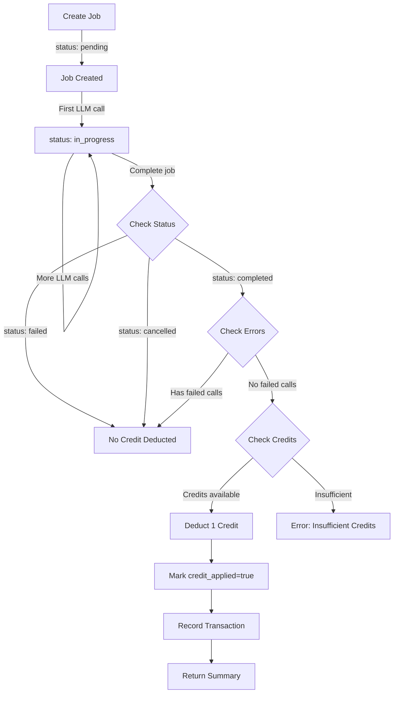

# Credit System Reference

Complete technical reference for the credit-based billing system in SaaS LiteLLM. This system implements job-based billing where **1 credit = 1 successfully completed job**, independent of actual LLM costs.

## Overview

The credit system provides:

- **Job-based billing**: Charge customers per business operation, not per token
- **Budget control**: Fixed and unlimited budget modes with optional auto-refill
- **Audit trail**: Complete transaction history for compliance
- **Credit isolation**: Per-team credit accounts with organization hierarchy
- **Flexible allocation**: Manual and automatic credit management

## Core Concept

### 1 Credit = 1 Job

Unlike traditional LLM billing (per token), this system charges **1 credit per successfully completed job**:

- A job can make 1 or 100 LLM calls - still costs 1 credit
- Failed jobs don't consume credits
- Cancelled jobs don't consume credits
- Only jobs with `status='completed'` and no failed calls are charged

This simplifies pricing for your customers and makes costs predictable.

---

## Credit Flow

### Job Lifecycle and Credit Deduction



### Credit Deduction Rules

Credits are deducted **only** when ALL conditions are met:

1. **Job Status**: `status = 'completed'` (not `'failed'` or `'cancelled'`)
2. **No Errors**: All associated LLM calls succeeded (no `error` field set)
3. **Not Already Applied**: `credit_applied = FALSE` (prevents double-charging)

**Implementation** (from `src/saas_api.py`):

```python
if (request.status == "completed" and
    costs["failed_calls"] == 0 and
    not job.credit_applied):

    credit_manager.deduct_credit(
        team_id=job.team_id,
        job_id=job.job_id,
        credits_amount=1,
        reason=f"Job {job.job_type} completed successfully"
    )
    job.credit_applied = True
```

---

## Database Schema

### team_credits Table

Primary table for credit balance tracking.

```sql
CREATE TABLE team_credits (
    team_id VARCHAR(255) PRIMARY KEY,
    organization_id VARCHAR(255) REFERENCES organizations(organization_id),
    credits_allocated INTEGER DEFAULT 0,
    credits_used INTEGER DEFAULT 0,
    credits_remaining INTEGER GENERATED ALWAYS AS (credits_allocated - credits_used) STORED,
    credit_limit INTEGER,
    auto_refill BOOLEAN DEFAULT FALSE,
    refill_amount INTEGER,
    refill_period VARCHAR(50),
    last_refill_at TIMESTAMP,
    virtual_key VARCHAR(500),
    created_at TIMESTAMP NOT NULL DEFAULT NOW(),
    updated_at TIMESTAMP NOT NULL DEFAULT NOW()
);
```

**Key Fields:**

- `credits_allocated`: Total credits given to team
- `credits_used`: Credits consumed by completed jobs
- `credits_remaining`: **Auto-calculated** (allocated - used)
- `credit_limit`: Hard limit (NULL = unlimited)
- `virtual_key`: LiteLLM virtual API key for this team

### credit_transactions Table

Immutable audit log of all credit operations.

```sql
CREATE TABLE credit_transactions (
    transaction_id UUID PRIMARY KEY DEFAULT gen_random_uuid(),
    team_id VARCHAR(255) NOT NULL,
    organization_id VARCHAR(255),
    job_id UUID REFERENCES jobs(job_id),
    transaction_type VARCHAR(50) NOT NULL,
    credits_amount INTEGER NOT NULL,
    credits_before INTEGER NOT NULL,
    credits_after INTEGER NOT NULL,
    reason VARCHAR(500),
    created_at TIMESTAMP NOT NULL DEFAULT NOW()
);
```

**Transaction Types:**

- `deduction`: Credit removed (job completed)
- `allocation`: Credit added (purchase, grant)
- `refund`: Credit returned (job failed after deduction, error correction)
- `adjustment`: Manual correction by admin

---

## Budget Modes

The credit system supports three budget modes that determine how credits are calculated and deducted:

### Mode 1: Job-Based (Default)

**1 credit = 1 completed job** regardless of actual costs.

**Configuration:**
```sql
UPDATE team_credits
SET budget_mode = 'job_based'
WHERE team_id = 'team-alpha';
```

**Behavior:**
- Simple, predictable pricing
- Every completed job costs exactly 1 credit
- Actual USD costs and token usage are tracked separately but don't affect credit deduction
- Perfect for fixed-price offerings

**Use Cases:**
- Subscription plans with fixed credit allocations
- Predictable pricing models
- Freemium tiers

### Mode 2: Consumption-USD

Credits are deducted based on **actual USD cost** from LLM providers.

**Configuration:**
```sql
UPDATE team_credits
SET budget_mode = 'consumption_usd',
    credits_per_dollar = 10.0  -- 1 credit = $0.10
WHERE team_id = 'team-alpha';
```

**Behavior:**
- Credit deduction: `credits = total_cost_usd * credits_per_dollar`
- Minimum: 1 credit per successful job
- Teams can have custom `credits_per_dollar` rates
- Falls back to `DEFAULT_CREDITS_PER_DOLLAR` (10.0) if not set

**Per-Team Rate Configuration:**

Admins can set team-specific rates:
```bash
# Set custom rate for premium customers
PATCH /api/credits/teams/{team_id}/conversion-rates
Authorization: Bearer {admin_token}

{
  "credits_per_dollar": 5.0  # 1 credit = $0.20 (better rate)
}
```

**Example Calculation:**
```
Job costs $0.034 in LLM API calls
credits_per_dollar = 10.0
Credits deducted = 0.034 * 10.0 = 0.34 → 1 credit (minimum)

Job costs $0.152 in LLM API calls
credits_per_dollar = 10.0
Credits deducted = 0.152 * 10.0 = 1.52 → 2 credits
```

**Use Cases:**
- Pay-as-you-go billing
- Enterprise customers with volume discounts
- Teams with different pricing tiers

### Mode 3: Consumption-Tokens

Credits are deducted based on **total tokens used**.

**Configuration:**
```sql
UPDATE team_credits
SET budget_mode = 'consumption_tokens',
    tokens_per_credit = 10000  -- 10,000 tokens = 1 credit
WHERE team_id = 'team-alpha';
```

**Behavior:**
- Credit deduction: `credits = total_tokens / tokens_per_credit`
- Minimum: 1 credit per successful job
- Teams can have custom `tokens_per_credit` rates
- Falls back to `DEFAULT_TOKENS_PER_CREDIT` (10000) if not set

**Per-Team Rate Configuration:**

Admins can set team-specific rates:
```bash
# Set custom rate for high-volume customers
PATCH /api/credits/teams/{team_id}/conversion-rates
Authorization: Bearer {admin_token}

{
  "tokens_per_credit": 20000  # 20,000 tokens = 1 credit (better rate)
}
```

**Example Calculation:**
```
Job uses 8,500 tokens
tokens_per_credit = 10000
Credits deducted = 8500 / 10000 = 0.85 → 1 credit (minimum)

Job uses 45,000 tokens
tokens_per_credit = 10000
Credits deducted = 45000 / 10000 = 4.5 → 5 credits
```

**Use Cases:**
- Token-based pricing models
- Different rates for different customer tiers
- Cost pass-through with markup

### Budget Mode Comparison

| Mode | Calculation | Predictability | Flexibility | Best For |
|------|-------------|----------------|-------------|----------|
| **job_based** | 1 credit/job | High | Low | Fixed pricing, subscriptions |
| **consumption_usd** | USD * rate | Medium | High | Enterprise, volume pricing |
| **consumption_tokens** | Tokens / rate | Medium | High | Token-based SaaS, developer tools |

### Managing Conversion Rates (Admin Only)

Administrators can configure per-team conversion rates via the API:

#### Get Current Rates

```bash
GET /api/credits/teams/{team_id}/conversion-rates
Authorization: Bearer {admin_token}

Response:
{
  "team_id": "team-alpha",
  "tokens_per_credit": 10000,
  "credits_per_dollar": 10.0,
  "budget_mode": "consumption_tokens",
  "using_defaults": {
    "tokens_per_credit": false,
    "credits_per_dollar": true
  }
}
```

#### Update Rates

```bash
PATCH /api/credits/teams/{team_id}/conversion-rates
Authorization: Bearer {admin_token}
Content-Type: application/json

{
  "tokens_per_credit": 20000,      # Optional
  "credits_per_dollar": 5.0         # Optional
}

Response:
{
  "team_id": "team-alpha",
  "tokens_per_credit": 20000,
  "credits_per_dollar": 5.0,
  "message": "Conversion rates updated successfully"
}
```

**Validation:**
- Both values must be positive numbers
- `tokens_per_credit` must be an integer
- `credits_per_dollar` can be a decimal
- Setting to `null` will use system defaults

### Default Values

If team-specific rates are not configured, the system uses these defaults:

```python
DEFAULT_TOKENS_PER_CREDIT = 10000      # 10,000 tokens = 1 credit
DEFAULT_CREDITS_PER_DOLLAR = 10.0      # 1 credit = $0.10
MINIMUM_CREDITS_PER_JOB = 1            # Always deduct at least 1 credit
```

These are defined in `src/api/constants.py`.

---

## Fixed Budget Implementation

### 1. Fixed Budget

Team has a fixed allocation. No automatic refills.

**Configuration:**

```sql
UPDATE team_credits
SET credits_allocated = 1000,
    credit_limit = 1000,
    auto_refill = FALSE
WHERE team_id = 'team-alpha';
```

**Behavior:**

- Can use up to `credits_allocated` credits
- When `credits_remaining = 0`, all new job completions fail with `InsufficientCreditsError`
- Must manually allocate more credits to continue

**Use Cases:**

- Free tier / trial users
- One-time credit packages
- Prepaid credits

### 2. Unlimited Budget

No hard limit on usage. Team can use as many credits as needed.

**Configuration:**

```sql
UPDATE team_credits
SET credits_allocated = 0,
    credit_limit = NULL,
    auto_refill = FALSE
WHERE team_id = 'team-enterprise';
```

**Behavior:**

- No credit checks performed
- Team can always complete jobs
- Track usage for billing/reporting purposes
- `credits_used` increments, but `credits_remaining` can go negative

**Use Cases:**

- Enterprise customers
- Pay-as-you-go billing
- Internal teams

### 3. Recurring Budget with Auto-Refill

Credits automatically refill on a schedule (daily, weekly, monthly).

**Configuration:**

```sql
UPDATE team_credits
SET credits_allocated = 1000,
    auto_refill = TRUE,
    refill_amount = 1000,
    refill_period = 'monthly',
    last_refill_at = NOW()
WHERE team_id = 'team-subscription';
```

**Behavior:**

- Every `refill_period`, add `refill_amount` to `credits_allocated`
- Useful for subscription-based pricing
- Requires background job to check `last_refill_at` and apply refills

**Refill Logic** (pseudocode):

```python
def check_refill(team_id):
    team = get_team_credits(team_id)

    if not team.auto_refill:
        return

    now = datetime.utcnow()
    last_refill = team.last_refill_at

    if should_refill(last_refill, team.refill_period, now):
        allocate_credits(
            team_id=team_id,
            amount=team.refill_amount,
            reason=f"Auto-refill: {team.refill_period}"
        )
        team.last_refill_at = now
```

**Use Cases:**

- Monthly subscription plans
- Weekly credit allowances
- Trial period extensions

---

## Credit Manager Service

The `CreditManager` service handles all credit operations.

### Location

`src/services/credit_manager.py`

### Class Definition

```python
class CreditManager:
    def __init__(self, db: Session):
        self.db = db
```

### Key Methods

#### 1. get_team_credits()

Retrieve team credit balance.

```python
def get_team_credits(self, team_id: str) -> Optional[TeamCredits]:
    return self.db.query(TeamCredits).filter(
        TeamCredits.team_id == team_id
    ).first()
```

**Returns:** `TeamCredits` object or `None` if not found

---

#### 2. check_credits_available()

Verify team has sufficient credits before starting a job.

```python
def check_credits_available(
    self,
    team_id: str,
    credits_needed: int = 1
) -> bool:
    credits = self.get_team_credits(team_id)

    if not credits:
        raise InsufficientCreditsError(
            f"No credit account found for team '{team_id}'"
        )

    if credits.credits_remaining < credits_needed:
        raise InsufficientCreditsError(
            f"Insufficient credits. Team has {credits.credits_remaining} "
            f"credits remaining, but {credits_needed} required."
        )

    return True
```

**Raises:** `InsufficientCreditsError` if credits insufficient or account not found

**Usage:**

```python
# Before creating job
credit_manager = get_credit_manager(db)
try:
    credit_manager.check_credits_available(team_id="team-alpha")
    # Proceed with job creation
except InsufficientCreditsError as e:
    return error_response(403, str(e))
```

---

#### 3. deduct_credit()

Deduct credits when job completes successfully.

```python
def deduct_credit(
    self,
    team_id: str,
    job_id: Optional[uuid.UUID] = None,
    credits_amount: int = 1,
    reason: str = "Job completed successfully"
) -> CreditTransaction:
```

**Parameters:**

- `team_id`: Team to deduct from
- `job_id`: Associated job (for audit trail)
- `credits_amount`: Number of credits (usually 1)
- `reason`: Human-readable explanation

**Returns:** `CreditTransaction` record

**Implementation:**

1. Get team credits
2. Check sufficient balance
3. Increment `credits_used`
4. Create transaction record with before/after balances
5. Commit to database

**Example:**

```python
transaction = credit_manager.deduct_credit(
    team_id="team-alpha",
    job_id=job_uuid,
    credits_amount=1,
    reason="Resume analysis completed successfully"
)

# Transaction record:
# - transaction_type: "deduction"
# - credits_amount: 1
# - credits_before: 1000
# - credits_after: 999
```

---

#### 4. allocate_credits()

Add credits to team account (purchase, grant, refill).

```python
def allocate_credits(
    self,
    team_id: str,
    credits_amount: int,
    reason: str = "Credit allocation",
    organization_id: Optional[str] = None
) -> CreditTransaction:
```

**Parameters:**

- `team_id`: Team to allocate to
- `credits_amount`: Number of credits to add
- `reason`: Explanation (e.g., "Monthly subscription refill")
- `organization_id`: Parent org (for reporting)

**Returns:** `CreditTransaction` record

**Implementation:**

1. Get or create team credits record
2. Increment `credits_allocated`
3. Create transaction record
4. Commit to database

**Example:**

```python
# Initial allocation
transaction = credit_manager.allocate_credits(
    team_id="team-alpha",
    credits_amount=1000,
    reason="New team signup - starter plan",
    organization_id="org-acme"
)

# Monthly refill
transaction = credit_manager.allocate_credits(
    team_id="team-alpha",
    credits_amount=1000,
    reason="Monthly subscription refill"
)
```

---

#### 5. refund_credit()

Return credits to team (error correction, failed job recovery).

```python
def refund_credit(
    self,
    team_id: str,
    job_id: Optional[uuid.UUID] = None,
    credits_amount: int = 1,
    reason: str = "Credit refund"
) -> CreditTransaction:
```

**Parameters:**

- `team_id`: Team to refund
- `job_id`: Original job (for audit trail)
- `credits_amount`: Credits to return
- `reason`: Explanation

**Returns:** `CreditTransaction` record

**Implementation:**

1. Get team credits
2. Decrement `credits_used` (not `credits_allocated`)
3. Create transaction record
4. Commit to database

**Example:**

```python
# Refund after discovering job failed
transaction = credit_manager.refund_credit(
    team_id="team-alpha",
    job_id=job_uuid,
    credits_amount=1,
    reason="Job marked as failed - refunding credit"
)
```

---

#### 6. get_credit_transactions()

Query transaction history with filters.

```python
def get_credit_transactions(
    self,
    team_id: Optional[str] = None,
    organization_id: Optional[str] = None,
    job_id: Optional[uuid.UUID] = None,
    limit: int = 100
) -> list[CreditTransaction]:
```

**Parameters:**

- `team_id`: Filter by team
- `organization_id`: Filter by organization
- `job_id`: Filter by specific job
- `limit`: Max results

**Returns:** List of `CreditTransaction` objects (newest first)

**Example:**

```python
# Get recent transactions for team
transactions = credit_manager.get_credit_transactions(
    team_id="team-alpha",
    limit=50
)

for txn in transactions:
    print(f"{txn.created_at}: {txn.transaction_type} "
          f"{txn.credits_amount} credits - {txn.reason}")
```

---

## Credit Deduction Flow

### Complete Job Endpoint Implementation

From `src/saas_api.py`:

```python
@app.post("/api/jobs/{job_id}/complete")
async def complete_job(
    job_id: str,
    request: JobCompleteRequest,
    db: Session = Depends(get_db),
    authenticated_team_id: str = Depends(verify_virtual_key)
):
    job = db.query(Job).filter(Job.job_id == uuid.UUID(job_id)).first()

    # Update job status
    job.status = JobStatus(request.status)
    job.completed_at = datetime.utcnow()

    # Calculate costs
    costs = calculate_job_costs(db, job.job_id)

    # Credit deduction logic
    credit_manager = get_credit_manager(db)

    if (request.status == "completed" and
        costs["failed_calls"] == 0 and
        not job.credit_applied):

        try:
            credit_manager.deduct_credit(
                team_id=job.team_id,
                job_id=job.job_id,
                credits_amount=1,
                reason=f"Job {job.job_type} completed successfully"
            )
            job.credit_applied = True
        except InsufficientCreditsError as e:
            # Log warning but don't fail job
            logger.warning(f"Job {job_id} couldn't deduct credit: {e}")

    db.commit()

    # Return response with credit balance
    team_credits = db.query(TeamCredits).filter(
        TeamCredits.team_id == job.team_id
    ).first()

    costs["credit_applied"] = job.credit_applied
    costs["credits_remaining"] = team_credits.credits_remaining

    return JobCompleteResponse(
        job_id=str(job.job_id),
        status=job.status.value,
        completed_at=job.completed_at.isoformat(),
        costs=costs,
        calls=calls_data
    )
```

### Key Points

1. **Status check**: Only `completed` jobs are charged
2. **Error check**: Jobs with failed LLM calls aren't charged
3. **Idempotency**: `credit_applied` flag prevents double-charging
4. **Graceful handling**: If credit deduction fails, job still completes (logged as warning)
5. **Balance returned**: Response includes updated `credits_remaining`

---

## Credit vs. Cost Tracking

This system tracks two separate metrics:

### Credits (Internal Billing)

- **Purpose**: Bill your customers
- **Unit**: 1 credit = 1 completed job
- **Table**: `team_credits`, `credit_transactions`
- **Predictable**: Fixed cost per job

### Costs (External Billing)

- **Purpose**: Track your expenses to LLM providers
- **Unit**: USD based on tokens
- **Table**: `llm_calls.cost_usd`, `job_cost_summaries.total_cost_usd`
- **Variable**: Depends on model, tokens used

**Example:**

```
Job: Resume Analysis
├─ Credit charged to customer: 1 credit
├─ Your revenue: $0.10 (if 1 credit = $0.10)
├─ Actual LLM cost: $0.034 (from OpenAI)
└─ Your margin: $0.066 (66% margin)
```

**Query both:**

```sql
SELECT
    j.job_id,
    j.job_type,
    j.credit_applied,
    jcs.total_cost_usd,
    tc.credits_remaining
FROM jobs j
JOIN job_cost_summaries jcs ON j.job_id = jcs.job_id
JOIN team_credits tc ON j.team_id = tc.team_id
WHERE j.team_id = 'team-alpha'
AND j.status = 'completed';
```

---

## API Operations

### Check Credit Balance

```python
GET /api/teams/{team_id}/credits
Authorization: Bearer {virtual_key}

Response:
{
  "team_id": "team-alpha",
  "credits_allocated": 1000,
  "credits_used": 234,
  "credits_remaining": 766,
  "credit_limit": 1000,
  "auto_refill": false
}
```

### Allocate Credits (Admin)

```python
POST /api/teams/{team_id}/credits/allocate
Authorization: Bearer {master_key}
Content-Type: application/json

{
  "credits_amount": 500,
  "reason": "Credit purchase - 500 credits"
}

Response:
{
  "transaction_id": "txn-uuid-123",
  "team_id": "team-alpha",
  "transaction_type": "allocation",
  "credits_amount": 500,
  "credits_before": 766,
  "credits_after": 1266,
  "reason": "Credit purchase - 500 credits"
}
```

### Get Transaction History

```python
GET /api/teams/{team_id}/credits/transactions?limit=50
Authorization: Bearer {virtual_key}

Response:
{
  "team_id": "team-alpha",
  "transactions": [
    {
      "transaction_id": "txn-uuid-456",
      "transaction_type": "deduction",
      "credits_amount": 1,
      "credits_before": 767,
      "credits_after": 766,
      "reason": "Job resume_analysis completed successfully",
      "job_id": "job-uuid-789",
      "created_at": "2024-10-15T10:30:00Z"
    },
    ...
  ]
}
```

---

## Error Handling

### InsufficientCreditsError

Raised when team lacks credits to complete operation.

**When Raised:**

- `check_credits_available()` - Before job starts (optional, not currently used)
- `deduct_credit()` - When completing job (if balance is 0)

**Example:**

```python
try:
    credit_manager.deduct_credit(team_id="team-alpha", job_id=job_uuid)
except InsufficientCreditsError as e:
    # Return error to user
    return {
        "error": "insufficient_credits",
        "message": str(e),
        "credits_remaining": 0,
        "credits_needed": 1
    }
```

**HTTP Response:**

```json
{
  "detail": "Insufficient credits. Team has 0 credits remaining, but 1 required. Allocated: 1000, Used: 1000"
}
```

### Handling During Job Completion

Currently, the system logs a warning but doesn't fail job completion:

```python
except InsufficientCreditsError as e:
    logger.warning(f"Job {job_id} completed but couldn't deduct credit: {e}")
    # Job still completes, but credit_applied stays false
```

**Rationale:** Job already executed, work was done. Failing at this point creates inconsistency.

**Alternative Approach:** Check credits **before** starting job (proactive check):

```python
@app.post("/api/jobs/{job_id}/llm-call")
async def make_llm_call(...):
    # Check credits before making expensive LLM call
    try:
        credit_manager.check_credits_available(job.team_id, credits_needed=1)
    except InsufficientCreditsError:
        raise HTTPException(403, "Insufficient credits to start job")

    # Proceed with LLM call...
```

---

## Best Practices

### 1. Always Use Transactions

Never manually update `credits_used` or `credits_allocated`. Always use `CreditManager` methods to ensure transaction records are created.

```python
# ✅ Good - Creates transaction record
credit_manager.deduct_credit(team_id, job_id, credits_amount=1)

# ❌ Bad - No audit trail
team_credits.credits_used += 1
db.commit()
```

### 2. Idempotent Operations

Use `credit_applied` flag to prevent double-charging:

```python
if not job.credit_applied:
    credit_manager.deduct_credit(...)
    job.credit_applied = True
```

### 3. Refund on Errors

If a job was marked completed but later found to have errors, refund the credit:

```python
if job.credit_applied and discovered_error:
    credit_manager.refund_credit(
        team_id=job.team_id,
        job_id=job.job_id,
        reason="Job retroactively marked as failed - refunding credit"
    )
    job.credit_applied = False
```

### 4. Monitor Credit Balance

Set up alerts when teams reach low credit thresholds:

```python
def check_low_balance(team_id: str, threshold: int = 10):
    credits = credit_manager.get_team_credits(team_id)
    if credits.credits_remaining < threshold:
        send_alert(
            team_id=team_id,
            message=f"Low balance: {credits.credits_remaining} credits remaining"
        )
```

### 5. Implement Credit Expiry (Optional)

For trial credits or promotional credits, track expiry:

```sql
ALTER TABLE team_credits ADD COLUMN credits_expire_at TIMESTAMP;

-- Query expired credits
SELECT team_id, credits_remaining
FROM team_credits
WHERE credits_expire_at < NOW()
AND credits_remaining > 0;
```

---

## Analytics Queries

### Team Credit Usage Over Time

```sql
SELECT
    DATE_TRUNC('day', created_at) AS date,
    SUM(CASE WHEN transaction_type = 'deduction' THEN credits_amount ELSE 0 END) AS credits_used,
    SUM(CASE WHEN transaction_type = 'allocation' THEN credits_amount ELSE 0 END) AS credits_added
FROM credit_transactions
WHERE team_id = 'team-alpha'
AND created_at >= NOW() - INTERVAL '30 days'
GROUP BY date
ORDER BY date;
```

### Organization-Wide Credit Summary

```sql
SELECT
    o.organization_id,
    o.name,
    COUNT(DISTINCT tc.team_id) AS team_count,
    SUM(tc.credits_allocated) AS total_allocated,
    SUM(tc.credits_used) AS total_used,
    SUM(tc.credits_remaining) AS total_remaining
FROM organizations o
LEFT JOIN team_credits tc ON o.organization_id = tc.organization_id
GROUP BY o.organization_id, o.name
ORDER BY total_used DESC;
```

### Credits per Job Type

```sql
SELECT
    j.job_type,
    COUNT(*) AS job_count,
    SUM(CASE WHEN j.credit_applied THEN 1 ELSE 0 END) AS credits_charged,
    AVG(jcs.total_cost_usd) AS avg_cost_usd
FROM jobs j
LEFT JOIN job_cost_summaries jcs ON j.job_id = jcs.job_id
WHERE j.team_id = 'team-alpha'
AND j.status = 'completed'
GROUP BY j.job_type
ORDER BY credits_charged DESC;
```

---

## See Also

- [Database Schema Reference](database-schema.md) - Complete schema documentation
- [API Reference: Credits](../api-reference/credits.md) - Credit management endpoints
- [Job Workflow Guide](../guides/job-workflow.md) - Understanding job lifecycle
