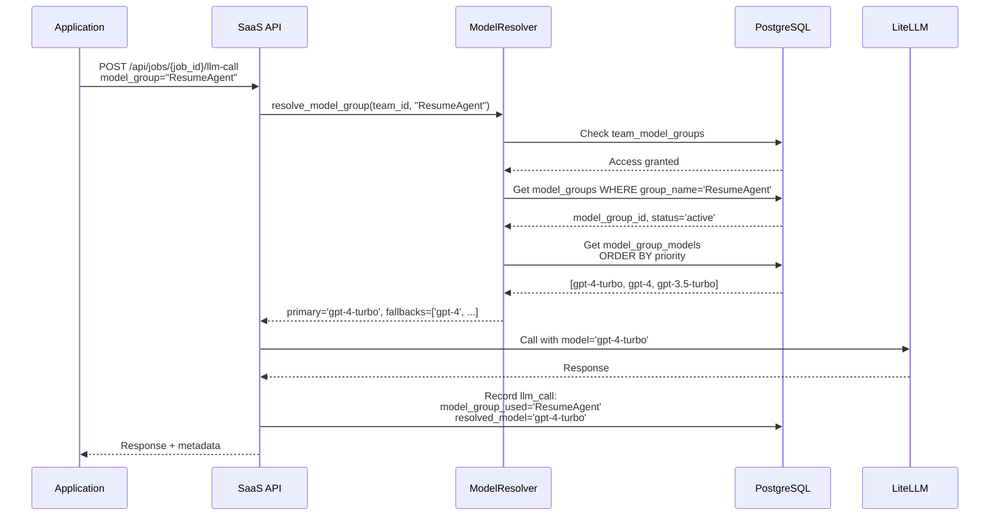

# Model Resolution Reference

Complete technical reference for the model group resolution system in SaaS LiteLLM. This system allows you to define named model groups (like "ResumeAgent", "ParsingAgent") with primary models and fallbacks, then control which teams have access to which groups.

## Overview

The model resolution system provides:

- **Named Model Groups**: Abstract model names from implementation (e.g., "ResumeAgent" instead of "gpt-4-turbo")
- **Primary + Fallback Models**: Define fallback chains for reliability
- **Access Control**: Per-team permissions for model groups
- **Easy Model Updates**: Change underlying models without code changes
- **Model Versioning**: Switch between model versions centrally

## Core Concepts

### Model Groups

A **model group** is a named collection of models with a priority order:

```
ResumeAgent:
  Priority 0 (Primary): gpt-4-turbo
  Priority 1 (Fallback): gpt-4
  Priority 2 (Fallback): gpt-3.5-turbo
```

Your application requests `model_group="ResumeAgent"`, and the system resolves it to the actual model.

### Why Model Groups?

**Problem:** Hard-coding model names creates maintenance nightmares:

```python
# ❌ Bad - Hard-coded model names
response = litellm.completion(
    model="gpt-4-turbo-2024-04-09",  # What if we want to change this?
    messages=messages
)
```

**Solution:** Use model groups:

```python
# ✅ Good - Abstract model group
response = saas_api.llm_call(
    job_id=job_id,
    model_group="ResumeAgent",  # Resolved to actual model by system
    messages=messages
)
```

**Benefits:**

- Update models centrally in database (no code changes)
- Different teams can use different models for same group
- Easy A/B testing of models
- Rollback model changes instantly
- Add fallbacks without code changes

---

## Database Schema

### model_groups Table

Defines named model groups.

```sql
CREATE TABLE model_groups (
    model_group_id UUID PRIMARY KEY DEFAULT gen_random_uuid(),
    group_name VARCHAR(100) UNIQUE NOT NULL,
    display_name VARCHAR(200),
    description TEXT,
    status VARCHAR(50) DEFAULT 'active',
    created_at TIMESTAMP NOT NULL DEFAULT NOW(),
    updated_at TIMESTAMP NOT NULL DEFAULT NOW()
);
```

**Columns:**

- `model_group_id`: Unique identifier
- `group_name`: Code-friendly name (e.g., "ResumeAgent")
- `display_name`: Human-readable name (e.g., "Resume Analysis Agent")
- `description`: Purpose and usage notes
- `status`: `active` or `inactive` (inactive groups can't be used)

**Example:**

```sql
INSERT INTO model_groups (group_name, display_name, description)
VALUES (
    'ResumeAgent',
    'Resume Analysis Agent',
    'High-quality model for resume parsing, skills extraction, and job matching'
);
```

---

### model_group_models Table

Maps models to groups with priority for fallback handling.

```sql
CREATE TABLE model_group_models (
    id UUID PRIMARY KEY DEFAULT gen_random_uuid(),
    model_group_id UUID NOT NULL REFERENCES model_groups(model_group_id) ON DELETE CASCADE,
    model_name VARCHAR(200) NOT NULL,
    priority INTEGER DEFAULT 0,
    is_active BOOLEAN DEFAULT TRUE,
    created_at TIMESTAMP NOT NULL DEFAULT NOW()
);

CREATE INDEX idx_model_group_models_lookup
    ON model_group_models(model_group_id, priority, is_active);
```

**Columns:**

- `model_group_id`: Parent group
- `model_name`: LiteLLM model identifier (e.g., "gpt-4-turbo", "claude-3-opus")
- `priority`: 0 = primary, 1 = first fallback, 2 = second fallback, etc.
- `is_active`: Whether this model is enabled (allows disabling without deletion)

**Priority System:**

- **Priority 0**: Primary model (always tried first)
- **Priority 1**: First fallback (used if primary fails or unavailable)
- **Priority 2+**: Additional fallbacks

**Example:**

```sql
-- Get model group ID
SELECT model_group_id FROM model_groups WHERE group_name = 'ResumeAgent';
-- Returns: 'a1b2c3d4-...'

-- Add models with priorities
INSERT INTO model_group_models (model_group_id, model_name, priority)
VALUES
    ('a1b2c3d4-...', 'gpt-4-turbo', 0),        -- Primary
    ('a1b2c3d4-...', 'gpt-4', 1),              -- First fallback
    ('a1b2c3d4-...', 'gpt-3.5-turbo', 2);      -- Second fallback
```

---

### team_model_groups Table

Junction table controlling which teams have access to which model groups.

```sql
CREATE TABLE team_model_groups (
    id UUID PRIMARY KEY DEFAULT gen_random_uuid(),
    team_id VARCHAR(255) NOT NULL,
    model_group_id UUID NOT NULL REFERENCES model_groups(model_group_id) ON DELETE CASCADE,
    assigned_at TIMESTAMP NOT NULL DEFAULT NOW(),
    CONSTRAINT unique_team_model_group UNIQUE(team_id, model_group_id)
);

CREATE INDEX idx_team_model_groups_team ON team_model_groups(team_id);
CREATE INDEX idx_team_model_groups_group ON team_model_groups(model_group_id);
```

**Columns:**

- `team_id`: Team identifier
- `model_group_id`: Model group this team can access
- `assigned_at`: When access was granted

**Example:**

```sql
-- Grant team access to model group
INSERT INTO team_model_groups (team_id, model_group_id)
SELECT 'team-alpha', model_group_id
FROM model_groups
WHERE group_name = 'ResumeAgent';

-- Grant access to multiple groups
INSERT INTO team_model_groups (team_id, model_group_id)
SELECT 'team-alpha', model_group_id
FROM model_groups
WHERE group_name IN ('ResumeAgent', 'ParsingAgent', 'ChatAgent');
```

---

## Model Resolver Service

The `ModelResolver` service handles model group resolution and access control.

### Location

`src/services/model_resolver.py`

### Class Definition

```python
class ModelResolver:
    def __init__(self, db: Session):
        self.db = db
```

---

### Key Methods

#### 1. verify_team_access()

Check if a team has access to a specific model group.

```python
def verify_team_access(self, team_id: str, model_group_name: str) -> bool:
    # Get model group
    model_group = self.db.query(ModelGroup).filter(
        ModelGroup.group_name == model_group_name
    ).first()

    if not model_group:
        return False

    # Check if team has this group assigned
    assignment = self.db.query(TeamModelGroup).filter(
        and_(
            TeamModelGroup.team_id == team_id,
            TeamModelGroup.model_group_id == model_group.model_group_id
        )
    ).first()

    return assignment is not None
```

**Returns:** `True` if team has access, `False` otherwise

**Example:**

```python
resolver = ModelResolver(db)

if resolver.verify_team_access("team-alpha", "ResumeAgent"):
    print("Access granted")
else:
    print("Access denied")
```

---

#### 2. resolve_model_group()

Resolve a model group name to actual model(s).

```python
def resolve_model_group(
    self,
    team_id: str,
    model_group_name: str,
    include_fallbacks: bool = True
) -> Tuple[str, List[str]]:
```

**Parameters:**

- `team_id`: Team requesting the model
- `model_group_name`: Name of model group (e.g., "ResumeAgent")
- `include_fallbacks`: Whether to return fallback models (default: `True`)

**Returns:** Tuple of `(primary_model, [fallback_models])`

**Raises:** `ModelResolutionError` if:
- Team doesn't have access to group
- Model group not found or inactive
- No active models configured for group

**Implementation:**

```python
def resolve_model_group(
    self,
    team_id: str,
    model_group_name: str,
    include_fallbacks: bool = True
) -> Tuple[str, List[str]]:
    # 1. Verify access
    if not self.verify_team_access(team_id, model_group_name):
        raise ModelResolutionError(
            f"Team '{team_id}' does not have access to model group '{model_group_name}'"
        )

    # 2. Get model group
    model_group = self.db.query(ModelGroup).filter(
        and_(
            ModelGroup.group_name == model_group_name,
            ModelGroup.status == "active"
        )
    ).first()

    if not model_group:
        raise ModelResolutionError(
            f"Model group '{model_group_name}' not found or inactive"
        )

    # 3. Get models sorted by priority
    models = self.db.query(ModelGroupModel).filter(
        and_(
            ModelGroupModel.model_group_id == model_group.model_group_id,
            ModelGroupModel.is_active == True
        )
    ).order_by(ModelGroupModel.priority).all()

    if not models:
        raise ModelResolutionError(
            f"No active models configured for group '{model_group_name}'"
        )

    # 4. Return primary + fallbacks
    primary_model = models[0].model_name
    fallback_models = [m.model_name for m in models[1:]] if include_fallbacks else []

    return primary_model, fallback_models
```

**Example:**

```python
resolver = ModelResolver(db)

primary, fallbacks = resolver.resolve_model_group(
    team_id="team-alpha",
    model_group_name="ResumeAgent"
)

print(f"Primary: {primary}")
# Output: Primary: gpt-4-turbo

print(f"Fallbacks: {fallbacks}")
# Output: Fallbacks: ['gpt-4', 'gpt-3.5-turbo']
```

---

#### 3. get_model_group_by_name()

Retrieve model group details.

```python
def get_model_group_by_name(self, model_group_name: str) -> Optional[ModelGroup]:
    return self.db.query(ModelGroup).filter(
        ModelGroup.group_name == model_group_name
    ).first()
```

**Returns:** `ModelGroup` object or `None`

---

#### 4. get_team_model_groups()

Get all model groups assigned to a team.

```python
def get_team_model_groups(self, team_id: str) -> List[ModelGroup]:
    assignments = self.db.query(TeamModelGroup).filter(
        TeamModelGroup.team_id == team_id
    ).all()

    model_group_ids = [a.model_group_id for a in assignments]

    return self.db.query(ModelGroup).filter(
        ModelGroup.model_group_id.in_(model_group_ids)
    ).all()
```

**Returns:** List of `ModelGroup` objects

**Example:**

```python
resolver = ModelResolver(db)

groups = resolver.get_team_model_groups("team-alpha")

for group in groups:
    print(f"- {group.group_name}: {group.display_name}")

# Output:
# - ResumeAgent: Resume Analysis Agent
# - ParsingAgent: Document Parsing Agent
# - ChatAgent: General Chat Agent
```

---

## Resolution Flow

### Complete Resolution Process



### Step-by-Step

1. **Application makes request** with `model_group` parameter
2. **API receives request**, extracts `team_id` from auth token
3. **Resolver checks access** via `team_model_groups` table
4. **Access granted** → Resolver fetches model group
5. **Get models** ordered by priority (ascending)
6. **Return primary** (priority 0) and fallbacks (priority 1+)
7. **API calls LiteLLM** with resolved primary model
8. **Record call** in database with both `model_group_used` and `resolved_model`
9. **Return response** to application

---

## API Integration

### Make LLM Call with Model Group

From `src/saas_api.py`:

```python
@app.post("/api/jobs/{job_id}/llm-call")
async def make_llm_call(
    job_id: str,
    request: LLMCallRequest,  # Contains model_group field
    db: Session = Depends(get_db),
    authenticated_team_id: str = Depends(verify_virtual_key)
):
    # Get job
    job = db.query(Job).filter(Job.job_id == uuid.UUID(job_id)).first()

    # Verify job belongs to team
    if job.team_id != authenticated_team_id:
        raise HTTPException(403, "Job does not belong to your team")

    # Get team's virtual key
    team_credits = db.query(TeamCredits).filter(
        TeamCredits.team_id == job.team_id
    ).first()

    if not team_credits.virtual_key:
        raise HTTPException(500, "Team has no virtual key configured")

    # Resolve model group to actual model
    model_resolver = ModelResolver(db)

    try:
        primary_model, fallback_models = model_resolver.resolve_model_group(
            team_id=job.team_id,
            model_group_name=request.model_group
        )
    except ModelResolutionError as e:
        raise HTTPException(403, str(e))

    # Track model group usage in job
    if not job.model_groups_used:
        job.model_groups_used = []
    if request.model_group not in job.model_groups_used:
        job.model_groups_used.append(request.model_group)
        db.commit()

    # Call LiteLLM with resolved model
    litellm_response = await call_litellm(
        model=primary_model,  # Use resolved primary model
        messages=request.messages,
        virtual_key=team_credits.virtual_key,
        team_id=job.team_id,
        temperature=request.temperature,
        max_tokens=request.max_tokens
    )

    # Store LLM call record
    llm_call = LLMCall(
        job_id=job.job_id,
        model_used=litellm_response.get("model", primary_model),
        model_group_used=request.model_group,  # Track requested group
        resolved_model=primary_model,          # Track resolved model
        prompt_tokens=usage.get("prompt_tokens", 0),
        completion_tokens=usage.get("completion_tokens", 0),
        total_tokens=usage.get("total_tokens", 0),
        cost_usd=cost_usd,
        latency_ms=latency_ms
    )

    db.add(llm_call)
    db.commit()

    return response

## Model Tracking Fields

### Understanding the Three Model Fields

The `llm_calls` table tracks three different model identifiers to provide complete visibility into model resolution:

| Field | Type | Description | Example Value |
|-------|------|-------------|---------------|
| `model_group_used` | string | The model group name requested by the application | `"ResumeAgent"` |
| `resolved_model` | string | The model your system resolved to from the model group | `"gpt-4-turbo"` |
| `model_used` | string | The actual model LiteLLM used (may differ if LiteLLM applies fallbacks) | `"gpt-4-turbo-2024-04-09"` |

### Why Three Fields?

This three-tier tracking provides complete audit trail:

**Example Scenario:**

1. **Application requests** `model_group="ResumeAgent"`
2. **Your system resolves** to `resolved_model="gpt-4-turbo"` (from model group configuration)
3. **LiteLLM returns** `model="gpt-4-turbo-2024-04-09"` (specific version/deployment)

**Tracking All Three Allows:**

- **`model_group_used`**: Track which logical model groups are most popular
- **`resolved_model`**: Verify your resolution logic worked correctly
- **`model_used`**: See the actual model/version LiteLLM used (important for cost tracking and debugging)

### Typical Values

```python
# Example 1: Standard resolution
{
    "model_group_used": "ResumeAgent",      # What app requested
    "resolved_model": "gpt-4-turbo",        # What you resolved to
    "model_used": "gpt-4-turbo-2024-04-09"  # What LiteLLM used
}

# Example 2: Direct model request (not using model groups)
{
    "model_group_used": null,               # No group used
    "resolved_model": "gpt-4",              # Direct model request
    "model_used": "gpt-4-0613"              # Specific version used
}

# Example 3: Fallback scenario
{
    "model_group_used": "ResumeAgent",      # What app requested
    "resolved_model": "gpt-4-turbo",        # What you resolved to
    "model_used": "gpt-4"                   # LiteLLM fell back to this
}
```

### Querying Model Usage

**Track most-used model groups:**

```sql
SELECT
    model_group_used,
    COUNT(*) as call_count,
    AVG(cost_usd) as avg_cost,
    AVG(latency_ms) as avg_latency
FROM llm_calls
WHERE model_group_used IS NOT NULL
AND created_at >= NOW() - INTERVAL '7 days'
GROUP BY model_group_used
ORDER BY call_count DESC;
```

**Verify resolution accuracy:**

```sql
-- Check if resolved models match actual models used
SELECT
    model_group_used,
    resolved_model,
    model_used,
    COUNT(*) as instances
FROM llm_calls
WHERE model_group_used IS NOT NULL
AND created_at >= NOW() - INTERVAL '1 day'
GROUP BY model_group_used, resolved_model, model_used
ORDER BY instances DESC;
```

**Detect unexpected fallbacks:**

```sql
-- Find cases where LiteLLM used a different model than resolved
SELECT
    job_id,
    model_group_used,
    resolved_model,
    model_used,
    created_at
FROM llm_calls
WHERE resolved_model != model_used
AND model_group_used IS NOT NULL
ORDER BY created_at DESC
LIMIT 100;
```
```

### Request Format

```json
POST /api/jobs/{job_id}/llm-call
{
  "model_group": "ResumeAgent",
  "messages": [
    {"role": "user", "content": "Analyze this resume..."}
  ],
  "temperature": 0.7,
  "max_tokens": 2000,
  "purpose": "Skills extraction"
}
```

### Response Format

```json
{
  "call_id": "call-uuid-123",
  "response": {
    "content": "This resume shows strong Python skills...",
    "finish_reason": "stop"
  },
  "metadata": {
    "tokens_used": 1850,
    "latency_ms": 2340,
    "model_group": "ResumeAgent"
  }
}
```

Note: The actual resolved model is **not** exposed to the client (keeps implementation details hidden).

---

## Error Handling

### ModelResolutionError

Raised when resolution fails.

**Scenarios:**

1. **Team lacks access:**
   ```
   ModelResolutionError: Team 'team-alpha' does not have access to model group 'ResumeAgent'
   ```

2. **Model group not found:**
   ```
   ModelResolutionError: Model group 'InvalidAgent' not found or inactive
   ```

3. **No models configured:**
   ```
   ModelResolutionError: No active models configured for group 'ResumeAgent'
   ```

**HTTP Response:**

```json
{
  "detail": "Team 'team-alpha' does not have access to model group 'ResumeAgent'"
}
```

Status code: `403 Forbidden`

---

## Common Operations

### 1. Create Model Group

```sql
-- Create group
INSERT INTO model_groups (group_name, display_name, description)
VALUES (
    'ChatAgent',
    'General Chat Agent',
    'Conversational AI for customer support and general queries'
)
RETURNING model_group_id;
-- Returns: 'xyz-uuid-789'

-- Add models
INSERT INTO model_group_models (model_group_id, model_name, priority)
VALUES
    ('xyz-uuid-789', 'gpt-4-turbo', 0),
    ('xyz-uuid-789', 'gpt-3.5-turbo', 1);
```

### 2. Assign Model Group to Team

```sql
INSERT INTO team_model_groups (team_id, model_group_id)
SELECT 'team-beta', model_group_id
FROM model_groups
WHERE group_name = 'ChatAgent';
```

### 3. Update Primary Model

```sql
-- Swap priorities to change primary
UPDATE model_group_models
SET priority = CASE
    WHEN model_name = 'gpt-4-turbo' THEN 1
    WHEN model_name = 'gpt-4' THEN 0
END
WHERE model_group_id = (
    SELECT model_group_id FROM model_groups WHERE group_name = 'ResumeAgent'
);
```

### 4. Add Fallback Model

```sql
INSERT INTO model_group_models (model_group_id, model_name, priority)
SELECT
    model_group_id,
    'claude-3-opus',
    3  -- Third fallback
FROM model_groups
WHERE group_name = 'ResumeAgent';
```

### 5. Disable Model (without deletion)

```sql
UPDATE model_group_models
SET is_active = FALSE
WHERE model_name = 'gpt-3.5-turbo'
AND model_group_id = (
    SELECT model_group_id FROM model_groups WHERE group_name = 'ResumeAgent'
);
```

### 6. Revoke Team Access

```sql
DELETE FROM team_model_groups
WHERE team_id = 'team-alpha'
AND model_group_id = (
    SELECT model_group_id FROM model_groups WHERE group_name = 'ResumeAgent'
);
```

---

## Analytics Queries

### Model Group Usage by Team

```sql
SELECT
    llm.model_group_used,
    llm.resolved_model,
    COUNT(*) AS call_count,
    AVG(llm.latency_ms) AS avg_latency_ms,
    SUM(llm.total_tokens) AS total_tokens,
    SUM(llm.cost_usd) AS total_cost_usd
FROM llm_calls llm
JOIN jobs j ON llm.job_id = j.job_id
WHERE j.team_id = 'team-alpha'
AND llm.created_at >= NOW() - INTERVAL '30 days'
GROUP BY llm.model_group_used, llm.resolved_model
ORDER BY call_count DESC;
```

### Model Group Access Report

```sql
SELECT
    mg.group_name,
    mg.display_name,
    COUNT(DISTINCT tmg.team_id) AS team_count,
    STRING_AGG(DISTINCT mgm.model_name, ', ' ORDER BY mgm.priority) AS models
FROM model_groups mg
LEFT JOIN team_model_groups tmg ON mg.model_group_id = tmg.model_group_id
LEFT JOIN model_group_models mgm ON mg.model_group_id = mgm.model_group_id
WHERE mg.status = 'active'
AND mgm.is_active = TRUE
GROUP BY mg.group_name, mg.display_name
ORDER BY team_count DESC;
```

### Teams Without Model Group Access

```sql
SELECT DISTINCT j.team_id
FROM jobs j
LEFT JOIN team_model_groups tmg ON j.team_id = tmg.team_id
WHERE tmg.team_id IS NULL
AND j.created_at >= NOW() - INTERVAL '7 days';
```

---

## Best Practices

### 1. Use Descriptive Group Names

```sql
-- ✅ Good - Clear purpose
'ResumeAgent', 'DocumentParser', 'ChatAssistant'

-- ❌ Bad - Unclear
'Agent1', 'ModelA', 'Default'
```

### 2. Always Have Fallbacks

Configure at least 2 models per group for reliability:

```sql
INSERT INTO model_group_models (model_group_id, model_name, priority)
VALUES
    (group_id, 'gpt-4-turbo', 0),      -- Primary
    (group_id, 'gpt-3.5-turbo', 1);    -- Fallback
```

### 3. Test Model Changes

Before switching primary models, test with a subset of teams:

```sql
-- Create test group with new model
INSERT INTO model_groups (group_name, display_name)
VALUES ('ResumeAgent-Beta', 'Resume Agent (Testing GPT-4.5)');

-- Assign to test teams only
INSERT INTO team_model_groups (team_id, model_group_id)
SELECT 'team-test', model_group_id
FROM model_groups
WHERE group_name = 'ResumeAgent-Beta';
```

### 4. Track Resolution History

The `llm_calls` table tracks both `model_group_used` and `resolved_model`, allowing you to:
- See which groups are most popular
- Identify when models change
- Audit resolution decisions

### 5. Document Model Group Purposes

Use the `description` field:

```sql
UPDATE model_groups
SET description = 'Use for: Resume parsing, skills extraction, job matching. Optimized for structured outputs. Fallback to GPT-4 if quota exceeded.'
WHERE group_name = 'ResumeAgent';
```

---

## Advanced Patterns

### Per-Team Model Overrides

Allow specific teams to use different models for the same group:

```sql
-- Create team-specific variant
INSERT INTO model_groups (group_name, display_name)
VALUES ('ResumeAgent-Premium', 'Resume Agent (Enterprise)');

INSERT INTO model_group_models (model_group_id, model_name, priority)
SELECT model_group_id, 'gpt-4-turbo', 0
FROM model_groups
WHERE group_name = 'ResumeAgent-Premium';

-- Assign premium version to enterprise team
INSERT INTO team_model_groups (team_id, model_group_id)
SELECT 'team-enterprise', model_group_id
FROM model_groups
WHERE group_name = 'ResumeAgent-Premium';
```

### Cost-Based Routing

Route to cheaper models for non-critical tasks:

```sql
-- Budget model group
INSERT INTO model_groups (group_name, display_name)
VALUES ('ChatAgent-Budget', 'Chat Agent (Economy)');

INSERT INTO model_group_models (model_group_id, model_name, priority)
SELECT model_group_id, 'gpt-3.5-turbo', 0
FROM model_groups
WHERE group_name = 'ChatAgent-Budget';

-- Assign to free-tier teams
INSERT INTO team_model_groups (team_id, model_group_id)
SELECT team_id, (SELECT model_group_id FROM model_groups WHERE group_name = 'ChatAgent-Budget')
FROM team_credits
WHERE credits_remaining < 100;
```

### A/B Testing Models

Split traffic between models to compare performance:

```sql
-- Create A/B variants
INSERT INTO model_groups (group_name, display_name)
VALUES
    ('ResumeAgent-A', 'Resume Agent (GPT-4 Test)'),
    ('ResumeAgent-B', 'Resume Agent (Claude Test)');

-- Configure models
INSERT INTO model_group_models (model_group_id, model_name, priority)
VALUES
    ((SELECT model_group_id FROM model_groups WHERE group_name = 'ResumeAgent-A'), 'gpt-4-turbo', 0),
    ((SELECT model_group_id FROM model_groups WHERE group_name = 'ResumeAgent-B'), 'claude-3-opus', 0);

-- Assign 50% of teams to each
-- (Application logic splits teams randomly)
```

---

## See Also

- [Database Schema Reference](database-schema.md) - Model group table definitions
- [API Reference: Model Groups](../api-reference/model-groups.md) - Model group management endpoints
- [LiteLLM Model List](https://docs.litellm.ai/docs/providers) - Supported model identifiers
