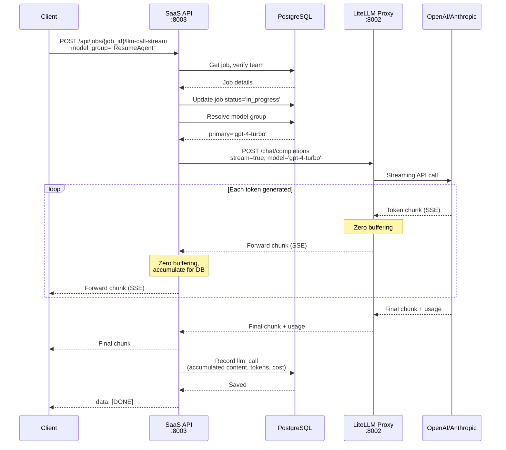

# Streaming Architecture Reference

Complete technical reference for Server-Sent Events (SSE) streaming implementation in SaaS LiteLLM. This system provides real-time streaming of LLM responses with zero buffering for minimal latency.

## Overview

The streaming architecture enables:

- **Real-time Response Streaming**: Tokens arrive as they're generated
- **Zero Buffering**: No intermediate buffering between hops
- **Low Latency**: ~300-500ms Time to First Token (TTFT)
- **Transparent Forwarding**: SaaS API passes chunks directly from LiteLLM
- **Same Credit Model**: Streaming and non-streaming use same billing (1 credit per job)
- **Error Handling**: Graceful stream interruption and recovery

## Architecture Diagram

```
┌─────────────┐         ┌──────────────┐         ┌──────────────┐         ┌─────────────┐
│   Client    │         │   SaaS API   │         │   LiteLLM    │         │  OpenAI/    │
│ Application │◄────────┤   :8003      │◄────────┤   Proxy      │◄────────┤  Anthropic  │
│             │  SSE    │              │  SSE    │   :8002      │  API    │             │
└─────────────┘         └──────────────┘         └──────────────┘         └─────────────┘
      ▲                        │                        │                        │
      │                        │                        │                        │
      └────────────────────────┴────────────────────────┴────────────────────────┘
                              Zero-buffering streaming
```

### Data Flow

1. **Client** → **SaaS API**: HTTP POST request with `stream=true` parameter
2. **SaaS API** → **LiteLLM**: Forward streaming request to LiteLLM proxy
3. **LiteLLM** → **Provider**: LiteLLM makes streaming API call to OpenAI/Anthropic/etc
4. **Provider** → **LiteLLM** → **SaaS API** → **Client**: Tokens forwarded in real-time
5. **Stream Complete**: Final chunk sent, metadata recorded in database

---

## Server-Sent Events (SSE)

### Protocol Overview

SSE is a standard for server-to-client streaming over HTTP:

```
HTTP/1.1 200 OK
Content-Type: text/event-stream
Cache-Control: no-cache
X-Accel-Buffering: no
Connection: keep-alive

data: {"choices":[{"delta":{"content":"Hello"}}]}

data: {"choices":[{"delta":{"content":" world"}}]}

data: {"choices":[{"delta":{"content":"!"}}]}

data: [DONE]
```

**Key Characteristics:**

- **Content-Type**: `text/event-stream`
- **Chunk Format**: Each chunk prefixed with `data: `
- **Newline Separation**: Double newline (`\n\n`) between chunks
- **Completion Signal**: `data: [DONE]` marks end of stream
- **Keep-Alive**: Connection stays open until complete

### Why SSE?

**Advantages over WebSockets:**

- Simpler protocol (HTTP-based)
- Automatic reconnection in browsers
- Works through most proxies and firewalls
- No need for handshake negotiation
- Built-in event IDs for resumption

**Advantages over HTTP polling:**

- Real-time delivery (no polling delay)
- Lower bandwidth (single connection)
- Reduced server load (no repeated requests)

---

## Streaming Endpoints

### Endpoint: `/api/jobs/{job_id}/llm-call-stream`

**Note:** Based on documentation and client code, the streaming endpoint is expected to be implemented but not found in `src/saas_api.py`. The non-streaming endpoint exists at `/api/jobs/{job_id}/llm-call`.

**Expected Implementation:**

```python
from fastapi import FastAPI
from fastapi.responses import StreamingResponse
from sse_starlette.sse import EventSourceResponse
import httpx
import json

@app.post("/api/jobs/{job_id}/llm-call-stream")
async def make_llm_call_stream(
    job_id: str,
    request: LLMCallRequest,
    db: Session = Depends(get_db),
    authenticated_team_id: str = Depends(verify_virtual_key)
):
    """
    Make a streaming LLM call within a job context.
    Returns Server-Sent Events (SSE) stream.
    """
    from .services.model_resolver import ModelResolver, ModelResolutionError

    # Get job
    job = db.query(Job).filter(Job.job_id == uuid.UUID(job_id)).first()
    if not job:
        raise HTTPException(404, "Job not found")

    # Verify job belongs to authenticated team
    if job.team_id != authenticated_team_id:
        raise HTTPException(403, "Job does not belong to your team")

    # Get team credentials
    team_credits = db.query(TeamCredits).filter(
        TeamCredits.team_id == job.team_id
    ).first()

    if not team_credits or not team_credits.virtual_key:
        raise HTTPException(500, "Team has no virtual key configured")

    # Update job status to in_progress
    if job.status == JobStatus.PENDING:
        job.status = JobStatus.IN_PROGRESS
        job.started_at = datetime.utcnow()
        db.commit()

    # Resolve model group
    model_resolver = ModelResolver(db)

    try:
        primary_model, _ = model_resolver.resolve_model_group(
            team_id=job.team_id,
            model_group_name=request.model_group
        )
    except ModelResolutionError as e:
        raise HTTPException(403, str(e))

    # Track model group usage
    if not job.model_groups_used:
        job.model_groups_used = []
    if request.model_group not in job.model_groups_used:
        job.model_groups_used.append(request.model_group)
        db.commit()

    # Stream generator
    async def stream_generator():
        litellm_url = f"{settings.litellm_proxy_url}/chat/completions"

        headers = {
            "Authorization": f"Bearer {team_credits.virtual_key}",
            "Content-Type": "application/json"
        }

        payload = {
            "model": primary_model,
            "messages": request.messages,
            "temperature": request.temperature,
            "stream": True,  # Enable streaming
            "user": job.team_id
        }

        if request.max_tokens:
            payload["max_tokens"] = request.max_tokens

        # Track for database recording
        accumulated_content = ""
        start_time = datetime.utcnow()
        prompt_tokens = 0
        completion_tokens = 0

        try:
            async with httpx.AsyncClient(timeout=120.0) as client:
                async with client.stream(
                    "POST",
                    litellm_url,
                    json=payload,
                    headers=headers
                ) as response:
                    response.raise_for_status()

                    # Forward each chunk to client
                    async for line in response.aiter_lines():
                        if line.startswith("data: "):
                            chunk_data = line[6:]

                            # Forward to client as-is
                            yield f"data: {chunk_data}\n\n"

                            # Parse for database recording
                            if chunk_data == "[DONE]":
                                break

                            try:
                                chunk_json = json.loads(chunk_data)

                                # Accumulate content
                                if "choices" in chunk_json:
                                    delta = chunk_json["choices"][0].get("delta", {})
                                    content = delta.get("content", "")
                                    accumulated_content += content

                                # Extract token usage (in final chunk)
                                if "usage" in chunk_json:
                                    usage = chunk_json["usage"]
                                    prompt_tokens = usage.get("prompt_tokens", 0)
                                    completion_tokens = usage.get("completion_tokens", 0)

                            except json.JSONDecodeError:
                                continue

            # Stream complete - record in database
            end_time = datetime.utcnow()
            latency_ms = int((end_time - start_time).total_seconds() * 1000)
            total_tokens = prompt_tokens + completion_tokens
            cost_usd = (prompt_tokens * 0.0005 / 1000) + (completion_tokens * 0.0015 / 1000)

            llm_call = LLMCall(
                job_id=job.job_id,
                model_used=primary_model,
                model_group_used=request.model_group,
                resolved_model=primary_model,
                prompt_tokens=prompt_tokens,
                completion_tokens=completion_tokens,
                total_tokens=total_tokens,
                cost_usd=cost_usd,
                latency_ms=latency_ms,
                purpose=request.purpose,
                request_data={"messages": request.messages, "model_group": request.model_group},
                response_data={"content": accumulated_content}
            )

            db.add(llm_call)
            db.commit()

        except Exception as e:
            # Record failed call
            llm_call = LLMCall(
                job_id=job.job_id,
                model_group_used=request.model_group,
                purpose=request.purpose,
                error=str(e),
                request_data={"messages": request.messages, "model_group": request.model_group}
            )
            db.add(llm_call)
            db.commit()

            # Send error to client
            yield f"data: {json.dumps({'error': str(e)})}\n\n"
            yield "data: [DONE]\n\n"

    # Return streaming response
    return StreamingResponse(
        stream_generator(),
        media_type="text/event-stream",
        headers={
            "Cache-Control": "no-cache",
            "X-Accel-Buffering": "no",
            "Connection": "keep-alive"
        }
    )
```

---

## Streaming Flow Diagram

### Complete Request Flow



### Performance Metrics

**Typical Latencies:**

- **Time to First Token (TTFT)**: 300-500ms
- **Per-token Latency**: 50ms
- **SaaS API Overhead**: 10-50ms per hop (minimal!)
- **LiteLLM Overhead**: 10-30ms per hop

**Total TTFT Breakdown:**

```
Client Request → SaaS API: ~20ms (network)
SaaS API Processing: ~30ms (auth, DB lookup, resolution)
SaaS API → LiteLLM: ~10ms (local network)
LiteLLM Processing: ~20ms (routing)
LiteLLM → Provider: ~50ms (network)
Provider Processing: ~200-300ms (model inference)
────────────────────────────────────────────
Total TTFT: ~330-430ms
```

---

## Chunk Format

### OpenAI-Compatible Stream Chunks

Each chunk is a JSON object following OpenAI's format:

```json
{
  "id": "chatcmpl-abc123",
  "object": "chat.completion.chunk",
  "created": 1697896000,
  "model": "gpt-4-turbo-2024-04-09",
  "choices": [
    {
      "index": 0,
      "delta": {
        "role": "assistant",
        "content": "Hello"
      },
      "finish_reason": null
    }
  ]
}
```

**Fields:**

- `id`: Unique completion ID
- `object`: Always `"chat.completion.chunk"` for streaming
- `created`: Unix timestamp
- `model`: Actual model used
- `choices[].delta`: Incremental content
- `choices[].delta.role`: Only present in first chunk ("assistant")
- `choices[].delta.content`: The text chunk
- `choices[].finish_reason`: `null` during streaming, `"stop"`/`"length"` at end

### Final Chunk

Last chunk includes usage metadata:

```json
{
  "id": "chatcmpl-abc123",
  "object": "chat.completion.chunk",
  "created": 1697896000,
  "model": "gpt-4-turbo-2024-04-09",
  "choices": [
    {
      "index": 0,
      "delta": {},
      "finish_reason": "stop"
    }
  ],
  "usage": {
    "prompt_tokens": 125,
    "completion_tokens": 450,
    "total_tokens": 575
  }
}
```

**Usage Field:**

- `prompt_tokens`: Input tokens
- `completion_tokens`: Generated tokens
- `total_tokens`: Sum of prompt + completion

This data is extracted and stored in the `llm_calls` table.

---

## Client-Side Implementation

### Python Client (httpx)

From `examples/typed_client.py`:

```python
async def chat_stream(
    self,
    job_id: str,
    model_group: str,
    messages: List[Dict[str, str]],
    temperature: float = 0.7,
    max_tokens: Optional[int] = None
) -> AsyncGenerator[StreamChunk, None]:
    """Stream LLM response"""

    payload = {
        "model_group": model_group,
        "messages": messages,
        "temperature": temperature
    }

    if max_tokens:
        payload["max_tokens"] = max_tokens

    # Open streaming connection
    async with self.client.stream(
        "POST",
        f"{self.api_url}/api/jobs/{job_id}/llm-call-stream",
        json=payload
    ) as response:
        response.raise_for_status()

        # Process SSE stream
        async for line in response.aiter_lines():
            if line.startswith("data: "):
                chunk_data = line[6:]  # Remove "data: " prefix

                if chunk_data == "[DONE]":
                    break

                try:
                    chunk_json = json.loads(chunk_data)

                    # Handle errors
                    if "error" in chunk_json:
                        raise Exception(f"Stream error: {chunk_json['error']}")

                    # Yield parsed chunk
                    yield StreamChunk(**chunk_json)

                except json.JSONDecodeError:
                    continue
```

**Usage:**

```python
async with SaaSLLMClient(base_url, team_id, virtual_key) as client:
    job_id = await client.create_job("chat")

    async for chunk in client.chat_stream(
        job_id=job_id,
        model_group="ChatAgent",
        messages=[{"role": "user", "content": "Hello"}]
    ):
        if chunk.choices:
            content = chunk.choices[0].delta.get("content", "")
            if content:
                print(content, end="", flush=True)
```

---

### JavaScript Client

```javascript
async function streamChat(jobId, messages) {
  const response = await fetch(`${API_URL}/api/jobs/${jobId}/llm-call-stream`, {
    method: 'POST',
    headers: {
      'Authorization': `Bearer ${VIRTUAL_KEY}`,
      'Content-Type': 'application/json'
    },
    body: JSON.stringify({
      model_group: 'ChatAgent',
      messages: messages
    })
  });

  const reader = response.body.getReader();
  const decoder = new TextDecoder();

  while (true) {
    const {done, value} = await reader.read();
    if (done) break;

    const text = decoder.decode(value);
    const lines = text.split('\n');

    for (const line of lines) {
      if (line.startsWith('data: ')) {
        const data = line.substring(6);

        if (data === '[DONE]') {
          console.log('\nStream complete');
          return;
        }

        try {
          const chunk = JSON.parse(data);
          const content = chunk.choices?.[0]?.delta?.content || '';
          if (content) {
            process.stdout.write(content);  // Node.js
            // Or: document.getElementById('output').textContent += content;  // Browser
          }
        } catch (e) {
          // Ignore parse errors
        }
      }
    }
  }
}
```

---

## Error Handling

### Stream Interruption

**Scenarios:**

1. **Network disconnection**: Client or proxy drops connection
2. **LLM provider error**: OpenAI/Anthropic returns error mid-stream
3. **Timeout**: Request exceeds configured timeout
4. **Server error**: Internal error in SaaS API or LiteLLM

### Error Chunk Format

When errors occur, send error chunk before closing:

```json
{
  "error": {
    "message": "Model timeout exceeded",
    "type": "timeout_error",
    "code": "model_timeout"
  }
}
```

**Client Handling:**

```python
async for chunk in client.chat_stream(...):
    # Check for error field
    if hasattr(chunk, 'error') and chunk.error:
        raise StreamError(chunk.error['message'])

    # Normal processing
    if chunk.choices:
        content = chunk.choices[0].delta.get("content", "")
        print(content, end="", flush=True)
```

### Graceful Degradation

If streaming fails, client can fall back to non-streaming:

```python
async def resilient_llm_call(client, job_id, messages):
    try:
        # Try streaming first
        accumulated = ""
        async for chunk in client.chat_stream(job_id, messages):
            if chunk.choices:
                accumulated += chunk.choices[0].delta.get("content", "")
        return accumulated

    except StreamError as e:
        print(f"Streaming failed: {e}. Falling back to non-streaming.")
        # Fall back to non-streaming
        response = await client.chat(job_id, messages)
        return response.choices[0].message["content"]
```

### Timeout Configuration

Set appropriate timeouts at each layer:

**Client:**

```python
async with httpx.AsyncClient(timeout=120.0) as client:
    async with client.stream(...) as response:
        # 120 second timeout for entire stream
        pass
```

**SaaS API:**

```python
async with httpx.AsyncClient(timeout=120.0) as client:
    async with client.stream("POST", litellm_url, ...) as response:
        # 120 second timeout to LiteLLM
        pass
```

**Application-Level:**

```python
import asyncio

async with asyncio.timeout(60):  # 60 second max for operation
    async for chunk in client.chat_stream(...):
        # Process chunks
        pass
```

---

## Database Recording

### Recording Streamed Content

The SaaS API accumulates content during streaming, then records to database once complete:

```python
# During streaming
accumulated_content = ""
prompt_tokens = 0
completion_tokens = 0

async for line in response.aiter_lines():
    if line.startswith("data: "):
        chunk_json = json.loads(line[6:])

        # Accumulate content
        if "choices" in chunk_json:
            delta = chunk_json["choices"][0].get("delta", {})
            accumulated_content += delta.get("content", "")

        # Extract final usage
        if "usage" in chunk_json:
            prompt_tokens = chunk_json["usage"]["prompt_tokens"]
            completion_tokens = chunk_json["usage"]["completion_tokens"]

# After stream completes, record to database
llm_call = LLMCall(
    job_id=job_id,
    model_used=primary_model,
    model_group_used=request.model_group,
    resolved_model=primary_model,
    prompt_tokens=prompt_tokens,
    completion_tokens=completion_tokens,
    total_tokens=prompt_tokens + completion_tokens,
    cost_usd=calculate_cost(prompt_tokens, completion_tokens),
    latency_ms=latency_ms,
    response_data={"content": accumulated_content}
)
db.add(llm_call)
db.commit()
```

**Why Accumulate?**

- Database stores complete response, not individual chunks
- Allows cost calculation based on final token counts
- Enables full-text search on responses
- Provides audit trail

---

## Performance Optimization

### 1. Disable Buffering

**Nginx:**

```nginx
location /api/jobs/ {
    proxy_pass http://saas_api:8003;
    proxy_buffering off;
    proxy_cache off;
    proxy_set_header X-Accel-Buffering no;
}
```

**FastAPI:**

```python
return StreamingResponse(
    stream_generator(),
    media_type="text/event-stream",
    headers={
        "Cache-Control": "no-cache",
        "X-Accel-Buffering": "no"  # Disable nginx buffering
    }
)
```

### 2. Use HTTP/2

HTTP/2 multiplexing improves streaming performance:

```python
async with httpx.AsyncClient(http2=True) as client:
    async with client.stream(...) as response:
        # Faster streaming with HTTP/2
        pass
```

### 3. Async All The Way

Never block in stream processing:

```python
# ✅ Good - Fully async
async def stream_generator():
    async with httpx.AsyncClient() as client:
        async with client.stream(...) as response:
            async for line in response.aiter_lines():
                yield f"data: {line}\n\n"

# ❌ Bad - Blocks event loop
def stream_generator():
    response = requests.get(..., stream=True)
    for line in response.iter_lines():
        yield f"data: {line}\n\n"
```

### 4. Minimize Per-Chunk Processing

Keep per-chunk processing lightweight:

```python
# ✅ Good - Minimal processing
async for line in response.aiter_lines():
    if line.startswith("data: "):
        yield f"{line}\n\n"  # Forward as-is

# ❌ Bad - Heavy processing per chunk
async for line in response.aiter_lines():
    chunk = json.loads(line[6:])
    validated = validate_chunk(chunk)  # Expensive!
    enriched = enrich_chunk(validated)  # More processing!
    yield f"data: {json.dumps(enriched)}\n\n"
```

---

## Best Practices

### 1. Always Flush Output

```python
# ✅ Good - Immediate display
print(content, end="", flush=True)

# ❌ Bad - Buffered output
print(content, end="")
```

### 2. Handle Empty Chunks

Not all chunks contain content:

```python
async for chunk in client.chat_stream(...):
    if chunk.choices:
        delta = chunk.choices[0].delta
        if "content" in delta and delta["content"]:
            print(delta["content"], end="", flush=True)
```

### 3. Monitor finish_reason

```python
async for chunk in client.chat_stream(...):
    if chunk.choices:
        choice = chunk.choices[0]

        # Process content
        if "content" in choice.delta:
            print(choice.delta["content"], end="", flush=True)

        # Check completion reason
        if choice.finish_reason:
            if choice.finish_reason == "length":
                print("\n\nWarning: Response truncated (max_tokens reached)")
            elif choice.finish_reason == "stop":
                print("\n\nResponse complete")
```

### 4. Set Appropriate Timeouts

```python
# Long-form content (articles, code)
timeout = 180.0  # 3 minutes

# Chat responses
timeout = 60.0  # 1 minute

# Quick queries
timeout = 30.0  # 30 seconds

async with httpx.AsyncClient(timeout=timeout) as client:
    async with client.stream(...) as response:
        # Stream with appropriate timeout
        pass
```

### 5. Accumulate for Post-Processing

```python
accumulated = ""

async for chunk in client.chat_stream(...):
    if chunk.choices:
        content = chunk.choices[0].delta.get("content", "")
        accumulated += content
        print(content, end="", flush=True)

# Now use accumulated for analysis, storage, etc.
print(f"\n\nTotal length: {len(accumulated)} characters")
```

---

## Comparison: Streaming vs Non-Streaming

| Aspect | Non-Streaming | Streaming |
|--------|---------------|-----------|
| **TTFT** | ~2000-3000ms | ~300-500ms |
| **User Experience** | Wait for complete response | Progressive display |
| **Implementation** | Simpler | More complex |
| **Error Handling** | Single try/catch | Per-chunk error handling |
| **Buffering** | Full response buffered | Zero buffering |
| **Memory Usage** | Higher (full response in memory) | Lower (chunk-by-chunk) |
| **Network Usage** | Single large payload | Many small chunks |
| **Credit Cost** | 1 credit per completed job | 1 credit per completed job |
| **Database Recording** | Direct response storage | Accumulate then store |
| **Best For** | Batch processing, background jobs | Interactive chat, real-time UI |

---

## Troubleshooting

### Issue: Stream Hangs

**Symptoms:** No chunks received, connection stays open

**Causes:**

1. Buffering enabled at proxy level
2. Synchronous blocking code in stream handler
3. Missing `flush=True` in client

**Solutions:**

```nginx
# Disable nginx buffering
proxy_buffering off;
proxy_cache off;
```

```python
# Use async streaming
async with client.stream(...) as response:
    async for line in response.aiter_lines():
        yield line
```

### Issue: Chunks Arrive in Bursts

**Symptoms:** Chunks come in groups instead of continuously

**Causes:**

1. Intermediate proxy buffering
2. TCP buffering
3. Client-side buffering

**Solutions:**

```python
# Disable buffering headers
headers = {
    "Cache-Control": "no-cache",
    "X-Accel-Buffering": "no",
    "Connection": "keep-alive"
}
```

### Issue: High Memory Usage

**Symptoms:** Memory grows during long streams

**Causes:**

1. Accumulating entire response in memory
2. Not releasing chunks after processing

**Solutions:**

```python
# ✅ Good - Process and discard
async for chunk in stream:
    process_chunk(chunk)
    # Chunk is garbage collected

# ❌ Bad - Accumulate everything
chunks = []
async for chunk in stream:
    chunks.append(chunk)  # Memory grows!
```

---

## See Also

- [Streaming Integration Guide](../integration/streaming.md) - How to use streaming in your app
- [Streaming Examples](../examples/streaming-examples.md) - Code examples
- [Non-Streaming Guide](../integration/non-streaming.md) - Alternative approach
- [Job Workflow](../guides/job-workflow.md) - Understanding job lifecycle
